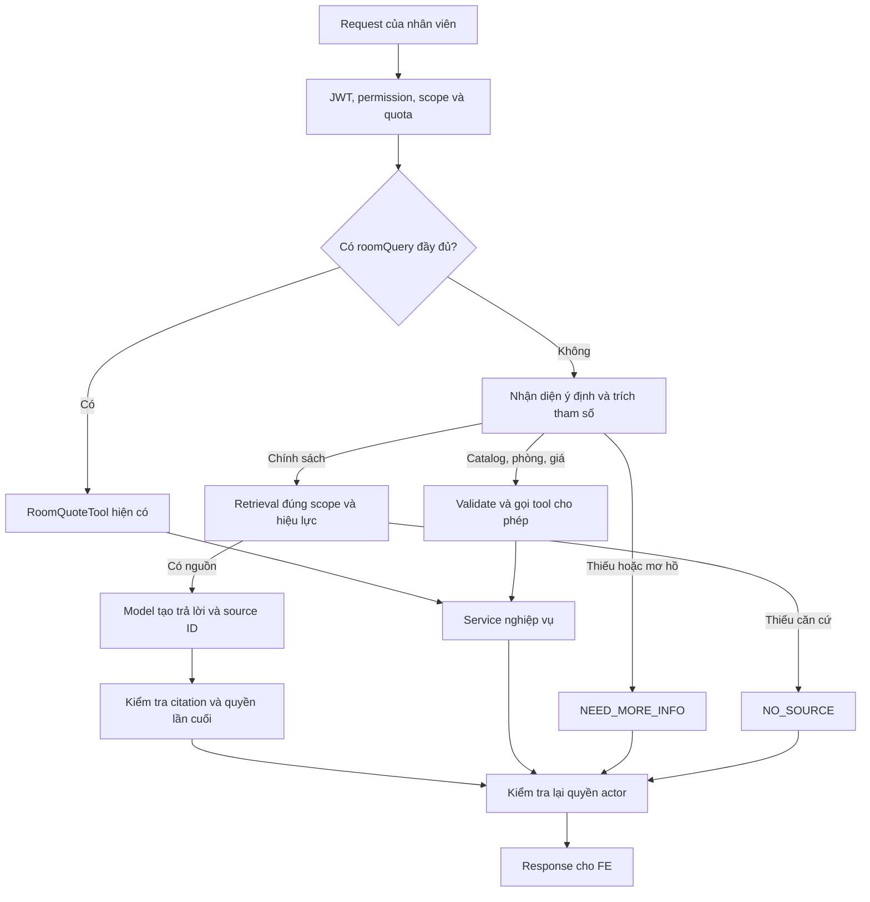

# Kế hoạch triển khai AI chatbot — Chi tiết thực hiện

Ngày lập: 25/09/2026. Owner: thành viên phụ trách AI. Đọc [bản tổng quan](AI_CHATBOT_IMPLEMENTATION_OVERVIEW.md) để xem thứ tự, ước lượng và mốc bàn giao.

Đơn vị theo dõi là `AIC-001` đến `AIC-036`: mỗi task có một branch và một PR; các nhóm cũ `AI-01` đến `AI-12` chỉ dùng đối chiếu. Đây là kế hoạch implementation, chưa phải thông báo các chức năng bên dưới đã được triển khai. Chỉ các thành phần được đánh dấu “hiện có” đã được đối chiếu với code. Tên lớp, field, migration và API mới là thiết kế đề xuất; chốt contract trong PR trước khi FE sử dụng.

## 1. Phạm vi và ranh giới

MVP AI phục vụ nhân viên đã xác thực, trả lời chính sách bằng RAG và tra cứu catalog/availability/quote qua service đọc hiện có. Kỳ lưu trú dùng `StayCriteria` với giới hạn 1–30 đêm. Mỗi yêu cầu tra cứu phòng áp dụng sức chứa của một phòng theo backend hiện tại.

Java 21 + Spring Boot + Spring AI tiếp tục là môi trường triển khai. Module `aiassistant` sở hữu tài liệu, job ingest, retrieval, prompt, điều phối tool và DTO của chat. IAM sở hữu identity/permission/scope; pricing sở hữu tính giá; inventory sở hữu tồn phòng. AI gọi service công khai của các module này; không gọi repository của chúng và không mở SQL tool cho model.

Chat một lượt là phạm vi bàn giao. FE có thể giữ bản nháp tham số để gửi lại đầy đủ sau câu hỏi bổ sung; server luôn kiểm tra lại input và quyền. Chưa coi đó là conversation memory đã triển khai.

### Các file cần đọc trước

| File hiện có | Trách nhiệm và điểm mở rộng |
|---|---|
| [AiChatController.java](../../backend/src/main/java/vn/edu/utc/hotel_booking/aiassistant/controller/AiChatController.java) | Nhận `message`, `hotelId`, `roomQuery`; kiểm tra flag AI; lấy actor qua IAM |
| [ChatService.java](../../backend/src/main/java/vn/edu/utc/hotel_booking/aiassistant/service/ChatService.java) | Rẽ nhánh `roomQuery` hoặc RAG; prompt inline; semaphore 8; recheck nguồn trước/sau gọi model |
| [RoomQuoteTool.java](../../backend/src/main/java/vn/edu/utc/hotel_booking/aiassistant/tool/RoomQuoteTool.java) | Kiểm tra ngày, quyền, quan hệ hotel/hạng phòng rồi gọi pricing |
| [KnowledgeController.java](../../backend/src/main/java/vn/edu/utc/hotel_booking/aiassistant/controller/KnowledgeController.java) | Create text, xem job, publish/revoke, đọc citation; chưa có list/detail và tạo version mới |
| [KnowledgeService.java](../../backend/src/main/java/vn/edu/utc/hotel_booking/aiassistant/knowledge/KnowledgeService.java) | Transaction lệnh tài liệu, scope và audit; `hotelId=null` là tài liệu toàn chuỗi |
| [KnowledgeRepository.java](../../backend/src/main/java/vn/edu/utc/hotel_booking/aiassistant/knowledge/KnowledgeRepository.java) | SQL tri thức, vector search, claim/finish job; ngưỡng search đang là 0,55 |
| [KnowledgeIngestionWorker.java](../../backend/src/main/java/vn/edu/utc/hotel_booking/aiassistant/knowledge/KnowledgeIngestionWorker.java) | Cắt text khoảng 800 ký tự, tạo embedding ngoài transaction, kiểm tra dimension |
| [V002__ai_knowledge.sql](../../backend/src/main/resources/db/migration/V002__ai_knowledge.sql) | Bốn bảng AI, vector 1536 chiều, một version `PUBLISHED`/document, một job/version |
| [application.yaml](../../backend/src/main/resources/application.yaml) | Provider/env, AI tắt mặc định, cấu hình timeout/retry, `topK` mặc định 4 |
| [CatalogAndKnowledgeIT.java](../../backend/src/test/java/vn/edu/utc/hotel_booking/integration/CatalogAndKnowledgeIT.java) | Test PostgreSQL/pgvector, ingest → publish → chat → revoke với fake model |

Không suy ra chất lượng RAG thật từ fake-model test: test này kiểm tra luồng dữ liệu và ràng buộc, chưa kiểm chứng retrieval/answer của provider thực tế.

## 2. Thiết kế đường đi của request



Routing từ câu hỏi tự nhiên là phần mới. Bước nhận diện chỉ trả ý định và tham số theo schema; không có quyền thực thi. Code Java quyết định tool được phép gọi, kiểm tra input và gắn actor. Nhánh `roomQuery` hiện có tiếp tục hoạt động và không cần model tự tính hay diễn giải số tiền.

## 3. Quy ước contract cần thống nhất trong AIC-005

### 3.1. Chat

Giữ `POST /api/v1/ai/chat`, envelope `code/message/result`, các field hiện có `type`, `answer`, `citations`, `roomQuote`, `asOf` và các loại `GROUNDED`, `LIVE_QUOTE`, `NO_SOURCE`.

| Đề xuất bổ sung | Mục đích | Tương thích |
|---|---|---|
| `type=NEED_MORE_INFO` | Cần chọn cơ sở/hạng phòng/ngày/số khách hoặc làm rõ câu hỏi | FE cần xử lý loại mới |
| `type=LIVE_DATA` | Kết quả catalog/availability không phải quote | Không đổi tên `LIVE_QUOTE` đang dùng |
| `requiredFields` | Danh sách key thiếu để FE hiển thị input | Optional; không tạo booking state |
| `liveData` | DTO có loại rõ ràng, ví dụ `HOTELS`, `ROOM_TYPES`, `AVAILABILITY` | Optional; giới hạn danh sách; không trả SDK type |
| Citation bổ sung `versionId`, `section`, `sourceRef` | Mở đúng phiên bản/đoạn và nguồn tham khảo | Optional, sau migration/DTO; giữ `sourceId/documentId/title` |

Ví dụ phản hồi **đề xuất** cho câu hỏi “Phòng đôi tại cơ sở A cuối tuần còn không?” khi chưa xác định đủ ngày:

```json
{
  "code": 1000,
  "result": {
    "type": "NEED_MORE_INFO",
    "answer": "Cần ngày nhận phòng, ngày trả phòng và số người để tra cứu.",
    "requiredFields": ["checkIn", "checkOut", "adults"],
    "citations": [],
    "asOf": "2026-09-25T08:00:00Z"
  }
}
```

Nếu cơ sở/hạng phòng chưa rõ, thêm các trường tương ứng và chỉ đưa lựa chọn actor được phép thấy. FE gửi lại câu hỏi đầy đủ hoặc `roomQuery` đầy đủ; không chỉ gửi “2 người” rồi kỳ vọng server nhớ câu trước. Câu hỏi mơ hồ không bị biến thành mã lỗi kỹ thuật; input có cấu trúc sai hoặc vượt 30 đêm vẫn trả `400`.

Quy ước lỗi: `401` chưa xác thực, `403` thiếu quyền, `404` tài nguyên không tồn tại/không còn công bố, `409` xung đột version/job, `422` pricing không thể báo giá, `429` vượt quota đề xuất, `503` AI tắt/provider không khả dụng. Mã số nghiệp vụ mới phải được đăng ký cùng BE1 trong `ErrorCode`, không tự chọn mã trùng. Có `Retry-After` khi xác định được thời điểm thử lại.

### 3.2. API quản lý tri thức

Base path là `/api/v1/ai/knowledge`. Các đường dẫn dưới đây là thiết kế để triển khai, trừ những đường dẫn ghi “hiện có”.

| Method/path tương đối | Tình trạng | Quyền và xử lý |
|---|---|---|
| `POST /documents` | Hiện có, mở rộng metadata | `CREATE:KNOWLEDGE` + scope; tạo draft và job trong transaction |
| `GET /documents` | Mới | `VIEW:KNOWLEDGE`; filter ở SQL trước phân trang/count; actor có thể đọc thêm metadata nguồn global được phép |
| `GET /documents/{id}` | Mới | `VIEW:KNOWLEDGE` + quyền đọc; content draft/full text chỉ theo quyền quản trị tương ứng |
| `GET /documents/{id}/versions` | Mới | Chỉ actor có quyền quản lý tài liệu; trả metadata/trạng thái cần cho màn hình duyệt |
| `POST /documents/{id}/versions` | Mới | `CREATE:KNOWLEDGE` + scope quản lý; tạo content bất biến và job mới |
| `PATCH /documents/{id}` | Hiện có, mở rộng `versionId` cho PUBLISH | `PUBLISH/REVOKE:KNOWLEDGE`; version phải thuộc document trong URL |
| `GET /jobs/{id}` | Hiện có | `VIEW:KNOWLEDGE` + scope quản lý; không trả raw provider error |
| `POST /jobs/{id}/retries` | Mới | Đề xuất `RETRY:KNOWLEDGE`; retry có hạn mức, audit, chỉ job hợp lệ |
| `GET /sources/{chunkId}` | Hiện có, mở rộng metadata | `USE:AI_ASSISTANT` + quyền nguồn; chỉ phiên bản hiện được công bố và còn hiệu lực |

Request PUBLISH từ UI mới luôn chỉ rõ `versionId`; endpoint hiện đang chọn bản READY mới nhất. Trong giai đoạn chuyển đổi, request cũ không có `versionId` chỉ xử lý khi có đúng một bản READY; nhiều bản READY trả `409` để yêu cầu chọn. Ghi thay đổi này vào OpenAPI và thông báo FE trong PR.

## 4. Task nhỏ: một task tương ứng một branch và một PR

Mỗi thẻ là phạm vi của một PR. Migration/test/quyền bắt buộc để tính năng hoạt động an toàn nằm cùng PR đó. Các task `test/*` phía sau bổ sung đánh giá xuyên luồng; không thay thế kiểm chứng tại từng PR chức năng. Dependency liệt kê dưới đây phải có trong nhánh gốc trước khi bắt đầu.

Đường dẫn file trong thẻ là khu vực thay đổi dự kiến dưới `backend/src/main/java/.../hotel_booking/aiassistant` trừ khi ghi khác. Lớp/API mới chỉ được thêm ở task sở hữu; không tạo lớp rỗng trước cho mọi task. Số thứ tự không phải dependency mặc định.

<a id="aic-001"></a>

### AIC-001 — Ghi baseline và cách chạy chatbot hiện có

**Branch:** `docs/aic-001-baseline-runbook`

**Nhóm:** AI-01. **Ưu tiên:** P0. **Ước lượng:** 0,5–1 ngày công.

**Phụ thuộc:** Có thể bắt đầu ngay. **Review:** AI; BE1 kiểm tra môi trường.

**Thực hiện trong branch:**

- Ghi cách cấu hình môi trường, map staff với Keycloak và gọi hai nhánh policy/roomQuery hiện có.
- Chuẩn bị mẫu create → ingest → publish → chat → source → revoke và mẫu lỗi theo scope.

**File/khu vực:** docs/ai/runbooks; fixture và request mẫu giả lập.

**Hoàn thành khi:** Một thành viên khác tái hiện được luồng hiện có; report ghi commit/cấu hình và phân biệt fake model với provider thật.

**Kiểm chứng trước merge:** Chạy kịch bản local bằng fixture, kiểm tra link/lệnh trong runbook; phần thật có key được thực hiện ở AIC-002.

<a id="aic-002"></a>

### AIC-002 — Kiểm chứng provider thật và cấu hình timeout

**Branch:** `chore/aic-002-provider-smoke`

**Nhóm:** AI-01. **Ưu tiên:** P0. **Ước lượng:** 0,5–1 ngày công.

**Phụ thuộc:** `AIC-001`. **Review:** BE1; người quản lý ngân sách AI.

**Thực hiện trong branch:**

- Dùng key thử nghiệm ngoài repository để chạy chat/embedding với cấu hình hiện có, ghi model và dimension thực tế.
- Xác minh timeout/retry hoạt động; lưu latency/usage mẫu, sửa cấu hình nếu property đang dùng không có tác dụng.

**File/khu vực:** AI config/example env khi cần; docs/ai/reports; smoke profile opt-in.

**Hoàn thành khi:** Có report smoke thật và cách chạy lại có giới hạn chi phí; không đưa provider trả phí vào CI mặc định.

**Kiểm chứng trước merge:** Provider smoke có key; mô phỏng timeout/lỗi xác thực. Chưa có key thì task giữ Blocked và chuyển sang AIC-003/AIC-005.

<a id="aic-003"></a>

### AIC-003 — Chuẩn bị corpus có nguồn và scope

**Branch:** `docs/aic-003-knowledge-corpus`

**Nhóm:** AI-02. **Ưu tiên:** P0. **Ước lượng:** 1–1,5 ngày công.

**Phụ thuộc:** Có thể bắt đầu ngay. **Review:** Nghiệp vụ + QA.

**Thực hiện trong branch:**

- Tạo corpus khởi đầu theo toàn chuỗi và 3 cơ sở, gắn owner/nguồn/hiệu lực và nhãn dữ liệu demo.
- Tách nội dung khác cơ sở; đánh dấu thông tin giá/tồn phải lấy từ tool. Hoàn thiện danh mục khoảng 30 mục được duyệt.

**File/khu vực:** docs/ai/corpus; danh mục nguồn giả lập.

**Hoàn thành khi:** Mỗi policy có nguồn và người duyệt; không chứa PII; có chủ đề trùng giữa các cơ sở để thử phân quyền.

**Kiểm chứng trước merge:** Nghiệp vụ kiểm tra ý nghĩa và phạm vi, validator văn bản/encoding và link nguồn.

<a id="aic-004"></a>

### AIC-004 — Tạo bộ câu hỏi và schema dữ liệu đánh giá

**Branch:** `test/aic-004-evaluation-fixtures`

**Nhóm:** AI-02. **Ưu tiên:** P0. **Ước lượng:** 0,5–1 ngày công.

**Phụ thuộc:** `AIC-003`. **Review:** QA.

**Thực hiện trong branch:**

- Định nghĩa caseId, actor fixture, hotel context, expected type/evidence/tool arguments.
- Tạo 20 câu development và quy tắc tách tập nghiệm thu; bổ sung case không dấu, thiếu thông tin, khác scope.

**File/khu vực:** backend/src/test/resources/ai/evals; mô tả nhãn trong docs/ai.

**Hoàn thành khi:** Fixture có nhãn kiểm tra được, khóa nguồn ổn định và không chứa đáp án trong corpus; QA giữ nhóm câu chưa dùng tuning.

**Kiểm chứng trước merge:** Đọc/validate JSONL và đối chiếu evidence với corpus. Chưa xây toàn bộ evaluation runner trong task này.

<a id="aic-005"></a>

### AIC-005 — Chuẩn hóa DTO và contract chat mở rộng

**Branch:** `feat/aic-005-chat-contract`

**Nhóm:** AI-03. **Ưu tiên:** P0. **Ước lượng:** 0,5–1 ngày công.

**Phụ thuộc:** Có thể bắt đầu ngay. **Review:** FE + BE1.

**Thực hiện trong branch:**

- Tách/chuẩn hóa DTO chat; giữ các field và loại LIVE_QUOTE/GROUNDED/NO_SOURCE đang dùng.
- Bổ sung thiết kế optional requiredFields/liveData, NEED_MORE_INFO và LIVE_DATA; giao JSON fixture cho FE. Chỉ runtime đã triển khai mới phát sinh loại mới.

**File/khu vực:** aiassistant/dto, AiChatController, DTO output hiện có; OpenAPI/fixture FE.

**Hoàn thành khi:** Payload cũ tương thích và OpenAPI mô tả rõ loại cũ/mới; code không trả repository/SDK type ra API.

**Kiểm chứng trước merge:** Contract test deserialize request cũ, serialize response cũ, validation và ví dụ field optional.

<a id="aic-006"></a>

### AIC-006 — Đưa prompt ra resource có version

**Branch:** `refactor/aic-006-prompt-resources`

**Nhóm:** AI-03. **Ưu tiên:** P0. **Ước lượng:** 0,5 ngày công.

**Phụ thuộc:** `AIC-001`. **Review:** AI; QA xem prompt.

**Thực hiện trong branch:**

- Chuyển system prompt inline sang resource; ghi version/checksum cấu hình prompt.
- Giữ nội dung và hành vi hiện tại để có baseline trước khi thay đổi cách sinh câu trả lời.

**File/khu vực:** ChatService; backend/src/main/resources/ai/prompts.

**Hoàn thành khi:** Có một nơi quản lý prompt đang dùng và cách đối chiếu version; ChatService vẫn chạy luồng cũ.

**Kiểm chứng trước merge:** Kiểm tra nạp resource và chạy lại test no-source/grounded hiện có; không cần provider eval toàn bộ.

<a id="aic-007"></a>

### AIC-007 — Thêm metadata nguồn và người tạo tài liệu

**Branch:** `feat/aic-007-document-provenance`

**Nhóm:** AI-04. **Ưu tiên:** P0. **Ước lượng:** 1–1,5 ngày công.

**Phụ thuộc:** `AIC-003`, `AIC-005`. **Review:** BE1.

**Thực hiện trong branch:**

- Bổ sung loại tài liệu, sourceRef và creator đúng nơi lưu document/version; mở rộng create/detail metadata nội bộ cần thiết.
- Backfill dữ liệu cũ có đánh dấu legacy; sourceRef là tham chiếu, không tự fetch URL.

**File/khu vực:** KnowledgeController/Service/Repository; DTO; migration additive mới.

**Hoàn thành khi:** Create text cũ vẫn hoạt động; metadata có validation và audit, không gán người duyệt giả cho dữ liệu cũ.

**Kiểm chứng trước merge:** Migration trên DB mới/bản fixture cũ; create/round-trip metadata; lỗi sourceRef và sai scope.

<a id="aic-008"></a>

### AIC-008 — Áp dụng ngày hiệu lực cho tài liệu

**Branch:** `feat/aic-008-document-effective-window`

**Nhóm:** AI-04. **Ưu tiên:** P0. **Ước lượng:** 1–1,5 ngày công.

**Phụ thuộc:** `AIC-007`. **Review:** BE1 + QA.

**Thực hiện trong branch:**

- Thêm effectiveFrom/effectiveTo với quy ước UTC, validation và phương án backfill có ghi nhận.
- Lọc hiệu lực đồng thời ở retrieval/source; chỉ publish bản đã đến ngày hiệu lực. Ghép migration, xử lý dữ liệu và test trong cùng branch.

**File/khu vực:** Version DTO/schema; KnowledgeService; query search/source và publish guard.

**Hoàn thành khi:** Nguồn hết hạn chưa công bố hoặc chưa đến hiệu lực không được dùng; không cần đợi job nền để hết hạn.

**Kiểm chứng trước merge:** Fixed Clock tại biên bắt đầu/kết thúc, end=null, ngày tương lai và đọc citation cũ.

<a id="aic-009"></a>

### AIC-009 — API danh sách, detail và lịch sử version

**Branch:** `feat/aic-009-knowledge-read-api`

**Nhóm:** AI-04. **Ưu tiên:** P0. **Ước lượng:** 1–1,5 ngày công.

**Phụ thuộc:** `AIC-007`, `AIC-008`. **Review:** BE1 + FE.

**Thực hiện trong branch:**

- Thêm list/detail/versions có filter và phân trang; SQL lọc scope trước count/pagination.
- Tách quyền đọc nguồn global đã duyệt và quyền quản lý bản nháp/metadata nhạy cảm.

**File/khu vực:** KnowledgeController/Service/Repository; knowledge response DTO.

**Hoàn thành khi:** API quản trị có dữ liệu đủ cho FE; không lộ số lượng/nội dung của cơ sở khác.

**Kiểm chứng trước merge:** API test CHAIN/REGION/PROPERTY, count/page, UUID ngoài scope, quyền draft và global.

<a id="aic-010"></a>

### AIC-010 — Publish đúng version và serialize publish/revoke

**Branch:** `feat/aic-010-explicit-version-publish`

**Nhóm:** AI-05. **Ưu tiên:** P0. **Ước lượng:** 1–2 ngày công.

**Phụ thuộc:** `AIC-008`, `AIC-009`. **Review:** BE1 + QA.

**Thực hiện trong branch:**

- Thêm versionId vào PUBLISH; xác minh version thuộc document, READY và có hiệu lực. Request cũ không có ID chỉ được xử lý khi một bản READY rõ ràng.
- Khóa document cho publish/revoke trong transaction; supersede/publish atomically và audit version. Không tự khôi phục tài liệu revoked bằng retry.

**File/khu vực:** ChangeDocument DTO; KnowledgeService/Repository; AuditService public API khi cần.

**Hoàn thành khi:** Người duyệt công bố đúng nội dung đã chọn; concurrent publish/revoke không làm có hai bản active hoặc mở lại nguồn ngoài ý muốn.

**Kiểm chứng trước merge:** PostgreSQL race publish/publish và publish/revoke, version sai document, bản draft/future, request cũ mơ hồ trả 409.

<a id="aic-011"></a>

### AIC-011 — Tạo phiên bản tài liệu mới và chống tạo trùng

**Branch:** `feat/aic-011-create-document-version`

**Nhóm:** AI-05. **Ưu tiên:** P0. **Ước lượng:** 1–2 ngày công.

**Phụ thuộc:** `AIC-010`. **Review:** BE1.

**Thực hiện trong branch:**

- Tạo content/checksum bất biến, version number tăng an toàn và job mới trong transaction.
- Request lặp cùng document/content/metadata tương đương trả kết quả ổn định; dữ liệu khác scope không bị dùng để báo tồn tại tài liệu.

**File/khu vực:** POST versions; KnowledgeService/Repository; constraint/migration nếu cần.

**Hoàn thành khi:** Tạo version mới không ảnh hưởng bản đang PUBLISHED; client không ghi đè content đang được trích dẫn.

**Kiểm chứng trước merge:** Tạo đồng thời, retry cùng payload, metadata thay đổi, ingest mới lỗi nhưng bản cũ vẫn đọc được.

<a id="aic-012"></a>

### AIC-012 — Củng cố lease và backoff của ingest job

**Branch:** `fix/aic-012-ingestion-lease-backoff`

**Nhóm:** AI-06. **Ưu tiên:** P0. **Ước lượng:** 1–2 ngày công.

**Phụ thuộc:** Có thể bắt đầu ngay. **Review:** BE1.

**Thực hiện trong branch:**

- Thêm ownership token và nextAttemptAt; finish/fail chỉ ghi khi còn đúng owner.
- Retry lỗi tạm thời theo backoff có hạn mức; terminal error báo FAILED; lease/heartbeat phù hợp deadline toàn job.

**File/khu vực:** KnowledgeIngestionWorker/Repository; job migration; cấu hình ingest.

**Hoàn thành khi:** Worker cũ không ghi kết quả sau khi job đã được claim lại; lỗi tạm thời không bị thử dồn dập.

**Kiểm chứng trước merge:** Crash/reclaim, stale finish/fail, hết retry, lỗi dimension không retry vô hạn; giữ transaction DB ngắn.

<a id="aic-013"></a>

### AIC-013 — API retry job FAILED có quyền và audit

**Branch:** `feat/aic-013-ingestion-retry-api`

**Nhóm:** AI-06. **Ưu tiên:** P0. **Ước lượng:** 0,5–1 ngày công.

**Phụ thuộc:** `AIC-012`, `AIC-009`. **Review:** BE1 + FE.

**Thực hiện trong branch:**

- Thêm POST jobs/{id}/retries cho trạng thái hợp lệ và quyền RETRY:KNOWLEDGE đã thống nhất.
- Đổi ownership khi retry, áp hạn mức; từ chối RUNNING/SUCCEEDED khi không có hành động phù hợp.

**File/khu vực:** KnowledgeController/Service/Repository; permission migration; DTO lỗi.

**Hoàn thành khi:** Nhân viên được quyền có thể phục hồi job; manual retry không làm worker cũ hợp lệ trở lại.

**Kiểm chứng trước merge:** 403 sai quyền/scope, 409 sai trạng thái, retry lặp/concurrent, audit đúng và error không chứa nội dung nhạy cảm.

<a id="aic-014"></a>

### AIC-014 — Chia đoạn theo nội dung và lưu vị trí nguồn

**Branch:** `feat/aic-014-semantic-chunking`

**Nhóm:** AI-06. **Ưu tiên:** P0. **Ước lượng:** 1–2 ngày công.

**Phụ thuộc:** `AIC-003`, `AIC-011`, `AIC-012`. **Review:** AI + QA.

**Thực hiện trong branch:**

- Tách splitter khỏi worker, chia theo heading/đoạn và giữ điều kiện/ngoại lệ; cấu hình chunk/overlap có giới hạn.
- Lưu section/offset và chunker version cho version mới; không thay nội dung chunk đang công bố.

**File/khu vực:** KnowledgeChunker; worker; chunk/version metadata và migration khi cần.

**Hoàn thành khi:** Có chunker kiểm thử độc lập và metadata đủ mở đúng đoạn; chưa kết luận cấu hình tối ưu trước evaluation.

**Kiểm chứng trước merge:** Fixture policy dài/không dấu/Unicode/bảng đơn giản, giới hạn số chunk và tính lặp lại của kết quả.

<a id="aic-015"></a>

### AIC-015 — Kiểm tra embedding ở cả ingest và câu hỏi

**Branch:** `fix/aic-015-embedding-validation`

**Nhóm:** AI-06. **Ưu tiên:** P0. **Ước lượng:** 0,5–1 ngày công.

**Phụ thuộc:** Có thể bắt đầu ngay. **Review:** BE1.

**Thực hiện trong branch:**

- Kiểm tra dimension, vector rỗng, giá trị không hữu hạn và phản hồi không dùng được trước truy vấn/ghi DB.
- Phân loại lỗi an toàn ở query và ingest; giữ logic kiểm tra dùng chung trong AI, không log payload embedding/tài liệu.

**File/khu vực:** VectorLiteral; query embedding/worker; validation dùng chung trong AI.

**Hoàn thành khi:** Embedding không hợp lệ không đi vào pgvector hoặc thành lỗi SQL không rõ nguyên nhân.

**Kiểm chứng trước merge:** Unit/service test cho query và ingest; provider mismatch được phân loại rõ, dữ liệu embedding hợp lệ vẫn xử lý.

<a id="aic-016"></a>

### AIC-016 — Reindex bằng version mới có thể chuyển đổi an toàn

**Branch:** `feat/aic-016-reindex-document-version`

**Nhóm:** AI-06. **Ưu tiên:** P0. **Ước lượng:** 1–1,5 ngày công.

**Phụ thuộc:** `AIC-011`, `AIC-012`, `AIC-014`, `AIC-015`. **Review:** BE1 + QA.

**Thực hiện trong branch:**

- Tạo version/index generation mới khi đổi model/chunker; dựng embedding và kiểm tra trước khi publish.
- Giữ nguồn đang dùng cho đến khi bản mới READY/được duyệt; dùng publish của AIC-010 để chuyển đọc.

**File/khu vực:** KnowledgeService/Repository; version API cho phép reindex; runbook ngắn.

**Hoàn thành khi:** Reindex lỗi không phá bản đang công bố; ghi đủ model/dimension/chunker metadata. Đổi dimension khác schema là kế hoạch migration riêng.

**Kiểm chứng trước merge:** Reindex thành công/thất bại, active citation trong quá trình rebuild, chuyển version và retry job.

<a id="aic-017"></a>

### AIC-017 — Tách retrieval và áp chính sách chọn nguồn

**Branch:** `feat/aic-017-scoped-retrieval`

**Nhóm:** AI-07. **Ưu tiên:** P0. **Ước lượng:** 1–2 ngày công.

**Phụ thuộc:** `AIC-004`, `AIC-005`, `AIC-008`, `AIC-014`, `AIC-015`. **Review:** BE1 + QA.

**Thực hiện trong branch:**

- Tách retrieval khỏi ChatService, giữ lọc scope/visibility/hiệu lực/khách sạn active ngay tại query và source API.
- Cấu hình threshold/topK, gộp nguồn trùng, giới hạn context; câu đặc thù cơ sở thiếu hotel phải hỏi lại hoặc chuyển nhánh đã quy định.

**File/khu vực:** KnowledgeRetrievalService; KnowledgeRepository; threshold/topK config.

**Hoàn thành khi:** Không trộn policy khác cơ sở; threshold điều chỉnh được có validation; ghi baseline hit@4 để tuning sau.

**Kiểm chứng trước merge:** Integration scope/count/filter, nguồn global, hotel inactive, nguồn mâu thuẫn và test câu có đáp án.

<a id="aic-018"></a>

### AIC-018 — Câu trả lời có citation được kiểm tra tại server

**Branch:** `feat/aic-018-grounded-citations`

**Nhóm:** AI-07. **Ưu tiên:** P0. **Ước lượng:** 1–2 ngày công.

**Phụ thuộc:** `AIC-006`, `AIC-007`, `AIC-014`, `AIC-017`. **Review:** QA + BE1.

**Thực hiện trong branch:**

- Yêu cầu answer/sourceIds có cấu trúc; chỉ nhận ID thuộc evidence đã cấp, nguồn còn hiệu lực/quyền khi trả.
- Chọn citation hỗ trợ nội dung thay vì liệt kê mọi chunk; output lỗi theo budget thì repair có hạn hoặc 503, thiếu căn cứ trả NO_SOURCE.

**File/khu vực:** GroundedAnswerService, CitationValidator; ChatService; prompt/response DTO.

**Hoàn thành khi:** Không phát sinh source ID giả; câu trả lời GROUNDED có evidence được QA đối chiếu ý nghĩa.

**Kiểm chứng trước merge:** Cite ngoài tập, output sai schema, revoke giữa call, unsupported claim và contract LIVE_QUOTE không bị đổi.

<a id="aic-019"></a>

### AIC-019 — Nhận diện intent và tham số có cấu trúc

**Branch:** `feat/aic-019-intent-parameters`

**Nhóm:** AI-08. **Ưu tiên:** P0. **Ước lượng:** 1–1,5 ngày công.

**Phụ thuộc:** `AIC-005`, `AIC-006`. **Review:** AI + QA.

**Thực hiện trong branch:**

- Phân loại policy/catalog/search/availability/quote/ngoài phạm vi; trích tham số thành DTO chưa có quyền thực thi.
- Thiếu hoặc mơ hồ trả thông tin cần hỏi; ngày tương đối dùng fixed Clock/timezone; không tự tạo ID hoặc giá. Chưa bật dispatch tool ở API.

**File/khu vực:** IntentResolver; intent DTO/schema; prompt và unit fixtures.

**Hoàn thành khi:** Resolver có schema, validation và test độc lập; output không chứa actor/role/scope do model quyết định.

**Kiểm chứng trước merge:** Câu không dấu, thiếu ngày/người, tên trùng, ngày mơ hồ, output lạ, intent ngoài allowlist.

<a id="aic-020"></a>

### AIC-020 — Tool danh sách khách sạn đúng scope

**Branch:** `feat/aic-020-hotel-catalog-tool`

**Nhóm:** AI-08. **Ưu tiên:** P0. **Ước lượng:** 0,5–1 ngày công.

**Phụ thuộc:** `AIC-005`. **Review:** BE1.

**Thực hiện trong branch:**

- Gọi HotelCatalogService.list với actor từ server và page size có giới hạn.
- Trả DTO cơ sở trong scope; chuẩn bị lựa chọn cho trường hợp tên khách sạn mơ hồ.

**File/khu vực:** HotelCatalogTool; liveData DTO.

**Hoàn thành khi:** Tool chỉ trả dữ liệu actor được xem; không cần LLM sinh ID hoặc truy vấn repository catalog.

**Kiểm chứng trước merge:** Tool contract theo 3 scope, thiếu VIEW:INVENTORY và phân trang.

<a id="aic-021"></a>

### AIC-021 — Tool availability với ngày và sức chứa

**Branch:** `feat/aic-021-room-availability-tool`

**Nhóm:** AI-08. **Ưu tiên:** P0. **Ước lượng:** 0,5–1 ngày công.

**Phụ thuộc:** `AIC-005`. **Review:** BE1.

**Thực hiện trong branch:**

- Validate StayCriteria, hotel/hạng phòng và quyền actor như RoomQuoteTool trước khi gọi RoomAvailabilityService.
- Trả DTO availability có nguồn backend; availableRooms=0 là kết quả hợp lệ.

**File/khu vực:** RoomAvailabilityTool; availability input/response DTO.

**Hoàn thành khi:** AI tra tồn theo ngày mà không tự suy ra từ current_status hay tổng số phòng.

**Kiểm chứng trước merge:** Sai scope/hạng phòng, kỳ ở 0/31 đêm, sức chứa vượt, phòng hết và đối chiếu REST.

<a id="aic-022"></a>

### AIC-022 — Tool tìm hạng phòng và giới hạn fan-out

**Branch:** `feat/aic-022-room-search-tool`

**Nhóm:** AI-08. **Ưu tiên:** P0. **Ước lượng:** 1–1,5 ngày công.

**Phụ thuộc:** `AIC-020`, `AIC-021`. **Review:** BE1 + BE2.

**Thực hiện trong branch:**

- Liệt kê hạng phù hợp theo hotel/date/số khách qua service đọc hiện có; xử lý tên hạng mơ hồ bằng lựa chọn rõ.
- Giới hạn phân trang và tối đa 5 hạng được quote trong một request; giữ lỗi pricing và tồn bằng 0 đúng nghĩa.

**File/khu vực:** RoomSearchTool; room option DTO; service đọc property/inventory/pricing.

**Hoàn thành khi:** Một tool call không tạo truy vấn không giới hạn; kết quả phòng/giá lấy nguyên từ backend.

**Kiểm chứng trước merge:** Nhiều hạng phòng, fan-out cap, scope, pricing 422 và kết quả ổn định trên fixture.

<a id="aic-023"></a>

### AIC-023 — Nối câu hỏi tự nhiên với tool và hỏi lại

**Branch:** `feat/aic-023-chat-tool-dispatch`

**Nhóm:** AI-08. **Ưu tiên:** P0. **Ước lượng:** 1–2 ngày công.

**Phụ thuộc:** `AIC-018`, `AIC-019`, `AIC-020`, `AIC-021`, `AIC-022`. **Review:** FE + BE1 + BE2.

**Thực hiện trong branch:**

- Nối IntentResolver vào API; allowlist, validation và actor binding do Java kiểm soát. Giữ nhánh roomQuery trực tiếp hiện có.
- Trả NEED_MORE_INFO/requiredFields, LIVE_DATA hoặc LIVE_QUOTE đúng contract; áp giới hạn 2 lần gọi chat model và 3 hành động tool, retry tính chung.

**File/khu vực:** ChatService, ReadOnlyToolDispatcher; chat DTO/OpenAPI.

**Hoàn thành khi:** Message tự nhiên chạy end-to-end, thiếu input hỏi lại; FE gửi lại request đầy đủ theo mô hình một lượt.

**Kiểm chứng trước merge:** Route policy/tool/ngoài phạm vi, unsupported intent, truyền tham số trái quyền, input cũ và DTO quote khớp REST.

<a id="aic-024"></a>

### AIC-024 — Kiểm tra lại quyền trước khi trả lời

**Branch:** `fix/aic-024-refresh-actor-access`

**Nhóm:** AI-09. **Ưu tiên:** P0. **Ước lượng:** 0,5–1,5 ngày công.

**Phụ thuộc:** `AIC-018`, `AIC-023`. **Review:** BE1.

**Thực hiện trong branch:**

- Làm mới actor bằng identity đã xác thực trước khi trả kết quả sau call dài; recheck permission, scope và nguồn.
- Không dùng actor cũ để kết luận quyền chưa đổi; module AI dùng API IAM công khai, không đọc bảng staff trực tiếp.

**File/khu vực:** AI request guard/ChatService; public IAM API do BE1 review nếu cần.

**Hoàn thành khi:** Thu hồi quyền hoặc đổi scope giữa request được phản ánh ở bước kiểm tra cuối.

**Kiểm chứng trước merge:** Staff inactive/permission mất/scope đổi trong lúc provider đang chạy; scope ID 200 và global document.

<a id="aic-025"></a>

### AIC-025 — Củng cố xử lý chỉ dẫn độc hại và source output

**Branch:** `fix/aic-025-prompt-injection-guards`

**Nhóm:** AI-09. **Ưu tiên:** P0. **Ước lượng:** 1–1,5 ngày công.

**Phụ thuộc:** `AIC-018`, `AIC-023`, `AIC-024`. **Review:** BE1 + QA + FE.

**Thực hiện trong branch:**

- Bao phủ nguồn chứa lệnh bỏ qua quyền/tool call/secret; hoàn thiện các guard còn thiếu tại input/output boundary.
- Chuẩn hóa lỗi, URL citation và hợp đồng render an toàn với FE; guard quyền ở từng API phải đã có từ PR chức năng.

**File/khu vực:** Prompt, CitationValidator, tool dispatcher guards; security fixtures.

**Hoàn thành khi:** Case injection không mở thêm công cụ/quyền; source ID và link không vượt policy của server.

**Kiểm chứng trước merge:** Regression malicious sources và direct request tampering, output escaping contract, không log dữ liệu nhạy cảm.

<a id="aic-026"></a>

### AIC-026 — Cấu hình giới hạn context, output và số lần gọi

**Branch:** `feat/aic-026-request-token-limits`

**Nhóm:** AI-10. **Ưu tiên:** P1. **Ước lượng:** 0,5–1 ngày công.

**Phụ thuộc:** `AIC-023`. **Review:** BE1 + QA.

**Thực hiện trong branch:**

- Đưa giới hạn đang áp dụng về cấu hình có validation: input/context/output token, model/tool calls và fan-out.
- Đếm token phù hợp model và tránh cắt mất điều kiện policy; không đủ budget thì kết thúc có lý do.

**File/khu vực:** AI limits config; context builder; model/tool budget.

**Hoàn thành khi:** Các đường policy/tool/repair đều tuân cùng budget; config sai fail rõ khi khởi động.

**Kiểm chứng trước merge:** Biên context/output, sửa output lỗi không vượt số call, điều kiện/ngoại lệ không bị bỏ khi cắt context.

<a id="aic-027"></a>

### AIC-027 — Deadline tổng và giải phóng tài nguyên khi timeout

**Branch:** `feat/aic-027-request-deadline`

**Nhóm:** AI-10. **Ưu tiên:** P1. **Ước lượng:** 1–2 ngày công.

**Phụ thuộc:** `AIC-002`, `AIC-026`. **Review:** BE1.

**Thực hiện trong branch:**

- Áp deadline cho toàn request gồm intent, embedding, retrieval, answer và retry; chỉ bắt đầu bước tiếp khi còn thời gian.
- Hủy công việc khi có thể, giải phóng permit và giới hạn queue; xử lý client cancel/timeout, ghi nhận usage đã phát sinh.

**File/khu vực:** Provider/request execution trong AI; semaphore/cancellation config.

**Hoàn thành khi:** Một request treo không giữ tài nguyên vô hạn; timeout/retry không kéo dài vượt policy tổng.

**Kiểm chứng trước merge:** Provider chậm, cancel, retry vượt deadline và request sau timeout vẫn lấy được permit.

<a id="aic-028"></a>

### AIC-028 — Rate limit theo actor bằng Redis

**Branch:** `feat/aic-028-redis-chat-rate-limit`

**Nhóm:** AI-10. **Ưu tiên:** P1. **Ước lượng:** 1–1,5 ngày công.

**Phụ thuộc:** `AIC-026`. **Review:** BE1.

**Thực hiện trong branch:**

- Áp quota request dùng Redis atomic; phân biệt chat/ingest nếu mở hạn mức cho cả hai.
- Trả 429/Retry-After phù hợp, key không chứa PII; Redis lỗi thì chặn request AI gọi provider theo policy 503.

**File/khu vực:** AI rate-limit guard; Redis config/test container; ErrorCode khi cần.

**Hoàn thành khi:** Nhiều request/instance dùng chung quota actor; không tăng gọi provider không giới hạn khi Redis lỗi.

**Kiểm chứng trước merge:** Concurrent rate limit, cửa sổ TTL, tách actor, Redis outage/recovery và security trước quota.

<a id="aic-029"></a>

### AIC-029 — Đo latency, token và trạng thái ingest

**Branch:** `feat/aic-029-ai-usage-metrics`

**Nhóm:** AI-10. **Ưu tiên:** P1. **Ước lượng:** 0,5–1,5 ngày công.

**Phụ thuộc:** `AIC-018`, `AIC-023`, `AIC-012`. **Review:** BE1.

**Thực hiện trong branch:**

- Đo theo route/model/config: latency, token, no-source, lỗi tool/provider, job retry/queue age.
- Không dùng staff ID/câu hỏi làm metric label; usage thiếu báo chưa đo được, không xem là 0; cập nhật price table có ngày khi ước tính tiền.

**File/khu vực:** AI observation hooks; provider usage DTO; metrics/log config.

**Hoàn thành khi:** Có số liệu để chẩn đoán và tính budget mà không lưu raw prompt/PII mặc định.

**Kiểm chứng trước merge:** Usage thành công/lỗi/retry, missing usage, label cardinality và log không chứa secret.

<a id="aic-030"></a>

### AIC-030 — Hạn mức token/ngày và ngân sách provider

**Branch:** `feat/aic-030-daily-token-budget`

**Nhóm:** AI-10. **Ưu tiên:** P1. **Ước lượng:** 1–1,5 ngày công.

**Phụ thuộc:** `AIC-026`, `AIC-028`, `AIC-029`. **Review:** BE1 + người quản lý ngân sách.

**Thực hiện trong branch:**

- Chốt token/ngày và ngân sách chạy eval; kiểm tra/reserve budget trước call rồi đối chiếu usage sau call, retry tính cả chi phí.
- Dùng xử lý atomic/idempotent; thiếu usage có policy bảo thủ, không hoàn budget thành vô hạn; provider/Redis lỗi có hành vi xác định.

**File/khu vực:** AI budget service; Redis reservation/reconciliation; cấu hình nhóm.

**Hoàn thành khi:** Quy mô gọi model bị giới hạn trước khi phát sinh phí; report phản ánh cả call lỗi đã có usage.

**Kiểm chứng trước merge:** Nhiều call tranh budget cuối, reserve/settle lặp, timeout/missing usage và chuyển ngày theo timezone quy định.

<a id="aic-031"></a>

### AIC-031 — Runner đánh giá retrieval, answer và tool

**Branch:** `test/aic-031-evaluation-runner`

**Nhóm:** AI-11. **Ưu tiên:** P0. **Ước lượng:** 1–1,5 ngày công.

**Phụ thuộc:** `AIC-004`, `AIC-018`, `AIC-023`. **Review:** QA.

**Thực hiện trong branch:**

- Chạy case theo tầng và resolve evidence fixture thành UUID; ghi commit/corpus/model/prompt/chunker config vào report.
- Tách fake-model CI và provider evaluation opt-in có budget; mở rộng bộ câu khoảng 100, QA giữ tập nghiệm thu.

**File/khu vực:** AI eval runner/profile; fixtures; report schema; CI opt-in khi cần.

**Hoàn thành khi:** Report có tử số/mẫu số, case lỗi và cách tái hiện; không có lệnh trả phí chạy trên mọi PR.

**Kiểm chứng trước merge:** Runner với fixture biết trước, phân loại retrieval/answer/tool, invalid cases và missing usage không bị tính đạt.

<a id="aic-032"></a>

### AIC-032 — Tuning retrieval trên bộ development

**Branch:** `perf/aic-032-retrieval-quality-tuning`

**Nhóm:** AI-11. **Ưu tiên:** P0. **Ước lượng:** 1–2 ngày công.

**Phụ thuộc:** `AIC-002`, `AIC-016`, `AIC-031`. **Review:** QA + BE1 nếu đổi query/index.

**Thực hiện trong branch:**

- Thay từng tham số dựa trên tập lỗi, so với baseline; reindex bằng luồng AIC-016 nếu đổi cách embedding/chunk.
- Chỉ bổ sung vector index nếu query plan/tải chứng minh cần, kèm migration/recall check; thay đổi kiến trúc lớn được tách task mới.

**File/khu vực:** Chunk/topK/threshold config; prompt khi có căn cứ; eval reports.

**Hoàn thành khi:** Có cải thiện hoặc quyết định giữ baseline có số liệu; không tuning trên tập nghiệm thu của QA.

**Kiểm chứng trước merge:** Before/after report, recall/scope regression và độ trễ trong cùng điều kiện.

<a id="aic-033"></a>

### AIC-033 — Kiểm chứng lỗi, cạnh tranh và giới hạn toàn luồng

**Branch:** `test/aic-033-ai-resilience-validation`

**Nhóm:** AI-11. **Ưu tiên:** P0. **Ước lượng:** 1–2 ngày công.

**Phụ thuộc:** `AIC-016`, `AIC-025`, `AIC-027`, `AIC-028`, `AIC-030`, `AIC-031`. **Review:** QA + BE1.

**Thực hiện trong branch:**

- Chạy kịch bản revoke/IAM change/lease race/provider timeout/Redis outage và concurrent quota bằng test không phá dữ liệu thật.
- Đo p50/p95/lỗi/tài nguyên với tải và sample size ghi rõ; ghi issue riêng cho lỗi vượt phạm vi branch.

**File/khu vực:** AI integration/security/load scenarios; report môi trường thử.

**Hoàn thành khi:** Có bằng chứng cho các guard tổng thể và danh sách lỗi có owner; mọi lỗi trọng yếu phải được đóng trước AIC-036.

**Kiểm chứng trước merge:** Regression suite PostgreSQL/Redis; provider run có ngân sách riêng, không lấy vài request làm SLA.

<a id="aic-034"></a>

### AIC-034 — Nghiệm thu contract với frontend

**Branch:** `test/aic-034-frontend-contract-uat`

**Nhóm:** AI-12. **Ưu tiên:** P1. **Ước lượng:** 0,5–1 ngày công.

**Phụ thuộc:** `AIC-009`, `AIC-010`, `AIC-011`, `AIC-013`, `AIC-018`, `AIC-023`, `AIC-024`, `AIC-028`. **Review:** FE + QA.

**Thực hiện trong branch:**

- Bàn giao và thử chat/citation/requiredFields/liveData/quote, quản lý version và job retry trên account thật của môi trường demo.
- FE gửi lại request đầy đủ khi thiếu tham số; kiểm tra JWT issuer/audience và scope, ghi kết quả UAT.

**File/khu vực:** API examples/contract fixtures; docs/ai/uat; chỉnh DTO lỗi nhỏ trong phạm vi.

**Hoàn thành khi:** FE xử lý các loại kết quả/lỗi đã chốt và không phải suy đoán trạng thái; màn hình FE do owner FE triển khai.

**Kiểm chứng trước merge:** UAT theo role với seed demo, error states và backward compatibility roomQuery/LIVE_QUOTE.

<a id="aic-035"></a>

### AIC-035 — Runbook vận hành, reindex và phục hồi

**Branch:** `docs/aic-035-operations-runbook`

**Nhóm:** AI-12. **Ưu tiên:** P1. **Ước lượng:** 0,5–1 ngày công.

**Phụ thuộc:** `AIC-002`, `AIC-013`, `AIC-016`, `AIC-027`, `AIC-028`, `AIC-030`. **Review:** BE1 + thành viên nhận bàn giao.

**Thực hiện trong branch:**

- Viết quy trình thêm/sửa/publish/revoke, retry/reindex, thay model, xử lý quota/provider lỗi và tắt AI.
- Ghi cách kiểm tra backup/restore dữ liệu AI cùng PostgreSQL, secret env và đường phục hồi bản tài liệu hợp lệ; liên kết report.

**File/khu vực:** docs/ai/runbooks; seed/corpus demo được duyệt; example config.

**Hoàn thành khi:** Thành viên khác vận hành được trên môi trường thử; lệnh không chứa secret hoặc target xóa dữ liệu mơ hồ.

**Kiểm chứng trước merge:** Thực hành runbook trên bản sao/fixture; kiểm tra link/config và phản hồi người dùng thử.

<a id="aic-036"></a>

### AIC-036 — Báo cáo nghiệm thu và đóng mốc AI MVP

**Branch:** `docs/aic-036-acceptance-report`

**Nhóm:** AI-12. **Ưu tiên:** P1. **Ước lượng:** 0,5–1 ngày công.

**Phụ thuộc:** `AIC-032`, `AIC-033`, `AIC-034`, `AIC-035`. **Review:** QA + BE1 + FE.

**Thực hiện trong branch:**

- Tổng hợp evaluation trên tập nghiệm thu, UAT, độ trễ/chi phí đã đo và trạng thái toàn bộ PR tiền đề.
- Lỗi mới cần sửa code lớn được cấp task/branch riêng, ví dụ fix/aic-037-<loi-cu-the>; cập nhật dependency của mốc nghiệm thu.

**File/khu vực:** docs/ai/reports; checklist/backlog; liên kết PR đã merge.

**Hoàn thành khi:** Tất cả gate cốt lõi đạt, không còn lỗi quyền/giá/revoke; report có giới hạn thực tế và owner vận hành.

**Kiểm chứng trước merge:** QA đối chiếu case/report/commit/PR; không đánh Done nếu thiếu smoke provider hoặc còn lỗi chặn.

## 5. Dữ liệu và migration dự kiến

Bảng AI đã có: `ai_documents`, `ai_document_versions`, `ai_chunks`, `ai_ingest_jobs`. Đã có status, checksum, unique version number, một bản PUBLISHED/document, một job/version và vector 1536 chiều. Không tạo lại những thành phần này.

| Nơi lưu đề xuất | Bổ sung khi cần | Lý do |
|---|---|---|
| Document | `documentType`, `createdBy` | Nhận diện policy và người tạo; giữ `hotelId/visibility` hiện có |
| Version | `sourceRef`, `effectiveFrom`, `effectiveTo`, `createdBy`, `approvedBy`, `approvedAt` | Nội dung thay đổi phải đi kèm nguồn/hiệu lực/người duyệt đúng phiên bản |
| Version/index generation | Model embedding, dimension, chunker version | Biết phải reindex khi đổi model hoặc cách chia đoạn |
| Chunk | `sectionPath` hoặc vị trí bắt đầu/kết thúc đủ dùng | Đưa người đọc đến đoạn hỗ trợ câu trả lời |
| Job | `nextAttemptAt`, ownership/lease token và metadata lỗi an toàn | Backoff và chống worker cũ hoàn tất job sau lần claim/retry mới |

Các tên ở bảng là khái niệm DTO; tên cột SQL được chốt trong migration, không mặc nhiên đã tồn tại. Chỉ thêm field gắn với use case đã được đưa vào API/service.

Quy ước đề xuất: hiệu lực version dùng timestamp UTC theo khoảng `[effectiveFrom, effectiveTo)`, `effectiveTo=null` nghĩa là chưa ấn định hết hạn. Nhập giờ địa phương phải có timezone. Đây là quy ước tài liệu, không thay quy tắc ngày lưu trú của pricing.

Backfill: bản cũ đã công bố có thể lấy `published_at` làm mốc bắt đầu hiển thị kỹ thuật sau khi nhóm xác nhận; không tự suy ra hiệu lực nghiệp vụ. Trường người duyệt cũ thiếu dữ liệu để nullable/ghi nhận legacy chưa xác minh, không gán staff giả. Dữ liệu demo cần được duyệt lại trước nghiệm thu.

Chọn version Flyway tiếp theo sau khi cập nhật nhánh; hiện mới có V001–V003 nhưng không giữ trước số V004 cho riêng AI. Không sửa migration đã áp dụng. Migration metadata additive triển khai trước code dùng field; đổi dimension/model cần kế hoạch index mới, backfill, kiểm tra rồi chuyển đọc. Cùng dimension nhưng khác embedding model cũng cần reindex; không trộn hai không gian vector.

## 6. Cấu trúc code đích tối thiểu

Các lớp mới dưới đây chỉ tạo khi thực hiện task tương ứng, tên có thể điều chỉnh trong review.

```text
aiassistant/
  controller/     AiChatController, KnowledgeController
  service/        ChatService, IntentResolver, KnowledgeRetrievalService,
                  GroundedAnswerService, CitationValidator
  knowledge/      KnowledgeService, KnowledgeRepository,
                  KnowledgeIngestionWorker, KnowledgeChunker
  tool/           RoomQuoteTool, HotelCatalogTool, RoomSearchTool,
                  RoomAvailabilityTool, ReadOnlyToolDispatcher
  dto/            ChatRequest/Result, intent DTO, knowledge request/response
  config/         AI limits/config, scheduling, provider wiring khi cần
  resources/...   Prompt được version hóa dưới src/main/resources/ai/prompts
```

Thư mục `resources` trong hình là vị trí logic; file thực nằm trong `backend/src/main/resources/ai/prompts/`. Controller nhận DTO, gọi service và trả DTO; repository chỉ thuộc AI. Cách đặt package bám project hiện tại, không chuyển sang namespace mẫu của framework khác.

## 7. Contract các tool đọc

| Tool | Input tối thiểu | Service hiện có được phép gọi | Output và quyền |
|---|---|---|---|
| Hotel catalog | Filter/page có giới hạn | `HotelCatalogService.list(page, actor)` | Cơ sở actor được xem; `VIEW:INVENTORY` |
| Room search | Hotel, dates, adults/children/infants | `RoomTypeCatalogService` + `RoomAvailabilityService`; quote khi cần | Danh sách hạng phù hợp sức chứa, tồn theo ngày; phải kiểm tra hotel scope trước |
| Availability | Hotel, hạng phòng, dates, số khách | `RoomAvailabilityService.availability` | DTO nguồn backend; xác minh hạng phòng thuộc hotel và quyền actor |
| Quote | `RoomQuery` hiện có | `PricingQuoteService.quote` qua `RoomQuoteTool` | `roomQuote`/`LIVE_QUOTE`; currency, breakdown, `pricedAt` từ backend |

Property/inventory/pricing read service hiện chưa tự nhận actor ở mọi method. Tool adapter phải gọi IAM trước service giống `RoomQuoteTool`; không hiểu “public service” là endpoint không cần quyền. Một service đọc trả `availableRooms=0` vẫn là kết quả hợp lệ.

Giới hạn đề xuất: một request tối đa 3 hành động tool ở mức dispatcher; một room search tối đa 5 hạng phòng được quote. Giới hạn fan-out ở bên trong search để một tool call không biến thành hàng trăm truy vấn. Phạm vi lớn hơn trả phân trang/yêu cầu thu hẹp câu hỏi.

## 8. Giới hạn tài nguyên đề xuất để bắt đầu

Các số sau là cấu hình thử nghiệm, đo lại trong AIC-002/AIC-033, không phải tuyên bố hệ thống đã đạt SLA.

| Tham số | Mức ban đầu | Cách xác minh |
|---|---|---|
| Message/document | Giữ mức hiện có 1.500/20.000 ký tự | Validation ở API và test biên |
| `topK` | 4, cấu hình hợp lệ trong 1–10 như hiện tại | Evaluation evidence trên câu có đáp án |
| Context/model output | Tối đa 4.000/800 token, điều chỉnh theo model | Đếm bằng tokenizer phù hợp và kiểm tra output usage |
| Model/tool calls | Tối đa 2 lần gọi chat model tổng cộng và 3 hành động tool; retry tính trong budget | Route policy cộng answer dùng hết 2 lần; không tiếp tục repair vượt hạn |
| Provider timeout/request deadline | Khởi điểm timeout 20 giây/lần, toàn chat request 30 giây | Deadline bao gồm routing/retry; chỉ gọi tiếp nếu còn thời gian |
| Chat quota | 10 request/phút/actor, burst nhỏ theo cấu hình | Redis atomic và test cạnh tranh |
| Concurrency | Tối đa 8 chat/instance như baseline; giới hạn queue riêng | Test timeout/cancel không mất permit |
| Chi phí | Quota token/ngày và ngân sách evaluation do nhóm chốt trước provider run lớn | Theo usage và bảng giá đã xác minh; không đặt hạn tiền giả |

`topK`, context và token limit phải thống nhất: nếu context vượt budget, giảm candidate theo mức liên quan, giữ đủ policy/ngoại lệ hoặc từ chối do không đủ căn cứ; không cắt tùy ý thành thông tin sai. Timeout ingest tính theo job, độc lập với deadline chat 30 giây.

<a id="9-thiet-ke-kiem-thu"></a>

## 9. Thiết kế kiểm thử và evaluation

### 9.1. Bộ case khoảng 100 câu

| Nhóm | Số ca đề xuất | Mong đợi |
|---|---:|---|
| Chính sách có nguồn | 30 | Đúng cơ sở, đủ điều kiện/ngoại lệ và có evidence |
| Câu không dấu, viết tắt, cách hỏi khác | 15 | Tìm được đúng nguồn thay vì chỉ khớp từ |
| Không nguồn, ngoài phạm vi, nguồn mâu thuẫn | 15 | Từ chối/hỏi lại phù hợp, không tự suy đoán |
| Scope/visibility/revoke/hết hiệu lực | 15 | Không rò rỉ nguồn; kiểm tra source endpoint và request đang chạy |
| Câu phòng/giá, thiếu ngày, tên mơ hồ | 15 | Đúng tool hoặc `NEED_MORE_INFO`, cùng giá với business service |
| Prompt injection, timeout, output lỗi, quota | 10 | Chặn tool trái phép, lỗi/fallback rõ, giới hạn hoạt động |

Case lưu `caseId`, nhóm, actor fixture, hotel context, question, expected type, expected evidence/version, requiredFields hoặc expected tool arguments. Evidence tham chiếu khóa fixture ổn định; runner resolve thành UUID thực tế khi seed để mỗi lần chạy tái hiện được.

Tập gồm khoảng 60 ca development và 40 ca nghiệm thu chưa dùng để tuning; QA cân bằng nhóm và bổ sung case sau khi phát hiện lỗi. Các test quyền trọng yếu là test deterministic riêng, không phụ thuộc việc 40 ca nghiệm thu có bao phủ ngẫu nhiên hay không.

### 9.2. Tiêu chí đạt

| Tiêu chí | Cách tính | Ngưỡng đề xuất |
|---|---|---|
| Retrieval hit@4 | Số câu có ít nhất một evidence đúng trong top 4 / số câu được gắn nhãn có đáp án | ≥90% |
| Answer đúng và có căn cứ | Số câu có nguồn được QA chấm đúng, đủ và citation hỗ trợ / số câu có nguồn | ≥90%; không có khẳng định trọng yếu trái nguồn |
| Hỏi lại/từ chối | Số ca xử lý đúng / số ca thiếu tham số hoặc không đủ căn cứ | ≥95% |
| Scope và revoke | Ca quyền trọng yếu đạt / tổng ca quyền trọng yếu | 100% trong bộ test; lỗi bất kỳ chặn bàn giao |
| Tool correctness | Đúng tham số, DTO và số tiền so với service trên fixture cố định | 100% ca xác định; không giả giá |
| Citation ID | ID hợp lệ, thuộc evidence và còn quyền/hiệu lực khi trả | 100% ca kiểm tra |
| Độ trễ | p95 end-to-end theo loại request, ghi cả lỗi/timeout, concurrency và sample size | Mục tiêu thử: RAG ≤10 giây, structured quote ≤2 giây; báo thực đo nếu không đạt |
| Chi phí | Input/output/embedding token và chi phí ước tính / request hoặc job thành công | Trong budget nhóm chốt; công bố cả retry/lỗi |

Không trộn request quote trực tiếp với request ngôn ngữ tự nhiên có bước nhận diện khi báo độ trễ. Ghi điều kiện mạng/model/corpus để tránh so sánh khác môi trường. Đạt test không bảo đảm model luôn đúng ngoài tập đánh giá.

### 9.3. Test kỹ thuật cần thêm theo task

- Unit: splitter giữ policy/ngoại lệ; intent schema; ngày tương đối với fixed Clock; citation ID; model output lỗi; budget/timeout.
- PostgreSQL integration: cấp version đồng thời, publish/revoke race, scope trong list/count/search/source, effective date biên, lease/retry và stale worker.
- Tool contract: hotel/hạng phòng sai scope, thiếu input, vượt 30 đêm, không còn phòng, pricing `422`, kết quả REST/AI khớp trên cùng fixture.
- API/security: JWT thiếu/sai, thiếu permission, staff inactive, actor quyền đổi giữa request, từng HTTP status và loại response.
- Redis: rate limit atomic, lỗi Redis, TTL cửa sổ hạn mức và namespace quota không chứa PII.
- Provider smoke/eval: embedding thật, grounded answer thật, timeout/rate limit của provider; chạy có key và ngân sách riêng, không chạy trả phí trên mọi PR.

Các lệnh xác minh dự kiến khi triển khai:

```powershell
# Từ thư mục backend, sử dụng JDK của dự án.
.\mvnw.cmd test
.\mvnw.cmd verify
```

`verify` hiện đã nối CI và Testcontainers PostgreSQL/pgvector. Khi thêm Redis integration phải khai báo container/profile riêng. Evaluation provider thật cần runner/profile mới do AIC-031 xây; chưa có lệnh evaluation sẵn để viện dẫn. Lần lập kế hoạch này không chạy test ứng dụng hoặc gọi provider.

<a id="10-quy-trinh-git"></a>

## 10. Quy trình Git cho từng task

### 10.1. Chọn nhánh gốc

Tại thời điểm lập kế hoạch, chỉ local `ndt/ai-chatbot` chứa commit nền `d73d62e`. Nhánh này được dùng làm nhánh tích hợp tạm. Sau khi codebase vào `develop`, dùng `develop` làm nhánh gốc và đích PR theo quy ước nhóm. Kiểm tra remote thực tế trước khi thao tác; không mặc định remote đã có cùng commit với local.

Trước task mới, cập nhật nhánh tích hợp từ remote theo workflow nhóm và kiểm tra các PR dependency đã merge. Không tạo task phụ thuộc từ một nhánh feature chưa merge rồi mở PR về nhánh tích hợp như thể nó độc lập.

Ví dụ **chỉ minh họa**, thực hiện khi working tree sạch và nhánh gốc đã được cập nhật:

```powershell
git status --short
$aiBaseBranch = 'ndt/ai-chatbot'
git switch $aiBaseBranch
git switch -c docs/aic-001-baseline-runbook
```

Sau khi task đã review/merge, cập nhật nhánh tích hợp rồi tạo branch cho task tiếp theo. Khi đang có thay đổi chưa commit, xử lý trên đúng branch của task đó trước; không mang thay đổi sang branch khác bằng cách đổi nhánh tùy ý. Nhánh mặc định của ví dụ cần đổi khi nhóm chuyển sang `develop`.

### 10.2. Một vòng làm việc

1. Chọn một task Todo có đủ dependency; chuyển Doing, ghi base commit và ngày bắt đầu.
2. Tạo đúng branch đã đặt tên; triển khai đúng phạm vi trong thẻ. Commit nhiều lần theo phần thay đổi có ý nghĩa.
3. Kiểm chứng theo thẻ và độ rủi ro; API mới phải có quyền/test từ chính PR đó. Không để security hoặc migration thiếu cho PR sau.
4. Mở một PR về nhánh tích hợp; mô tả theo mẫu dưới đây, liên kết task và dependency PR.
5. Sửa review trên cùng branch, chạy lại kiểm chứng bị ảnh hưởng rồi merge theo quy ước nhóm.
6. Ghi link PR/merge commit, chuyển task Done. Tạo task mới cho yêu cầu khác được phát hiện sau merge.

Không bắt buộc một commit cho một task. Branch `docs/*` hoặc `test/*` vẫn phải tạo sản phẩm review được: runbook, fixture, runner hoặc report có bằng chứng. Không mở branch chỉ để ghi “đã đọc code”.

### 10.3. Mẫu PR

```markdown
Task: AIC-011
Branch: feat/aic-011-create-document-version
Base: <nhánh tích hợp>
Depends on: <PR AIC-010 đã merge>

Kết quả
- Tạo version mới bất biến và đúng một ingest job.
- Tạo lặp/concurrent không làm mất phiên bản đang công bố.

Phạm vi
- API/service/repository, migration nếu cần, test và OpenAPI liên quan.
- Tác động dữ liệu/quyền và tương thích request cũ.

Kiểm chứng
- Lệnh/test đã chạy, kết quả và fixture sử dụng.
- Trường hợp chưa chạy kèm lý do.

Bàn giao
- Ví dụ request/response và việc FE/QA cần biết.
```

### 10.4. Khi task phình to hoặc phát hiện lỗi khác

Nếu cần hai kết quả độc lập hoặc mất hơn 2–3 ngày tập trung, tách trước khi PR khó review. Giữ mã task hiện có cho phần đầu, cấp mã mới tăng tiếp từ `AIC-037` cho phần còn lại; cập nhật cả hai tài liệu, dependency và ước lượng. Không đánh số lại các task đã có PR.

Ví dụ lỗi mới về mapping citation sau khi AIC-018 merge: tạo `fix/aic-037-citation-version-mapping`, liên kết AIC-018. Nếu lỗi này chặn nghiệm thu, AIC-036 phải phụ thuộc PR sửa lỗi. Không nhét toàn bộ lỗi tìm thấy trong evaluation vào một branch report.

Với stacked PR cần thiết, ghi rõ PR con phụ thuộc PR cha, đặt base/target đúng để diff chỉ chứa phần task con, rồi cập nhật lại sau khi PR cha merge. Mặc định cho một người thực hiện là chờ dependency merge và làm task độc lập khác trong lúc chờ.

## 11. Theo dõi và điều kiện đóng task

[Bảng tổng quan](AI_CHATBOT_IMPLEMENTATION_OVERVIEW.md#branch-task-board) là nơi ghi trạng thái; thẻ ở mục 4 là phạm vi và tiêu chí nghiệm thu. Không dùng checkbox của 12 nhóm cũ như task triển khai.

| Trạng thái | Ý nghĩa |
|---|---|
| Todo | Chưa bắt đầu; chọn task khi đã đủ dependency |
| Doing | Đã tạo branch và đang triển khai |
| Review | Có một PR cụ thể, đã ghi kết quả kiểm chứng |
| Blocked | Thiếu key, dữ liệu, dependency hoặc review bắt buộc; có owner gỡ vướng |
| Done | PR đã merge vào nhánh tích hợp và đủ tiêu chí; có link/merge commit |

Các mốc đánh giá:

- Baseline/contract: AIC-001–AIC-006; thiếu key ở AIC-002 được ghi riêng, không chặn mọi việc khác.
- Knowledge lifecycle: AIC-007–AIC-016; version, hiệu lực và retry/reindex hoạt động cùng nhau.
- Policy/live data: AIC-017–AIC-023; câu hỏi tự nhiên có nguồn hoặc tool đúng quyền.
- Quyền/tài nguyên: AIC-024–AIC-030; không để mất Redis/provider làm tăng tải hoặc mất kiểm soát phí.
- Bàn giao: AIC-031–AIC-036; evaluation/UAT/report đạt, mọi lỗi trọng yếu đã có PR sửa được merge.

Task chỉ Done khi đạt nội dung trong thẻ. PR đã mở chưa phải Done; một bản demo không thay test concurrency/quyền cần thiết. Đánh giá provider thật không bị thay bằng fake-model test. Không tạo branch thực tế hàng loạt từ tài liệu này: chỉ tạo khi bắt đầu task.
