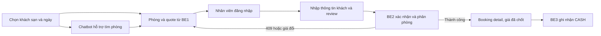

# Kế hoạch triển khai backend, chatbot và frontend

Ngày lập: 22/09/2026. Áp dụng cho source hiện tại: Spring Boot/Java 21, PostgreSQL 16, Keycloak, Redis và React/Vite. Đây là kế hoạch triển khai, chưa phải danh sách API đã tồn tại.

## Quyết định phạm vi

- Giữ nguyên tám script SQL và cấu trúc 44 bảng ở phiên bản đầu. Không sửa schema, trigger hoặc seed cho catalog, booking, inventory và pricing. Chỉ lập migration database cho thanh toán nếu chốt tích hợp cổng thanh toán ngoài.
- Backend và database là nguồn dữ liệu chính. Frontend và chatbot dùng DTO do backend công bố, không truy vấn database, không tự tính giá/VAT/tồn kho, không tự thêm trường chỉ phục vụ UI.
- MVP là **đặt phòng do nhân viên thực hiện**: chọn một phòng vật lý còn trống, tính lại giá và xác nhận booking trong cùng transaction. Booking được xác nhận trước khi thanh toán; không có trạng thái PENDING của booking trong schema. Không đưa flow giữ chỗ có TTL hoặc khách tự thanh toán online vào MVP vì schema hiện tại không lưu được từng lượt giữ độc lập và chưa có chốt idempotency của callback.
- Không sửa database nghĩa là một số giới hạn nghiệp vụ vẫn tồn tại. Ngày không có VAT hợp lệ thì backend từ chối báo giá/xác nhận; số phòng được bán không vượt số `room_instances` thực sự khả dụng; inclusions chỉ hiển thị menu cùng khách sạn. Việc nới các giới hạn này phải được quyết định như một yêu cầu mới, không âm thầm sửa dữ liệu.
- Kênh thanh toán MVP: ghi nhận **CASH** bởi nhân viên có quyền, tính số còn phải thu ở backend. Tích hợp VNPAY/MOMO/chuyển khoản tự xác nhận và refund được xếp sau khi chốt contract payment và migration riêng.
- **Nhân lực thực tế gồm đúng bốn người.** Ba người có backend là trọng tâm, đồng thời mỗi người tự triển khai frontend cho API mình sở hữu; người AI tự triển khai chat widget. Kế hoạch không ngầm giả định có người frontend thứ năm. Dành khoảng 70% năng lực mỗi người cho phần backend/AI cốt lõi và 30% cho frontend/integration; lịch giao việc phải tính cả phần này.

## Phân việc cho bốn người

| Người | Sở hữu backend/AI | Sở hữu frontend | Việc phải giao | Không sở hữu |
|---|---|---|---|---|
| Backend 1 — Catalog, pricing, inventory | `inventory`, `pricing`, `availability`; các API public đọc | F1: `pages/public`, `components/room`, service/type catalog–quote | Hotel/room type/feature/bed read model; báo giá theo ngày và số khách; tính availability từ phòng vật lý/slot; `PricingQuoteService` và `InventoryAllocationService` dùng trong transaction booking; UI tìm phòng; test giá, VAT, rule và cạnh tranh chọn phòng | Booking header, payment, chatbot, SecurityConfig |
| Backend 2 — Booking & guest | `booking`, `crm` | F2–F3: `pages/staff/bookings`, `components/booking`, service/type booking | API tạo/list/detail/hủy booking FIT một phòng; guest profile tối thiểu; điều phối transaction xác nhận: validate hotel/type → lấy quote mới → chọn/khóa phòng qua BE1 → ghi booking/detail/room/daily rate/slot → trả DTO; UI đặt và xem booking; check-in/check-out ở chặng sau; test rollback và không double-book | Engine giá, bảng payment, auth chung |
| Backend 3 — IAM & payment | `iam`, `payment`; `common/config/SecurityConfig` và error mapping chung | F4, auth, `App.tsx`, router, HTTP client, shared layout/UI primitives | Keycloak JWT role/scope mapping; phân quyền staff theo khách sạn; API GET payment và ghi nhận CASH idempotent theo booking lock; UI login/thu tiền; folio/tổng đã thu/còn phải thu; chuẩn bị phương án migration payment khi kết nối gateway; test auth và retry thanh toán | Sửa logic giá hoặc booking, tự tạo status booking mới |
| AI chatbot — ứng dụng AI | `assistant` hoặc `chatbot` backend adapter | F5: `components/chat`, service/type chat | FAQ từ nội dung đã duyệt; gọi **chỉ các API public** để tìm khách sạn, phòng và quote; chat widget; trả nguồn/ID hạng phòng và thời điểm báo giá; fallback khi API/model lỗi; giới hạn request, không ghi DB, không tự đặt phòng hay thu tiền; test câu hỏi ngoài phạm vi và giá thay đổi | Truy cập trực tiếp repository/DB, tạo booking, quyết định giá, lưu dữ liệu cá nhân vào prompt |

BE3 giữ các file frontend dùng chung (`App.tsx`, router, HTTP client và shared layout). BE1/BE2/người AI viết page/component/service thuộc slice của mình; BE3 gắn route/widget qua PR tích hợp. Không để bốn nhánh cùng sửa router hoặc `SecurityConfig`. Do BE3 có cả IAM, payment và shell frontend, công việc payment UI bắt đầu sau khi auth shell chạy được; nếu tiến độ căng, lùi invoice/refund/gateway, không cắt kiểm thử phân quyền hoặc idempotency.

## Điểm giao giữa các backend

| Giao diện nội bộ | Chủ sở hữu | Bên gọi | Điều kiện |
|---|---|---|---|
| `PricingQuoteService.quote(hotelRoomTypeId, dates, guests)` | BE1 | BE2, chatbot qua public API | Trả quote có breakdown, không ghi; lỗi rõ khi thiếu VAT/rule không xác định |
| `InventoryAllocationService.lockAssignableRoom(typeId, dates)` và `reserve(roomId, bookingRoomId, dates)` | BE1 | BE2 | Gọi trong transaction của BE2; khóa row `room_instances` được chọn kể cả khi chưa có slot, kiểm tra cùng khách sạn/hạng phòng và mọi đêm, rồi ghi slot; unique slot được xử lý như conflict 409 |
| `BookingReadService.getById(bookingId)`/`getBalanceBasis` | BE2 | BE3 | Không cho BE3 gọi thẳng BookingRepository; trả tổng snapshot và hotel scope |
| `StaffScopeService.requireHotelAccess(hotelId, permission)` | BE3 | BE1/BE2/BE3 | Dùng Keycloak subject + staff/role mapping; BE1 public read không cần staff scope |
| Public hotel/room/quote API | BE1 | Chatbot, frontend | Một nguồn thông tin về phòng và giá; chatbot không nhân bản logic |

`common` có một owner: BE3 quản lý security và exception mapping. Mọi người thống nhất error envelope trước khi sửa `ApiResponse`, `ErrorCode` hay `GlobalHandlerException`. Các lớp JPA dùng ID đúng kiểu SQL (`SMALLINT`, `INT`, `BIGINT`); không sao chép nguyên ví dụ skill vì tên cột/mapping trong skill không hoàn toàn khớp schema thực tế. `room_availability.version` chỉ có hiệu lực nếu dùng `@Version`/UPDATE có điều kiện; không xem sự hiện diện của cột là bằng chứng đã khóa đúng.

## Thiết kế frontend triển khai song song

Frontend hiện mới là trang placeholder; phần dưới là thiết kế route và trạng thái, không giả định API đã được viết. Phần UI được chia theo **vertical slice** để có thể nối với một backend module ngay khi module đó hoàn tất.

| Slice/frontend route | Người làm UI | Màn hình và component | API chủ | Bắt đầu song song khi nào |
|---|---|---|---|---|
| F1 `/hotels`, `/hotels/:hotelId/rooms` | BE1 | Danh sách khách sạn; bộ lọc ngày/khách; room card có sức chứa, giường/tiện ích, giá do server báo, số phòng còn; loading/empty/error | BE1 | Ngay sau khi contract GET hotel/room/quote được chốt; có thể dùng fixture DTO tạm |
| F2 `/staff/bookings/new` | BE2 | Form chọn hotel, ngày, một hạng phòng và khách; màn hình review quote; nút xác nhận gửi POST booking; sau POST hiển thị **giá cuối từ response**, không tự giữ quote cũ | BE1 + BE2 + BE3 auth | Dựng UI với fixture và trạng thái 409 ngay từ đầu; nối khi BE2 sẵn sàng |
| F3 `/staff/bookings`, `/staff/bookings/:id` | BE2 | Danh sách theo hotel/status, detail gồm phòng vật lý, ngày, giá chốt, trạng thái, action hủy; chỉ hiển thị action theo quyền | BE2 + BE3 auth | Song song với BE2; không lấy dữ liệu từ seed trực tiếp |
| F4 `/staff/bookings/:id/payment` | BE3 | Tổng phải thu/đã thu/còn lại từ backend; xác nhận CASH có trạng thái đang xử lý, retry giữ cùng idempotency key; kết quả thanh toán | BE3 | Thiết kế sớm, nối cuối MVP; chưa có giao diện gateway/refund |
| F5 Chat drawer trên màn hình public | AI | Gợi ý tìm phòng/FAQ; trích tên hotel/hạng phòng và liên kết tới trang room; cảnh báo giá có thể đổi khi xác nhận; trạng thái AI/API lỗi | AI + BE1 | Dựng widget mock sau khi thống nhất contract chatbot |

Trạng thái bắt buộc cho F1–F5: lần đầu tải, không có phòng, thông tin đầu vào sai, 401/403, 409 phòng vừa hết, giá thay đổi giữa quote và xác nhận, 5xx/retry và kết nối chậm. Trang staff chuyển tới login Keycloak khi chưa xác thực; 403 hiển thị không có quyền cho cơ sở đó. Không render nút thanh toán khi booking CANCELLED/NO_SHOW hoặc đã thanh toán đủ, nhưng backend vẫn kiểm tra lại.

UI chỉ định dạng tiền bằng `Intl.NumberFormat('vi-VN', { style: 'currency', currency: 'VND' })`; phép tính tiền luôn ở backend. Date gửi ISO `YYYY-MM-DD`, timestamp nhận kèm offset. `BIGINT` đi qua API dưới dạng chuỗi decimal để tránh mất chính xác trong JavaScript. Các field form chỉ gồm field mà SaveRequest đã chốt trong contract; số tiền, VAT, booking number, room instance phân, payment status và booking status do server quyết định.

Khung giao diện desktop: trang public có header → bộ lọc hotel/ngày/khách → danh sách room card → chat drawer ở cạnh phải; trang staff có sidebar → hotel đang thao tác → danh sách/biểu mẫu/detail → panel tổng tiền và hành động. Trên màn hình nhỏ, bộ lọc thành panel mở rộng, card xếp một cột, sidebar thu gọn và chat drawer phủ màn hình. Booking form có bước review trước POST; sau khi backend trả 201, chuyển sang detail và hiển thị tổng tiền trong response. Nếu backend trả 409, giữ dữ liệu khách đã nhập, tải lại quote và yêu cầu xác nhận lại; không lặng lẽ gửi lại booking.

Hướng thư mục frontend sau khi bắt đầu code: `pages/public`, `pages/staff`, `components/booking`, `components/room`, `components/chat`, `services`, `types`, `hooks`, `lib`. Mỗi `service` gọi API, component không gọi fetch trực tiếp. Router và thư viện form chỉ thêm khi bắt đầu triển khai; không thêm dependency chỉ để khớp ví dụ trong skill. Mock fixture phải tuân theo DTO ở [contract](api-frontend-contract-v1.md), bỏ fixture khi nối API.

### Luồng màn hình MVP

## Nhịp triển khai để tránh chờ nhau

| Mốc | Backend 1 + F1 | Backend 2 + F2/F3 | Backend 3 + F4/shell | AI chatbot + F5 |
|---|---|---|---|---|
| Ngày 1–2: contract | Chốt GET/quote, interface inventory, type F1 | Chốt SaveRequest, transaction/response, form F2 | Chốt auth/payment/error, shell/router và UI quy ước chung | Chốt chat request/response và tool cho public API, widget F5 |
| Đợt 1 | Hotel/room/quote, test, UI F1 với fixture | Guest/booking skeleton, mock BE1 interface, UI F2/F3 với fixture | JWT staff scope, auth shell, GET payment, UI F4 với fixture | FAQ/adapter và widget mock |
| Đợt 2 | Reserve/availability concurrency, nối F1 | POST/cancel/list/detail booking, integration test, nối F2/F3 | CASH idempotent/folio, phân quyền, nối F4, gắn routes | Tích hợp public room/quote tool, nối F5, test guardrails |
| Hợp nhất | Test multi-night và thiếu VAT | Test rollback và double booking | Test retry payment/role/scope | Test giá lấy từ API, model fail; cả nhóm chạy E2E tìm → đặt → xem → trả CASH, responsive/accessibility |

Mỗi nhánh giao OpenAPI/DTO, test và ví dụ response trước khi frontend xóa fixture. Thay đổi contract sau mốc 1 phải đi cùng PR cập nhật backend và frontend types. Không merge branch chỉ vì build xanh: demo end-to-end trên database thật cần chứng minh giá chốt, phòng vật lý và số còn phải thu cùng một booking.

## Tiêu chí nghiệm thu tối thiểu

- Tìm kiếm chỉ trả phòng có `room_instances` đủ ngày và đúng khách sạn/hạng. Hai yêu cầu đặt cùng phòng/đêm: một thành công, một trả 409 hoặc được phân phòng khác; không có hai `room_slots` cho cùng phòng/ngày.
- Booking tạo xong có detail, assigned room, daily rate snapshot và slot tương ứng; lỗi ở bất kỳ bước nào rollback toàn transaction. Hủy booking giải phóng slot và không xóa lịch sử booking. Retry cùng booking `Idempotency-Key` không tạo booking thứ hai; key cũ với payload khác trả 409.
- Staff không được đọc/sửa booking hoặc payment ở khách sạn ngoài scope dù gọi API trực tiếp. Lỗi DB ngoài dự kiến trả 500; conflict booking/payment trả 409 với error code ổn định.
- Ghi nhận CASH cùng idempotency key lặp lại không tạo hai payment/transaction; tổng thu không vượt tổng cần thu. Test ở backend và qua UI double-click/retry.
- Chatbot trả lời giá/tồn kho chỉ từ public API, không đưa thông tin khách hay token vào prompt, không gọi API ghi, và có câu trả lời rõ khi không có quote hợp lệ.
- Frontend lấy final amount/status từ response sau booking/payment; không đưa quote cũ hoặc phép tính client vào kết quả cuối.

## Giới hạn cần ghi trên backlog

Schema hiện tại không thể mô tả từng lượt giữ phòng độc lập, nên chưa hứa flow reserve-before-payment. `total_quantity` seed (117) khác số phòng vật lý seed (23); MVP chỉ bán số phòng vật lý. VAT ROOM seed kết thúc 31/12/2026; ngày không có rule hợp lệ phải được báo là chưa thể báo giá, không tự mặc định thuế. Inclusions seed có liên kết menu khác cơ sở; API cần lọc cùng hotel và không dùng số dòng đó để tính quyền lợi trước khi dữ liệu được rà soát. `booking_daily_rates` chưa UNIQUE theo phòng/ngày; service kiểm tra và test duplicate trong phạm vi MVP, nhưng DB vẫn không ngăn một tiến trình khác ghi sai. Các giới hạn này là hệ quả của quyết định giữ schema, cần được chấp nhận trong phạm vi MVP.
