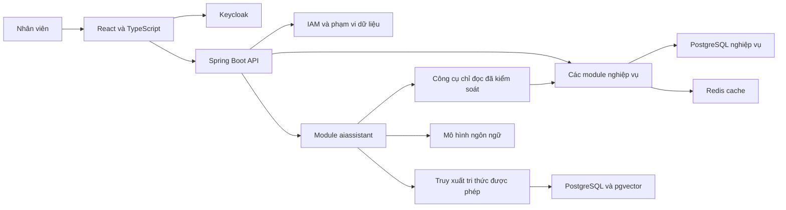

# Kế hoạch phân công nhóm 5 người xây dựng hệ thống quản lý chuỗi khách sạn tích hợp chatbot RAG

Ngày lập kế hoạch: 24/09/2026.

**Đề xuất:** xây dựng bản MVP phục vụ vận hành nội bộ chuỗi khách sạn trong 12 tuần, với đúng 2 người backend, 1 người chatbot AI, 1 người frontend và 1 người kiểm thử. Backend dùng Spring Boot theo kiến trúc modular monolith; chatbot dùng Java và Spring AI trong module riêng, kết hợp PostgreSQL và pgvector. Trọng tâm nghiệm thu là một quy trình vận hành hoàn chỉnh, phân quyền đúng cơ sở, không bán vượt phòng và chatbot trả lời có căn cứ.

Thời gian 12 tuần và mức tham gia 15–20 giờ/người/tuần là **giả định lập kế hoạch**, chưa phải thời hạn đã được nhóm xác nhận. Các tiêu chí hiệu năng, chất lượng RAG và quy mô dữ liệu dưới đây là mục tiêu kiểm thử đề xuất, chưa phải kết quả đã đạt.

## 1. Căn cứ và cách sử dụng tài liệu

### 1.1. Những gì kế thừa từ báo cáo

Nguồn nghiệp vụ chính là [báo cáo Project 1](<E:/Downloads/baoCaoProject1 (3).docx>), đặc biệt các phần 1.1, 1.3, 1.4, 1.5 và các kịch bản ở Chương 2. Báo cáo đã xác định:

- Hệ thống thuộc một tổ chức vận hành nhiều khách sạn, phân cấp chuỗi → vùng → cơ sở → bộ phận.
- Nhóm nghiệp vụ gồm tổ chức, IAM, tồn phòng, đặt phòng, định giá, lễ tân, khách lưu trú, buồng phòng, tài chính, báo cáo và AI.
- Phải chống overbooking, chống xử lý thanh toán lặp, lưu bản chốt giá và giới hạn dữ liệu theo phạm vi quản lý.
- AI dùng tri thức tĩnh cho chính sách, còn giá và phòng trống phải lấy từ API nghiệp vụ.
- Không xây dựng sàn OTA/marketplace; không thay thế ERP/HRM toàn diện.

Nội dung báo cáo được dùng làm **đầu vào phân tích**, không được coi là lệnh triển khai toàn bộ chức năng hoặc bằng chứng chức năng đã hoàn thành. Kế hoạch này thu hẹp và chia giai đoạn theo yêu cầu mới về nhóm 5 người. Không suy đoán tên người phụ trách từ danh sách tác giả báo cáo; dùng mã BE1, BE2, AI, FE, QA để nhóm tự điền tên. Người gửi yêu cầu đảm nhận vai trò AI.

### 1.2. Hiện trạng repository đã đối chiếu

| Hạng mục | Quan sát từ tệp hiện có | Ý nghĩa đối với kế hoạch |
|---|---|---|
| Backend | [README](../README.md) và [pom.xml](../backend/pom.xml) ghi Java 21, Spring Boot 4.0.7; mã Java hiện chủ yếu là lớp khởi động và nền tảng `common` | Tái sử dụng nền tảng; không coi các module nghiệp vụ mô tả trong README là đã chạy hoàn chỉnh |
| Frontend | [package.json](../frontend/package.json) có React, TypeScript, Vite, Tailwind; `App.tsx` hiện là màn hình khởi tạo | Cần lập lịch xây dựng giao diện từ nền tảng hiện có, không ước lượng như chỉ còn nối API |
| Database | Có SQL cho tổ chức, nhân sự, phòng, tồn phòng, giá, booking và thanh toán | Kiểm tra schema và quy tắc hiện có trước khi bổ sung migration; không tạo lại mô hình từ đầu |
| Bảo mật | Có Spring Security Resource Server; cấu hình hiện ghi chú phần ánh xạ role sẽ bổ sung | Xác thực JWT chưa đủ để chứng minh phân quyền theo vai trò và khách sạn |
| Tài liệu khác | Có bản kế hoạch cũ trong `document/` mô tả nhóm 4 người và ràng buộc riêng | Không dùng phân công cũ để thay thế yêu cầu 5 người hiện tại; giữ nguyên các tệp đó |

Việc đối chiếu trên là đọc mã và cấu hình, chưa bao gồm chạy ứng dụng hay kiểm chứng toàn bộ SQL. Chưa tìm thấy DTO nghiệp vụ SaveRequest trong phần mã đã kiểm tra. Vì vậy, các nhóm API và dữ liệu trong kế hoạch là **hạng mục phải thiết kế**, không phải contract đang tồn tại. FE và chatbot chỉ dùng trường đã được backend thống nhất, có trong OpenAPI và phục vụ nghiệp vụ lưu trữ hoặc phản hồi thực tế.

Chỉ dẫn crawler JavaFX/Java 17/MySQL trong ngữ cảnh ban đầu thuộc bài toán khác với yêu cầu web khách sạn hiện tại. Kế hoạch áp dụng stack khách sạn được yêu cầu ở lượt này; giữ nguyên nền Java 21 đã có trong repository làm phương án đề xuất. Không thay JDK, sửa mã, chuyển nhánh hay áp dụng pipeline Selenium vào hệ thống khách sạn trong tác vụ lập kế hoạch này.

### 1.3. Các điểm phải thống nhất trong tuần 1

| Điểm chưa nhất quán | Căn cứ trong báo cáo | Cách xử lý đề xuất |
|---|---|---|
| Thời hạn giữ phòng | FR-RES-02 ghi 15 phút; NFR-REL-01 lấy ví dụ 10 phút | Dùng 15 phút làm cấu hình demo; một cấu hình chung cho backend, giao diện và test |
| Mã yêu cầu bị lặp | FR-GRP-01 và FR-GRP-05 xuất hiện lặp | QA lập bảng ánh xạ mã cũ sang mã duy nhất; giữ tên chức năng để truy vết |
| Phạm vi tìm kiếm | FR-SRCH-02 không lọc số người ở baseline; FR-AI-01 có số khách | MVP tìm theo cơ sở, ngày ở, hạng phòng; số khách được kiểm tra khi báo giá và xác nhận, không để AI tự suy ra khả năng đáp ứng |
| Nhầm trạng thái | Một số kịch bản dùng trạng thái booking để thể hiện lưu trú | Tách trạng thái đặt phòng, lưu trú, thanh toán, vệ sinh và khả năng bán |
| Cọc 50%, ngưỡng đoàn 6 phòng, mức phạt hủy | Báo cáo đưa ra bộ quy tắc demo | Coi là chính sách kinh doanh có phiên bản; không trình bày như quy định pháp luật áp dụng chung |
| Java 17 trong chỉ dẫn crawler và Java 21 trong repository | Hai ngữ cảnh công nghệ khác nhau | Ghi nhận khác biệt; kế hoạch khách sạn dựa trên cấu hình hiện có, không tự hạ phiên bản |

## 2. Định nghĩa sản phẩm và phạm vi bàn giao

### 2.1. Sản phẩm cần chứng minh

Một hệ thống nội bộ cho **một chuỗi khách sạn**, có nhiều vùng và cơ sở, dùng dữ liệu demo của ít nhất 3 khách sạn thuộc 2 vùng. Đây là số lượng phục vụ kiểm thử phân quyền, không phải giới hạn cứng của thiết kế. A25 và Mường Thanh là đối tượng tham khảo nghiệp vụ công khai, không phải khách hàng đã xác nhận yêu cầu cho dự án.

Người dùng chính là lễ tân, buồng phòng, quản lý cơ sở, quản lý vùng/chuỗi, kế toán và quản trị hệ thống. MVP ưu tiên chatbot dành cho nhân viên đã đăng nhập: tra cứu chính sách, quy trình vận hành, tiện ích và hỗ trợ tìm phòng/báo giá trong phạm vi được phép. Chatbot công khai cho khách cùng cổng đặt phòng trực tuyến được đưa vào giai đoạn mở rộng; đây là điều chỉnh rõ ràng so với phạm vi rộng của báo cáo.

### 2.2. Phạm vi P0 bắt buộc trong 12 tuần

| Nhóm chức năng | Phạm vi MVP | Giới hạn để bảo đảm khả thi |
|---|---|---|
| Tổ chức và phân quyền | Chuỗi, vùng, khách sạn; role, permission, scope; dữ liệu mẫu đa cơ sở | Cấu hình tổ chức và tài khoản ban đầu bằng seed/Keycloak; chưa xây bộ giao diện IAM đầy đủ |
| Danh mục phòng | Hạng phòng, phòng vật lý, tiện ích cơ bản; cấu hình theo cơ sở | Một bộ biểu mẫu dùng lại, chưa làm quản lý tài sản chi tiết |
| Tồn phòng | Khả dụng theo từng đêm; giữ chỗ có hạn; chống bán vượt; chống gán trùng; khóa phòng bảo trì | Theo đêm, không triển khai thuê theo giờ hoặc chu kỳ 24 giờ trượt |
| Giá và chính sách | Giá theo cơ sở/hạng phòng/ngày; phụ thu cơ bản; thuế theo nhóm và hiệu lực; bản chốt giá | Chưa làm tối ưu giá bằng AI, nhiều ưu đãi cộng dồn hoặc hợp đồng giá doanh nghiệp |
| Đặt phòng | Lễ tân tìm phòng → báo giá → giữ chỗ → xác nhận; hủy theo chính sách; xử lý no-show có kiểm soát | Một booking một phòng, có thể nhiều khách; đặt nhiều phòng và khách đoàn chuyển P1 |
| Lễ tân và khách lưu trú | Booker tách guest; gán phòng; check-in; check-out; thông tin khách tối thiểu | Nhập thông tin thủ công; chưa OCR, VNeID hoặc tích hợp khóa từ |
| Buồng phòng | Dirty → Cleaning → Ready; chỉ hiện dữ liệu công việc cần thiết | Phòng bảo trì được khóa bán; chưa có hệ thống phiếu kỹ thuật nhiều cấp |
| Folio và thu tiền | Bảng kê phòng/dịch vụ, ghi nhận thu tiền tại quầy, số dư, nhật ký điều chỉnh | Không thu tiền thật qua cổng online; không phát hành hóa đơn điện tử chính thức |
| Lưu trú | Hàng chờ, cảnh báo hạn, kiểm tra dữ liệu, xuất danh sách, nhân viên ghi nhận kết quả nộp | Không tự nhận là đã kết nối API Bộ Công an; xuất tệp không đồng nghĩa đã khai báo thành công |
| Báo cáo | Công suất phòng, doanh thu phòng theo kỳ/cơ sở, tổng hợp vùng/chuỗi | Báo cáo quản trị cơ bản; chưa phải báo cáo tài chính hay sổ kế toán pháp định |
| Chatbot RAG | Tri thức đã duyệt, nguồn trích dẫn, lọc phạm vi, công cụ chỉ đọc giá/phòng trống, chuyển nhân viên | Không tự tạo booking, giữ phòng, thu tiền, hoàn tiền; không truy cập hồ sơ khách qua chat trong P0 |
| Vận hành kỹ thuật | Docker Compose, migration có phiên bản, log có mã truy vết, sao lưu/khôi phục thử | Môi trường demo/staging; chưa cam kết SLA production hoặc triển khai dự phòng đa vùng |

**Kịch bản nghiệm thu xuyên suốt:** quản lý cấu hình giá → lễ tân A tạo booking → thu tiền/cọc tại quầy → gán phòng Ready → check-in → ghi dịch vụ → quyết toán và check-out → phòng chuyển Dirty → buồng phòng chuyển Ready → báo cáo cập nhật. Song song, chatbot giải thích chính sách kèm nguồn và lấy giá/phòng trống cùng nguồn nghiệp vụ với màn hình lễ tân. Tài khoản của cơ sở B không truy cập được dữ liệu riêng của A.

### 2.3. Phạm vi P1 và P2

| Ưu tiên | Hạng mục | Điều kiện bắt đầu |
|---|---|---|
| P1 | Booking nhiều phòng, đổi phòng, gợi ý cơ sở thay thế, ADR/RevPAR, UI quản trị giá/IAM đầy đủ | P0 đạt kiểm thử nghiệp vụ và phân quyền; có ước lượng bổ sung |
| P1 | Cổng đặt phòng của chuỗi, chatbot cho khách, tra cứu booking sau xác minh | Tách kho tri thức công khai/nội bộ; có contract xác thực khách |
| P1 | Khách đoàn, Room Block, Rooming List, Master Folio, cọc theo hợp đồng | Hoàn thiện tồn phòng/booking nhiều phòng; dành một đợt triển khai riêng |
| P1 | Cổng thanh toán sandbox, callback, hoàn tiền có phê duyệt, hóa đơn điện tử sandbox | Có tài khoản nhà cung cấp, contract, test idempotency và đối soát |
| P2 | Night Audit đầy đủ, chốt ca, công nợ doanh nghiệp, order F&B/giặt là, phiếu bảo trì | Nghiệp vụ kế toán/vận hành được mô tả và thẩm định riêng |
| P2 | Dự báo nhu cầu, gợi ý giá, OCR, kết nối cơ quan nhà nước thực tế | Có dữ liệu, quyền tích hợp, ngân sách và đánh giá bảo mật |

Không đưa ERP/HRM, channel manager hai chiều, marketplace, phần cứng khóa từ và quản lý tài sản chuyên sâu vào phạm vi cam kết. Nếu thời gian giảm xuống 8 tuần, giảm chức năng mở rộng và số màn hình cấu hình trước; không cắt chống overbooking, kiểm soát quyền hoặc kiểm thử RAG.

### 2.4. Ánh xạ với báo cáo

| Nhóm yêu cầu gốc | Cách xử lý trong kế hoạch |
|---|---|
| FR-ORG, FR-IAM | P0 giữ phân cấp và kiểm tra quyền server-side; UI quản trị nâng cao và phê duyệt theo hạn mức chuyển P1 |
| FR-SRCH, FR-RES | P0 dùng cho nhân viên và booking một phòng; nhiều phòng, đặt trực tuyến, gợi ý thay thế chuyển P1 |
| FR-INV | P0 giữ phân biệt hạng phòng/phòng vật lý, tồn theo ngày và OOO; đổi phòng chuyển P1 |
| FR-PRC, FR-BIL, FR-PAY | P0 có giá chuẩn, bản chốt, folio, thu tiền tại quầy; callback, hoàn tiền tự động và hóa đơn pháp định chuyển P1 |
| FR-FD, FR-GST, FR-HK | P0 có nhận/trả phòng, dữ liệu lưu trú tối thiểu và vệ sinh; quy trình ngoại lệ chuyên sâu chuyển P1 |
| FR-RPT, FR-AUD, FR-NOT | P0 báo cáo cơ bản, audit và thông báo trong ứng dụng; KPI nâng cao, Night Audit, email/SMS chuyển giai đoạn sau |
| FR-GRP | Toàn bộ workflow đoàn chuyển P1; chưa đánh dấu hoàn thành khi P0 kết thúc |
| FR-AI-01, 02, 03, 07, 08 | P0 thực hiện trong ngữ cảnh nhân viên; chuyển tiếp bằng liên hệ/ticket, chưa cần live chat |
| FR-AI-04, 05, 06 | P0 chủ động không cấp công cụ ghi hoặc tra cứu dữ liệu cá nhân; triển khai các luồng này ở P1 |
| NFR-COR, REL, FIN, SEC, PRV, AUD, AI | Giữ các nguyên tắc toàn vẹn, phân quyền và bám nguồn ngay từ P0; đo bằng bộ test đã thống nhất |

## 3. Kiến trúc và công nghệ

### 3.1. Kiến trúc đề xuất

Hai khối PostgreSQL trong sơ đồ có thể dùng chung một instance, tách schema hoặc bảng và quyền truy cập theo trách nhiệm. Đây không phải đề xuất bổ sung một hệ quản trị dữ liệu độc lập.

Backend chia package theo chức năng. Module chỉ gọi public service của module khác; không truy cập repository chéo. Frontend tổ chức theo feature, dùng chung layout, biểu mẫu và API client. PostgreSQL lưu dữ liệu nghiệp vụ bền vững; Redis chỉ phục vụ cache và trạng thái ngắn hạn có thể khôi phục.

**Lý do:** quy mô 5 người phù hợp với một ứng dụng backend có ranh giới module rõ ràng. Cách này giảm chi phí triển khai, chia sẻ transaction cho booking/tồn phòng/thanh toán và tái sử dụng IAM cho chatbot. **Đánh đổi:** chatbot và nghiệp vụ dùng chung tiến trình, nên cần giới hạn tài nguyên, timeout và hàng đợi ingest để không chặn thao tác lễ tân. Việc tách dịch vụ chỉ xem xét khi có số liệu tải hoặc nhu cầu ML riêng.

### 3.2. Stack và quyết định kỹ thuật

| Thành phần | Đề xuất | Lý do và giới hạn |
|---|---|---|
| Backend | Java theo cấu hình hiện có, Spring Boot, JPA, MapStruct, SpringDoc, Maven | Tái sử dụng repository; không nâng/hạ dependency hàng loạt trong đợt lập kế hoạch |
| Chatbot | Java + Spring AI, package `aiassistant` | Cùng ngôn ngữ với backend; gọi public service có kiểm soát; hỗ trợ RAG và metadata filter |
| Vector search | pgvector trong PostgreSQL | Tận dụng database hiện có; kho demo chưa cần thêm vector database riêng |
| Frontend | React + TypeScript + Vite + Tailwind CSS | Giữ stack yêu cầu; chọn một bộ component và dùng lại cho các màn hình |
| Form và dữ liệu FE | Đề xuất React Hook Form + Zod và TanStack Query | Giảm mã form/loading/cache lặp; đây là thư viện cần bổ sung, chưa coi là đã cài |
| IAM | Keycloak + Spring Security + quyền/phạm vi tại backend | Keycloak quản lý danh tính; backend quyết định quyền trên dữ liệu cụ thể |
| Cache | Redis | Cache danh mục và rate limit; không dùng TTL Redis làm bằng chứng giữ phòng còn hiệu lực |
| Migration | Flyway với baseline từ schema hiện có | SQL khởi tạo Docker không tự nâng cấp volume cũ; migration phải kiểm tra cả DB mới và DB có dữ liệu |
| Đóng gói | Docker Compose | Đủ cho phát triển, kiểm thử, demo; cấu hình healthcheck và secret qua môi trường |
| Kiểm thử | JUnit 5, Testcontainers, API collection, Playwright, k6 | Kiểm tra PostgreSQL/Redis thật trong integration test và hành vi trình duyệt; k6 dùng cho tải có mục tiêu |

Spring AI có cơ chế RAG với bộ lọc metadata; pgvector hỗ trợ tìm kiếm vector trong PostgreSQL. Đây là căn cứ kỹ thuật cho lựa chọn trên. [Spring AI RAG](https://docs.spring.io/spring-ai/reference/api/retrieval-augmented-generation.html), [pgvector](https://github.com/pgvector/pgvector).

Tài liệu Spring AI hiện công bố nhánh 2.0.x hỗ trợ Spring Boot 4.0.x và 4.1.x. AI và BE1 cần thử dependency trên `pom.xml` thực tế trong tuần 1, sau đó khóa phiên bản BOM; không lấy ví dụ Spring AI 1.x rồi mặc định tương thích với Boot 4.0.7. [Spring AI Getting Started](https://docs.spring.io/spring-ai/reference/getting-started.html).

### 3.3. Vì sao chọn Java cho phần AI

| Phương án | Điểm phù hợp | Chi phí đối với nhóm | Kết luận |
|---|---|---|---|
| Java + Spring AI trong backend | RAG, công cụ nghiệp vụ, bảo mật và kiểm thử dùng chung nền Spring | Cần học embedding, retrieval, đánh giá và quản lý tri thức | **Chọn cho MVP** |
| Python + FastAPI riêng | Hợp khi có huấn luyện mô hình, xử lý dữ liệu hoặc thử nghiệm ML chuyên sâu | Thêm deployment, service authentication, contract liên dịch vụ và theo dõi lỗi mạng | Dành cho nhu cầu ML sau này; RAG hiện tại chưa cần tách service |

Việc lựa chọn Java không làm phần AI thành một nhiệm vụ backend phụ. Người AI sở hữu toàn bộ vòng đời tri thức, retrieval, prompt, công cụ, đánh giá, độ trễ và chi phí; hai người backend vẫn chịu trách nhiệm riêng về nghiệp vụ khách sạn.

## 4. Phân công cụ thể cho 5 người

### 4.1. Quyền sở hữu và người review

| Mã | Vai trò | Phạm vi chịu trách nhiệm chính | Người phối hợp/review |
|---|---|---|---|
| BE1 | Backend nền tảng và tài nguyên | Organization, IAM, property, inventory, housekeeping; nền audit, migration, Docker/CI backend | BE2 review transaction/contract; QA kiểm tra scope và cạnh tranh |
| BE2 | Backend giao dịch | Pricing, reservation, customer, frontdesk, billing/payment tại quầy, báo cáo cơ bản | BE1 review quyền, tồn phòng và migration; QA đối soát tiền |
| AI | Chatbot RAG — người gửi yêu cầu | `aiassistant`, kho tri thức, ingest, retrieval, công cụ chỉ đọc, đánh giá AI | BE1 review bảo mật; BE2 review giá; QA chấm bộ câu hỏi độc lập |
| FE | Frontend | Toàn bộ giao diện, routing, đăng nhập, API client, form, bảng/sơ đồ phòng, chat widget | Chủ API hỗ trợ contract; QA kiểm tra luồng và hiển thị |
| QA | Tester | Phân tích AC, test plan, dữ liệu test, API/E2E, test tải, phân quyền, đánh giá RAG và báo cáo lỗi | Toàn nhóm sửa lỗi; QA không phải người viết thay unit test của lập trình viên |

BE1 điều phối tích hợp kỹ thuật, QA theo dõi điều kiện nghiệm thu. Mỗi thành viên viết phần báo cáo thuộc công việc của mình; FE và QA tổng hợp hình minh họa và kết quả kiểm thử. Không mặc định thêm người DevOps, BA hay designer ngoài nhóm.

### 4.2. Backend 1

| Mã việc | Công việc | Đầu ra và điều kiện hoàn thành |
|---|---|---|
| B1-01 | Rà soát nền tảng, schema, migration, Docker và CI | Một cách dựng môi trường lặp lại được; migration không xóa dữ liệu hiện có; mẫu API/error chung |
| B1-02 | Keycloak, role/permission/scope | JWT được kiểm tra; backend chặn truy cập khác cơ sở; scope không lấy nguyên từ giá trị FE gửi |
| B1-03 | Tổ chức, danh mục và phòng vật lý | API đủ cho FE; seed 3 cơ sở/2 vùng; phân biệt hạng phòng chung và cấu hình tại cơ sở |
| B1-04 | Tồn phòng, giữ quỹ phòng và gán phòng | Public service cho BE2; transaction và ràng buộc bảo vệ tồn; test phòng cuối và khoảng thời gian trùng |
| B1-05 | Buồng phòng và khóa bán bảo trì | Check-out tạo trạng thái Dirty; chỉ luồng hợp lệ chuyển Ready; không gán phòng chưa sẵn sàng |
| B1-06 | Audit, sao lưu, hỗ trợ tích hợp | Hành động nhạy cảm có actor/scope/reference; khôi phục DB thử thành công; lỗi AI không làm sập API nghiệp vụ |

BE1 là owner cơ chế tồn phòng; BE2 chỉ sử dụng service công khai, không tự cập nhật `room_availability` hay `room_slots` từ module reservation.

### 4.3. Backend 2

| Mã việc | Công việc | Đầu ra và điều kiện hoàn thành |
|---|---|---|
| B2-01 | Xác nhận quy tắc giá/thuế/phí; kiểm tra engine SQL hiện có | Bảng quyết định và ví dụ tính tay; chọn một nơi tính giá chuẩn, tránh tính lặp ở Java và SQL |
| B2-02 | Quote và bản chốt giá | Cùng yêu cầu cho cùng kết quả tại lễ tân/chatbot; thay giá mới không sửa giao dịch đã chốt |
| B2-03 | Booking, hold, xác nhận, hủy, no-show | State transition có kiểm soát; hết hạn/nhấn lại không tăng tồn hai lần; timeout trả lỗi có thể xử lý |
| B2-04 | Booker/guest, nhận và trả phòng | Kiểm tra phòng Ready, định danh tối thiểu và điều kiện thanh toán; không trả phòng khi còn số dư chưa được xử lý |
| B2-05 | Folio và payment tại quầy | Ghi thu có idempotency; tiền dùng `BigDecimal`/`NUMERIC`; điều chỉnh bằng bản ghi bổ sung, không sửa lịch sử âm thầm |
| B2-06 | Hàng chờ lưu trú và báo cáo tối thiểu | Xuất theo quyền; ghi nhận trạng thái nộp; công suất và doanh thu đối chiếu được với dữ liệu gốc |

BE2 là owner số liệu giá và tiền. FE/AI chỉ hiển thị breakdown từ backend. Giao dịch hoàn tiền tự động, hóa đơn điện tử và Night Audit không nằm trong tải P0 của BE2.

### 4.4. Người AI

| Mã việc | Công việc | Đầu ra và điều kiện hoàn thành |
|---|---|---|
| AI-01 | Thử Java/Spring AI/pgvector và abstraction nhà cung cấp | Một luồng hỏi đáp chạy được; phiên bản được khóa; key ở môi trường; đo độ trễ/chi phí mẫu |
| AI-02 | Chuẩn hóa kho tri thức | Tối thiểu 30 tài liệu hoặc mục chính sách ngắn đã duyệt, phủ 3 cơ sở; có nguồn, phạm vi, phiên bản và hiệu lực |
| AI-03 | Ingest và retrieval | Nạp → làm sạch → chia đoạn → embedding → index; ingest lại không nhân đôi; gỡ tài liệu có hiệu lực ngay khi truy vấn |
| AI-04 | Trả lời có căn cứ | Có trích dẫn đúng đoạn; không đủ căn cứ thì báo thiếu thông tin; phân biệt chính sách toàn chuỗi và cơ sở |
| AI-05 | Công cụ giá/phòng trống | Chỉ gọi public service đã cho phép; server kiểm tra scope và tham số; API lỗi thì không đoán dữ liệu |
| AI-06 | Chat API và chuyển nhân viên | FE tích hợp được; giới hạn request, timeout, chiều dài hội thoại; ghi trace đã che dữ liệu nhạy cảm |
| AI-07 | Đánh giá và bàn giao | Báo cáo trước/sau điều chỉnh retrieval; bộ test phiên bản hóa; hướng dẫn thêm/sửa/gỡ tri thức và đổi mô hình |

Người AI cung cấp dữ liệu phản hồi và quy tắc hiển thị trích dẫn; FE sở hữu chat widget. AI tự viết test module AI, QA giữ bộ câu hỏi nghiệm thu độc lập. Chi tiết thực hiện ở mục 7.

### 4.5. Frontend

| Mã việc | Công việc | Đầu ra và điều kiện hoàn thành |
|---|---|---|
| F-01 | Layout, routing, đăng nhập Keycloak, API client | Đăng nhập/đăng xuất, trạng thái hết phiên, chọn cơ sở theo quyền, xử lý lỗi chung |
| F-02 | Danh mục phòng và tình trạng phòng | Bộ table/form tái sử dụng; phân biệt trạng thái vệ sinh, đang ở và khóa bán |
| F-03 | Luồng booking và hồ sơ khách | Tìm → quote → giữ → xác nhận; hiển thị breakdown, thời hạn giữ; không tạo trùng khi bấm lại |
| F-04 | Check-in, folio, thu tiền và check-out | Form hợp lệ, thông báo lỗi rõ; tiền hiển thị theo backend; thao tác nhạy cảm cần xác nhận |
| F-05 | Buồng phòng, lưu trú, dashboard | Dùng được trên màn hình nhỏ; lọc đúng cơ sở; xuất dữ liệu có quyền |
| F-06 | Chat widget và ổn định giao diện | Trích dẫn mở đúng nguồn theo quyền, hiển thị thời điểm quote, trạng thái chờ/lỗi/chuyển nhân viên |

Giới hạn khoảng **9 nhóm màn hình**: đăng nhập/layout; danh mục; tình trạng phòng; booking; check-in/hồ sơ; folio/check-out; buồng phòng; lưu trú/báo cáo; chat. Dùng tab/modal và component chung, tránh tạo một giao diện quản trị riêng cho mọi bảng database. UI cấu hình giá/IAM phức tạp được seed hoặc thao tác qua công cụ quản trị có quyền ở P0.

### 4.6. Tester

| Mã việc | Công việc | Đầu ra và điều kiện hoàn thành |
|---|---|---|
| Q-01 | Chuẩn hóa FR, AC và phạm vi | Ma trận yêu cầu → task → test; đánh dấu rõ P0/P1; xử lý mã FR trùng |
| Q-02 | Dữ liệu và test API | Tài khoản nhiều vai trò/cơ sở; khách và giấy tờ giả lập; test ngày biên, thiếu dữ liệu, scope sai |
| Q-03 | Kiểm thử tồn phòng và tiền | Phòng cuối, hết hạn giữ, retry, hủy, thu tiền lặp, snapshot giá và làm tròn |
| Q-04 | E2E và trải nghiệm | Luồng lễ tân, buồng phòng, lỗi API, hết phiên, màn hình nhỏ; chạy tự động các luồng trọng yếu |
| Q-05 | RAG và bảo mật | Bộ câu hỏi 100 ca; chấm nguồn, đáp án, quyền, dữ liệu hết hiệu lực và prompt injection |
| Q-06 | UAT, tải, khôi phục và nghiệm thu | Biên bản kết quả có bằng chứng; danh sách lỗi theo mức độ; báo cáo phần chưa hoàn thành |

QA làm từ tuần 1. Mỗi lập trình viên sửa lỗi trong module sở hữu và viết unit/integration test trước khi chuyển QA. Không để tester chờ tới cuối dự án mới bắt đầu.

## 5. Tiến độ 12 tuần và phụ thuộc

Mỗi sprint dài 2 tuần. Chốt scope đầu sprint, demo cuối sprint; mỗi tuần có một buổi tích hợp 30 phút. Task nên đủ nhỏ để hoàn thành trong 1–2 ngày làm việc của thành viên, có đầu ra và test rõ.

| Sprint | BE1 | BE2 | AI | FE | QA | Mốc phải đạt |
|---|---|---|---|---|---|---|
| S1 — tuần 1–2 | Môi trường, migration baseline, IAM mẫu, seed tổ chức | Quy tắc giá/booking, rà schema, draft API | Spike Spring AI/pgvector, tài liệu mẫu, contract chat | Layout, đăng nhập, mock API, component chung | Traceability, AC, dữ liệu test, smoke test | **M1:** dựng môi trường được; đăng nhập; chốt scope/API v1 và rủi ro schema |
| S2 — tuần 3–4 | Catalog, room, availability; service tồn phòng đầu tiên | Pricing/quote, snapshot; khung reservation | Ingest và FAQ RAG, nguồn và bộ lọc phạm vi | Danh mục, tìm phòng, quote bằng API thật | Test catalog, scope, giá; bộ câu hỏi AI đầu tiên | **M2:** lễ tân và chatbot mẫu cùng đọc được dữ liệu đã xác thực |
| S3 — tuần 5–6 | Khóa tồn, gán phòng, audit nền; hỗ trợ transaction | Hold, xác nhận/hủy, cash payment có idempotency | Công cụ chỉ đọc với mock rồi API thật; trace/fallback | Booking, hold, xác nhận, bảng kê/thu tiền | Test phòng cuối, retry, hết hạn và tiền | **M3:** một booking chạy từ tìm phòng đến xác nhận/thu tiền; test cạnh tranh đạt |
| S4 — tuần 7–8 | Buồng phòng, OOO, quyền từng thao tác | Guest, check-in/out, hàng chờ lưu trú | Chat API hoàn chỉnh, quyền tài liệu, phối hợp widget | Check-in/out, buồng phòng, chat widget | E2E vận hành, PII, RAG và lỗi công cụ | **M4:** demo đầy đủ vòng đời một lượt lưu trú và chatbot |
| S5 — tuần 9–10 | Củng cố scope, cache, log, backup/restore | Báo cáo cơ bản, đối soát folio/giá, sửa lỗi | Đánh giá, điều chỉnh chunk/retrieval, hạn mức chi phí | Dashboard/lưu trú, xử lý lỗi, hoàn thiện UI | Tải, phân quyền toàn bộ, 100 ca AI, regression | **M5:** khóa chức năng P0; có ứng viên nghiệm thu |
| S6 — tuần 11–12 | Sửa lỗi, đóng gói, tài liệu vận hành | Sửa lỗi, dữ liệu demo, tài liệu nghiệp vụ | Regression AI, hướng dẫn quản trị tri thức | Sửa lỗi UX, demo và hướng dẫn sử dụng | UAT, retest, báo cáo và biên bản nghiệm thu | **M6:** bàn giao có bằng chứng kiểm thử, giới hạn và backlog P1 |

**Đường phụ thuộc chính:** IAM + catalog → inventory + pricing → booking + payment → check-in/out + housekeeping → báo cáo → UAT. Nhánh AI có thể ingest và đánh giá bằng tài liệu mẫu từ S1, nhưng chỉ nghiệm thu giá/phòng trống sau khi nối service thật. FE dùng mock theo OpenAPI để làm sớm; mock không được tính là bằng chứng tích hợp.

### 5.1. Mốc bàn giao giữa các vai trò

| Hạn | Bên giao → bên nhận | Nội dung |
|---|---|---|
| Cuối tuần 1 | BE1 + BE2 → FE, AI, QA | Danh sách P0, quy tắc tiền/ngày/scope, draft request/response và mã lỗi |
| Cuối tuần 2 | BE1 → cả nhóm | Seed, tài khoản demo, Keycloak realm, môi trường và pipeline smoke test |
| Cuối tuần 4 | BE1 + BE2 → FE, AI | Service/API catalog, availability và quote thật; ví dụ thành công/lỗi có thể tái lập |
| Cuối tuần 6 | BE2 + BE1 → FE, QA | Luồng hold/booking/payment chạy thật; kiểm tra đồng thời và idempotency |
| Cuối tuần 8 | AI → FE, QA | Chat API, trích dẫn, lỗi/fallback; FE hoàn thành widget |
| Cuối tuần 10 | Tất cả → QA | Bản khóa chức năng, bộ test, dữ liệu demo, tài liệu thao tác |
| Cuối tuần 12 | QA + cả nhóm → hội đồng/người nghiệm thu | Bản bàn giao, kết quả kiểm thử, video hoặc kịch bản demo và phạm vi còn lại |

### 5.2. Ước lượng năng lực và dự phòng

Dùng mức tối thiểu 15 giờ/người/tuần để lập cam kết: 12 × 15 = 180 giờ/người, tổng 900 giờ. Trong đó 150 giờ/người cho công việc có kế hoạch, 30 giờ dự phòng cho tích hợp, sửa lỗi và thay đổi nhỏ. Phần thời gian tăng lên tới 20 giờ/tuần không dùng để tự động mở rộng scope.

| Người | Phân bổ 150 giờ có kế hoạch | Dự phòng | Tổng |
|---|---|---|---|
| BE1 | Nền tảng 25; IAM 30; catalog 20; inventory 35; housekeeping 15; test/tài liệu 25 | 30 | 180 |
| BE2 | Phân tích/contract 15; pricing 25; booking 35; frontdesk/guest 25; folio/payment 20; lưu trú/báo cáo 10; test/tài liệu 20 | 30 | 180 |
| AI | Học/spike 20; kho tri thức 25; ingest/retrieval 30; công cụ/chat API 25; bảo mật/đánh giá 35; tài liệu 15 | 30 | 180 |
| FE | Nền UI/auth 25; catalog/availability 20; booking 30; vận hành/folio 30; chat 15; báo cáo/lưu trú 10; kiểm tra/tài liệu 20 | 30 | 180 |
| QA | AC/test plan 20; dữ liệu/API 30; concurrency/tiền/quyền 30; E2E 25; RAG 25; UAT/báo cáo 20 | 30 | 180 |

Đây là ước lượng sơ bộ với giả định thành viên đã có kiến thức nền và tận dụng được schema hiện có. BE2 và FE là hai vị trí dễ quá tải nhất. Cuối S1 phải ước lượng lại sau khi rà SQL và thử luồng đầu tiên; nếu tăng quá 20%, giảm UI cấu hình/báo cáo mở rộng hoặc kéo dài lịch. Không giao thêm frontend cho hai backend để che thiếu năng lực.

## 6. Hợp đồng tích hợp và nguyên tắc nghiệp vụ

### 6.1. Phân chia service và API

Tên dưới đây là tên đề xuất để thống nhất, chưa phải API đã có. Chủ module phải đối chiếu schema và SaveRequest/Response thực tế trước khi chốt OpenAPI.

| Giao diện | Owner | Bên dùng | Quy tắc |
|---|---|---|---|
| Kiểm tra permission và scope | BE1 | Tất cả module, AI | Kiểm tra từ danh tính đã xác thực và phân công tại server |
| Catalog và availability | BE1 | FE, BE2, AI | Kiểm tra toàn bộ khoảng ở; kết quả tìm kiếm không bảo đảm phòng cho tới khi giữ thành công |
| Inventory reservation/allocation | BE1 | BE2 | Gọi trong transaction nghiệp vụ phù hợp; không cho AI gọi phương thức ghi |
| Quote và chi tiết giá | BE2 | FE, AI, reservation | Một nguồn tính giá; trả thông tin hiệu lực và breakdown đã chốt contract |
| Booking, guest, check-in/out | BE2 | FE | Validate trạng thái, tiền, quyền và khả dụng tại thời điểm thao tác |
| Folio và payment | BE2 | FE | Idempotency, số tiền chuẩn, audit; không tin số tổng FE gửi |
| Housekeeping và khóa bảo trì | BE1 | FE, frontdesk | Trạng thái vệ sinh tách khỏi trạng thái bán/chiếm dụng |
| Chat, tri thức và citations | AI | FE, QA | Quyền đọc nguồn được kiểm tra cả lúc retrieval và khi mở citation |
| Báo cáo và xuất lưu trú | BE2 | FE, QA | Áp scope trên cả API và tệp xuất; audit truy cập PII |

FE chỉ triển khai biểu mẫu sau khi biết request được backend chấp nhận. Thay contract phải thông báo bên dùng, cập nhật OpenAPI, mock và test trong cùng PR hoặc một chuỗi PR được điều phối. Ưu tiên thay đổi bổ sung tương thích; không âm thầm đổi ý nghĩa trường/trạng thái chung.

### 6.2. Quy tắc không được phá vỡ

1. **Tồn phòng:** đặt theo hạng phòng, gán phòng vật lý khi vận hành. Mỗi đêm phải còn đủ quỹ bán; phòng vật lý không được có hai lượt ở trùng thời gian. Dùng khoảng ngày dạng `[check-in, check-out)` và test riêng các biên nhận sớm/trả muộn.
2. **Giữ chỗ:** bản ghi hold và hạn dùng phải nằm trong PostgreSQL. Scheduler giải phóng bằng chuyển trạng thái có điều kiện trong transaction; nhiều worker hoặc lần chạy lặp không hoàn tồn hai lần. Redis mất dữ liệu không làm mất booking hay tự xác nhận phòng.
3. **Cạnh tranh:** BE1/BE2 chọn cơ chế khóa/ràng buộc dựa trên schema thật, khóa các ngày theo thứ tự ổn định và kiểm tra lại trong transaction. Không chỉ kiểm tra tồn bằng một câu SELECT trước khi INSERT.
4. **Giá:** một engine authoritative. Giữ lại giá/phí/chính sách của giao dịch; frontend và AI không tự tính giá cuối. Bản quote là báo giá, không tự động là hóa đơn thuế; thời điểm và quy tắc thuế trên hóa đơn thực tế phải được xử lý riêng.
5. **Tiền:** không dùng float/double. Mỗi lần ghi thu có khóa chống trùng; đối soát tổng đã thu, điều chỉnh và số dư. Thay đổi tài chính có lý do và người thực hiện; không xóa lịch sử để sửa số liệu.
6. **Phân quyền:** Keycloak xác thực; backend kiểm tra permission + scope + điều kiện nghiệp vụ. Quản lý chuỗi được xem tổng hợp không mặc nhiên được hoàn tiền. Ẩn menu không thay thế kiểm tra API.
7. **Dữ liệu tối thiểu:** buồng phòng không cần CCCD/hộ chiếu; chatbot P0 không cần hồ sơ khách. Dữ liệu thật không xuất hiện trong seed, bộ test, prompt hoặc log demo.
8. **Sự cố phụ trợ:** lỗi chatbot, gửi thông báo hoặc cache không được rollback giao dịch đã hoàn tất. Cần timeout, xử lý retry đúng loại thao tác và mã truy vết để điều tra.

## 7. Lộ trình chuyên sâu cho người phụ trách chatbot RAG

### 7.1. Những gì cần học và thử trước

Trong S1 tập trung vào embedding, chunk, vector similarity, retrieval, metadata filter, grounding, tool calling và cách đo chất lượng. Làm một thử nghiệm nhỏ với 5 tài liệu và 20 câu hỏi trước khi xây quản trị tri thức. Không huấn luyện mô hình riêng trong MVP.

Chọn một mô hình sinh và một mô hình embedding hỗ trợ tiếng Việt dựa trên cùng bộ câu hỏi, độ trễ và ngân sách thực tế. Lưu model ID, cấu hình và chi phí thử nghiệm. Chưa chốt nhà cung cấp hoặc giá dịch vụ khi nhóm chưa xác định ngân sách; wrapper phải cho phép đổi nhà cung cấp mà không đổi API nghiệp vụ.

### 7.2. Nguồn tri thức và quản trị dữ liệu

| Nhóm dữ liệu | Đưa vào RAG | Cách quản lý |
|---|---|---|
| Giờ nhận/trả phòng, tiện ích, chính sách trẻ em, hủy/cọc | Có | Nội dung đã duyệt của chuỗi/cơ sở, có hiệu lực và nguồn |
| Quy trình nội bộ cho lễ tân/buồng phòng | Có, kho nội bộ | Phân quyền theo role/scope; không trả sang kênh khách công khai |
| Hướng dẫn lưu trú và thuế | Có chọn lọc cho nhân viên | Nguồn chính thức, ngày rà soát; trả dẫn nguồn và chuyển người có trách nhiệm khi cần diễn giải |
| Giá hiện tại, phòng trống | Không làm tri thức authoritative trong vector store | Gọi service backend tại thời điểm hỏi |
| CCCD, hộ chiếu, số điện thoại, payment, booking riêng tư | Không trong P0 | Chỉ nằm ở module nghiệp vụ với quyền tương ứng |
| Website tham khảo A25/Mường Thanh | Dùng nghiên cứu; chỉ nhập nội dung phù hợp đã duyệt | Không coi chính sách của khách sạn tham khảo là chính sách mặc định của chuỗi demo |

MVP dùng nội dung Markdown/text đã chuẩn hóa, có thể đọc văn bản từ PDF/DOCX nếu cần; OCR và crawler tự động để sau. Không cần xây Selenium crawler để hoàn thành RAG. Quy trình đề xuất: nhập tài liệu → kiểm tra → người phụ trách nghiệp vụ duyệt → lập chỉ mục → cho phép truy xuất → thu hồi khi hết hiệu lực.

Các metadata như mã tài liệu, phiên bản, nguồn, phạm vi cơ sở, đối tượng được đọc, ngày hiệu lực và trạng thái duyệt là **đề xuất thiết kế**. AI và BE1 phải thống nhất chúng trong contract/migration trước khi lưu. Chỉ lưu trường có mục đích truy vết, kiểm soát quyền hoặc truy xuất rõ ràng.

### 7.3. Hai luồng xử lý

**Luồng nạp tri thức:** nội dung đã duyệt → trích xuất văn bản → làm sạch → chia theo tiêu đề/chính sách → embedding → lưu pgvector và metadata → đánh giá truy xuất. Thử chunk khoảng 400–700 token, overlap 50–100 token làm điểm xuất phát; điều chỉnh bằng kết quả test, tránh cắt đôi bảng phụ thu hoặc một điều kiện chính sách. Lưu phiên bản embedding; đổi mô hình khác kích thước phải tạo lại index phù hợp.

**Luồng trả lời:** xác thực người dùng → xác định phạm vi tại server → phân loại câu hỏi → truy xuất tài liệu được phép hoặc gọi công cụ nghiệp vụ → kiểm tra đủ căn cứ → tạo câu trả lời → gắn citations/dữ liệu cấu trúc → ghi trace đã che thông tin nhạy cảm. Bắt đầu với top-k khoảng 4–6 đoạn, đo recall và độ nhiễu trước khi thêm hybrid search hoặc reranker.

Nếu thiếu ngày ở, cơ sở hoặc hạng phòng thì chatbot hỏi bổ sung. Nếu dữ liệu giá không hợp lệ/hết hiệu lực thì trả thông báo từ backend. Giá nên hiển thị bằng thẻ dữ liệu cấu trúc từ tool result, tránh để mô hình viết lại số tiền. FE dẫn người dùng sang form booking thông thường; bản thân chatbot P0 không tạo hold.

### 7.4. Bảo mật, độ tin cậy và chi phí

- Bộ lọc quyền phải do server tạo trước truy xuất; không tin hotel ID/role do mô hình hoặc người dùng yêu cầu trong câu chat.
- Tài liệu truy xuất là dữ liệu tham khảo. Chỉ dẫn trong tài liệu như yêu cầu bỏ qua quy tắc, gọi công cụ ghi hoặc tiết lộ bí mật không được thực thi.
- Khi thu hồi quyền/tài liệu, kiểm tra lại trước khi sử dụng lịch sử hội thoại hoặc cache; khóa cache phải phân biệt người/phạm vi/phiên bản tài liệu.
- Chỉ cho phép công cụ trong danh sách đã duyệt, validate tham số và giới hạn số vòng gọi. Không cho LLM sinh SQL, truy cập repository nghiệp vụ hoặc tùy ý đọc URL.
- Lịch sử hội thoại có TTL và chính sách lưu riêng; không gửi toàn bộ hồ sơ khách lên mô hình. Citation phải mở được với đúng quyền, không làm lộ tài liệu nội bộ qua link công khai.
- Timeout và hạn mức request phải cấu hình được. Khi LLM hoặc embedding lỗi, giao diện vẫn cho dùng các màn hình nghiệp vụ và liên hệ nhân viên hỗ trợ.
- Theo dõi token đầu vào/đầu ra, chi phí embedding, chi phí mỗi câu hỏi và độ trễ. Dự toán bằng số lượt hỏi × token trung bình × đơn giá đã xác minh ở lúc chọn nhà cung cấp; đặt cảnh báo trước khi vượt ngân sách nhóm.

### 7.5. Tiêu chí nghiệm thu AI

QA chuẩn bị 100 ca độc lập: 30 FAQ có đáp án; 20 câu hỏi quy trình theo cơ sở; 20 truy vấn giá/phòng trống; 10 câu thiếu dữ liệu hoặc ngoài phạm vi; 10 ca vượt quyền/prompt injection; 10 ca tài liệu hết hiệu lực hoặc công cụ lỗi. Tách bộ dùng điều chỉnh prompt/retrieval khỏi bộ nghiệm thu cuối.

| Chỉ số | Mục tiêu đề xuất | Cách đo |
|---|---|---|
| Recall@5 | ≥ 90% trên câu hỏi có đoạn nguồn được gán nhãn | Đo riêng retrieval trước khi chấm câu trả lời |
| Câu trả lời đúng và có nguồn hỗ trợ | ≥ 90% trên câu hỏi tri thức có đáp án | QA chấm theo đáp án chuẩn; nguồn phải chứng minh đúng khẳng định |
| Trích dẫn hợp lệ | 100% câu trả lời khẳng định chính sách có citation hợp lệ | Kiểm tra mã tài liệu/phiên bản/đoạn và quyền truy cập |
| Giá và phòng trống | 100% ca nghiệp vụ dùng kết quả service, không bịa số khi lỗi | Đối chiếu thẻ dữ liệu với tool result và trace |
| An toàn | 0 ca lộ dữ liệu khác cơ sở hoặc thực hiện công cụ ghi | Bộ negative test và kiểm tra trực tiếp log/công cụ |
| Thiếu căn cứ | Từ chối hoặc hỏi bổ sung đúng ở ≥ 90% ca phù hợp | Không dùng câu trả lời chung chung để tính là đạt |
| Thời gian phản hồi đầy đủ | p95 ≤ 10 giây trong cấu hình demo đã ghi nhận | Đo ít nhất 100 lượt, tách API nghiệp vụ và độ trễ nhà cung cấp |

Tỷ lệ trên là ngưỡng đánh giá trên bộ test, không phải cam kết mô hình đúng với mọi câu hỏi ngoài thực tế. Có lỗi lộ quyền hoặc bịa giá thì chưa nghiệm thu, dù điểm trung bình cao.

## 8. Tham khảo thực tế và yêu cầu pháp lý ảnh hưởng thiết kế

Các ghi nhận dưới đây được tra cứu ngày 24/09/2026 để hình thành yêu cầu phần mềm. Chúng không thay thế việc kế toán/người phụ trách lưu trú xác nhận quy trình trước khi dùng dữ liệu thật.

### 8.1. A25 và Mường Thanh

Trang A25 25 Trương Định công khai cách tính lưu trú linh hoạt, nhận phòng khuya/sáng sớm và thuê theo giờ. Điều này cho thấy chính sách vận hành có thể khác đáng kể giữa các mô hình khách sạn. **Suy luận thiết kế:** lưu chính sách theo cơ sở và gói giá; MVP chọn theo đêm để giới hạn độ phức tạp, mô hình 24 giờ/thuê giờ là một mở rộng có kiểm thử riêng. Không khẳng định chính sách một trang đại diện cho toàn bộ A25. [Chính sách A25 25 Trương Định](https://a25hotel.com/quan-1/a25-hotel-25-truong-dinh-p1062.html).

Mường Thanh công khai quy định xác nhận đặt phòng, sức chứa, phụ thu và khung nhận sớm/trả muộn. **Suy luận thiết kế:** cần bản chốt điều kiện giá/chính sách gắn giao dịch, cấu hình phụ thu tại backend và hiển thị trước xác nhận. Nguồn công khai chỉ hỗ trợ khảo sát chính sách; không đủ để kết luận kiến trúc hay quy trình PMS nội bộ của Mường Thanh. [Quy định đặt và nhận trả phòng Mường Thanh](https://www.muongthanh.com/quy-dinh-ve-xac-nhan-thong-tin-dat-phong-c5).

### 8.2. Hạng mục cần đưa vào backlog

| Chủ đề | Căn cứ và lưu ý | Yêu cầu phần mềm đề xuất | Owner |
|---|---|---|---|
| Công dân Việt Nam lưu trú | Hướng dẫn Bộ Công an dẫn Điều 30 Luật Cư trú: thông báo trước 23 giờ ngày bắt đầu lưu trú; đến sau 23 giờ thì trước 8 giờ hôm sau. [Nguồn Bộ Công an](https://bocongan.gov.vn/hoi-dap/chi-tiet-cau-hoi/898c8e23-d63a-49b6-883d-36c2e70ee8c5?page=%2F) | Hàng chờ và hạn theo thời điểm thực tế; test qua nửa đêm; tình huống đúng mốc 23 giờ cần người phụ trách xác nhận cách vận hành | BE2 + QA |
| Người nước ngoài | Hướng dẫn Bộ Công an về Thông tư 87/2026/TT-BCA yêu cầu khai báo điện tử ngay khi đến; khai bằng phiếu có hạn 12 giờ, vùng sâu/xa 24 giờ. Không dùng một bộ đếm chung cho mọi hình thức. [Hướng dẫn cập nhật của Bộ Công an](https://bocongan.gov.vn/chinh-sach-phap-luat/bai-viet/chu-dong-phong-ngua-vi-pham-phap-luat-trong-linh-vuc-xuat-nhap-canh-tai-cac-doanh-nghiep-co-so-luu-tru-tren-dia-ban-1789118196) | Tách quy trình theo đối tượng/hình thức; nhắc ngay khi check-in; xác minh biểu mẫu đang được cơ quan tiếp nhận sử dụng | BE2 + QA |
| Kênh khai báo | Bộ Công an thông tin triển khai hệ thống dùng chung tại Ninh Bình từ 21/05/2026. [Thông tin triển khai](https://www.bocongan.gov.vn/bai-viet/luc-luong-cong-an-tinh-ninh-binh-trien-khai-phan-mem-dung-chung-cua-bo-cong-an-phuc-vu-khai-bao-tam-tru-cho-nguoi-nuoc-ngoai-va-thong-bao-luu-tru-cho-cong-dan-viet-nam-1779763005) | Kiểm tra kênh áp dụng tại địa bàn demo; chưa có contract tích hợp thì chỉ xuất dữ liệu và ghi nhận kết quả nộp thủ công | BE2 |
| Thuế GTGT | Nghị định 174/2025/NĐ-CP quy định chính sách giảm thuế tới hết 31/12/2026, có điều kiện và nhóm loại trừ; mức 8% dành cho hàng hóa/dịch vụ đủ điều kiện theo phương pháp khấu trừ. [Báo Chính phủ](https://baochinhphu.vn/giam-thue-gia-tri-gia-tang-tu-01-7-2025-den-het-31-12-2026-10225070118590677.htm) | Thuế theo nhóm dịch vụ và thời gian hiệu lực; không áp một mức cho mọi dòng folio; khi thiếu cấu hình thì chặn chốt, không đoán thuế suất | BE2 + QA |
| Hóa đơn điện tử | Nghị định 70/2025/NĐ-CP sửa đổi Nghị định 123/2020 về hóa đơn, chứng từ, hiệu lực 01/06/2025. [Văn bản Chính phủ](https://chinhphu.vn/?classid=1&docid=213179&pageid=27160&typegroupid=4) | Phân biệt folio/phiếu thu nội bộ với hóa đơn điện tử; adapter nhà cung cấp và quy trình lập/điều chỉnh để P1, sau rà soát quy định áp dụng | BE2 |
| Dữ liệu cá nhân | Luật 91/2025/QH15 là căn cứ cần rà soát cho hồ sơ khách và hội thoại AI, hiệu lực 01/01/2026. [Luật Bảo vệ dữ liệu cá nhân](https://vanban.chinhphu.vn/?classid=1&docid=214590&pageid=27160&typegroup=), [Thông tin hiệu lực](https://congbao.chinhphu.vn/van-ban-dang-cong-bao/quoc-hoi-c31/trang-11.htm) | Xác định mục đích/căn cứ xử lý, quyền truy cập, thời hạn lưu và bên xử lý; che PII; không mặc định thu thập đồng ý cho mọi trường hợp hoặc gửi dữ liệu lên LLM | BE1 + AI + QA |

Phí dịch vụ, cọc 50%, phạt hủy và giờ check-in/out là cấu hình chính sách kinh doanh của chuỗi demo. Cần lưu phiên bản và kiểm tra tác động tài chính, không gắn nhãn “theo luật” nếu chưa có căn cứ. Trong MVP chưa xây khai thuế TNDN, TNCN hay toàn bộ nghiệp vụ kế toán doanh nghiệp.

## 9. Kế hoạch kiểm thử và điều kiện nghiệm thu

### 9.1. Các ca bắt buộc

| Nhóm | Ca kiểm thử | Kết quả cần chứng minh |
|---|---|---|
| Tồn phòng | 50 yêu cầu đồng thời tranh phòng cuối cùng trong cùng khoảng ở | Chỉ một yêu cầu giữ/xác nhận thành công theo luồng; tồn không âm |
| Nhiều đêm | Một đêm giữa kỳ đã hết phòng | Không chấp nhận booking toàn kỳ dù ngày đầu/cuối còn phòng |
| Gán phòng | Hai thao tác gán cùng phòng, khoảng thời gian giao nhau | Không có hai phân bổ hiệu lực trùng nhau |
| Hold | Scheduler chạy lặp, hai worker cùng giải phóng, restart và Redis mất cache | Hoàn tồn đúng một lần; DB vẫn xác định được hold hiệu lực |
| Hủy/no-show | Retry cùng yêu cầu; tiền cọc nhỏ hơn phí phạt | Không hoàn tồn hai lần; không sinh số tiền hoàn âm; khoản còn phải thu được thể hiện đúng chính sách |
| Payment tại quầy | Nhấn gửi lại, mất mạng sau khi server ghi thành công | Không có hai lần thu cho một thao tác; tra lại được kết quả |
| Giá/thuế | Đổi bảng giá sau booking; đổi hiệu lực thuế; nhiều nhóm thuế; làm tròn | Booking giữ bản chốt; invoice/thuế dùng quy tắc đúng sự kiện; thiếu quy tắc thì lỗi rõ |
| Phân quyền | Đổi hotel ID, booking ID, file export URL, citation ID; gọi API trực tiếp | Từ chối truy cập ngoài scope trên mọi kênh |
| Vận hành | Check-in phòng Dirty/OOO, check-out còn dư nợ | Bị chặn hoặc đi đúng quy trình ngoại lệ đã chốt; không bỏ qua vì FE ẩn nút |
| Lưu trú | Đến trước/sau 23 giờ, sau nửa đêm; khách nước ngoài | Nhắc đúng luồng; tệp xuất đúng contract; chưa có xác nhận nộp thì không ghi thành công |
| RAG | Nguồn trái quyền/hết hạn, câu hỏi không có đáp án, tool timeout, prompt injection | Không lộ dữ liệu; không bịa giá; từ chối hoặc chuyển nhân viên |
| Khôi phục | Backup → database thử nghiệm → chạy lại luồng đọc | Đối chiếu được booking, payment, snapshot và tri thức; có biên bản |

### 9.2. Hiệu năng và báo cáo

Báo cáo gốc đặt mục tiêu tìm phòng dưới 0,5 giây và tính tiền dưới 0,2 giây. Dùng chúng làm mục tiêu đo **p95 phía API** trên môi trường ghi rõ CPU/RAM, phiên bản và dữ liệu: đề xuất 3 khách sạn × 50 phòng, 12 tháng dữ liệu mô phỏng, 20 người dùng đồng thời trong 5 phút sau warm-up. Ghi riêng lần không có cache và có cache; không quy đổi một lần chạy local thành cam kết production.

QA báo cáo số request, p95, tỷ lệ lỗi, dữ liệu đầu vào và nguyên nhân nếu không đạt. Thời gian UI và LLM đo riêng. Nếu có nghẽn, sửa truy vấn/chỉ mục hoặc giảm tác vụ nền có bằng chứng; không che lỗi bằng cache giá/phòng đã hết hiệu lực.

### 9.3. Definition of Done

- Có yêu cầu/AC, owner và dấu vết tới mã FR gốc hoặc quyết định thay đổi phạm vi.
- Code được một thành viên khác review; các test phù hợp chạy đạt; backend kiểm tra quyền thực tế.
- Contract, migration và dữ liệu demo được cập nhật đồng bộ; FE lint/build đạt cho thay đổi FE.
- Các luồng P0 chạy bằng backend và database thật; phần mock/sandbox được ghi rõ.
- Không còn lỗi chặn vận hành, sai tiền, overbooking, vượt quyền hoặc lộ PII. Lỗi còn lại có mức độ, tác động và kế hoạch xử lý được ghi trong biên bản.
- Chatbot đạt bộ tiêu chí mục 7.5; tài liệu thu hồi không còn được dùng trong câu trả lời.
- Có hướng dẫn dựng môi trường, backup/restore, vận hành tri thức và kịch bản demo có thể làm lại.

## 10. Phối hợp, rủi ro và bàn giao

### 10.1. Cách quản lý công việc

Board gồm Backlog → Ready → In Progress → Review → QA → Done. Mỗi task ghi: mục tiêu nghiệp vụ, owner, phụ thuộc, contract/tables/quyền bị ảnh hưởng, AC, test và tài liệu phải cập nhật. Mỗi người ưu tiên một task chính đang làm để giảm số việc dở dang.

BE1 điều phối `pom.xml`, `docker-compose.yml`, `application.yaml`, SecurityConfig và thứ tự migration. FE điều phối router, `package.json` và API client. Người AI đề xuất dependency/metadata qua PR nhỏ; không sửa tài chính hoặc IAM để làm chatbot chạy nhanh. Không đổi nhánh nền chỉ vì tài liệu này; trước khi mở nhánh triển khai, nhóm xác nhận nhánh tích hợp thực tế của dự án khách sạn.

Không sửa migration đã áp dụng. Trước khi thay schema cần kiểm tra bảng/DTO hiện có, caller FE/AI, dữ liệu cũ và phương án chuyển đổi. Việc lập kế hoạch này chỉ thêm tài liệu; không thay framework, database, API hoặc quyền hiện tại. Khi triển khai, tái sử dụng config/error handling/MapStruct và engine giá đã kiểm chứng, sửa hạn chế của nền tảng bằng thay đổi có review và test tương thích.

### 10.2. Rủi ro chính

| Rủi ro | Dấu hiệu sớm | Xử lý | Owner |
|---|---|---|---|
| Scope báo cáo vượt năng lực | S1 chưa phân biệt P0/P1; bổ sung liên tục tính năng đoàn/ERP | Chốt phạm vi mục 2; thêm việc phải đổi lịch hoặc bỏ việc tương đương | BE1 + cả nhóm |
| BE2 và FE quá tải | Booking chưa tích hợp cuối S3; UI cấu hình chiếm phần lớn thời gian | Giữ UI đơn giản; giảm báo cáo/cấu hình mở rộng; không đẩy test sang cuối | BE2 + FE |
| Schema/engine hiện có không bảo vệ invariant | Mô phỏng cạnh tranh sinh trùng hoặc dữ liệu lịch sử đổi | Bổ sung migration và contract đúng, ước lượng lại; không vá bằng frontend | BE1 + BE2 |
| Tri thức AI thiếu hoặc sai | Nguồn mâu thuẫn, không rõ hiệu lực/cơ sở | Duyệt nguồn, version, kiểm tra scope; giảm phạm vi trả lời tới phần có căn cứ | AI + QA |
| Chi phí/độ trễ LLM | Vượt hạn mức, nhiều tool loop, câu trả lời dài | Giới hạn token/tool/request, đo ngân sách, fallback rõ | AI |
| Phụ thuộc API ngoài | Không có sandbox hoặc tài khoản cơ quan/nhà cung cấp | Giữ xuất thủ công và payment tại quầy trong P0; không giả lập là tích hợp thật | BE2 |
| Rò dữ liệu giữa cơ sở | Scope chỉ kiểm tra ở UI hoặc lọc sau retrieval | Negative test cả API/nguồn/tệp xuất; kiểm tra scope ở server trước truy cập | BE1 + AI + QA |

### 10.3. Gói bàn giao cuối kỳ

1. Mã nguồn, cấu hình mẫu không chứa secret, migration và seed dữ liệu giả lập; Docker Compose dựng được môi trường.
2. OpenAPI và tài liệu ranh giới module, quyền/scope, quy tắc tồn phòng, giá và tiền.
3. Bộ tri thức RAG có nguồn/phiên bản/phạm vi; quy trình nhập, duyệt, thu hồi và đánh giá lại.
4. Test plan, API/E2E/concurrency test, bộ đánh giá AI, kết quả hiệu năng và khôi phục; danh sách lỗi còn lại.
5. Hướng dẫn sử dụng cho lễ tân, buồng phòng, quản lý; kịch bản demo đầy đủ vòng đời lưu trú và tình huống AI lỗi.
6. Báo cáo Project 1 cập nhật: Chương 3 phản ánh kiến trúc và phần đã xây; Chương 4 ghi kết quả thực đo; phần P1/P2 chưa làm được ghi rõ, không đánh dấu hoàn thành toàn bộ FR của tài liệu gốc.

### 10.4. Việc bắt đầu trong tuần đầu

| Người | Việc ưu tiên ngay |
|---|---|
| BE1 | Dựng môi trường, rà schema/IAM, chốt quyền theo 3 cơ sở, đề xuất baseline migration |
| BE2 | Viết một bộ ví dụ giá/thuế/phí/hủy và state transition; dự thảo API quote/booking/payment |
| AI | Thử Spring AI/pgvector, chuẩn hóa 5 tài liệu và 20 câu hỏi đầu tiên; thống nhất chat contract với FE |
| FE | Dựng layout và đăng nhập, phác thảo luồng booking/check-in/out, mock contract đầu tiên |
| QA | Chuẩn hóa mã FR, lập ma trận AC và bộ tài khoản/dữ liệu; viết ca phòng cuối, scope sai và giá sai trước |

Cuối tuần 1, nhóm điền tên cho 5 vai trò, xác nhận số giờ thực tế và lịch kết thúc, duyệt phạm vi P0, chốt thời hạn giữ phòng, kênh thanh toán demo và ngân sách LLM. Các quyết định này trở thành đầu vào cho backlog triển khai; không cần chờ hoàn thiện mọi chức năng trong báo cáo mới bắt đầu tích hợp.
