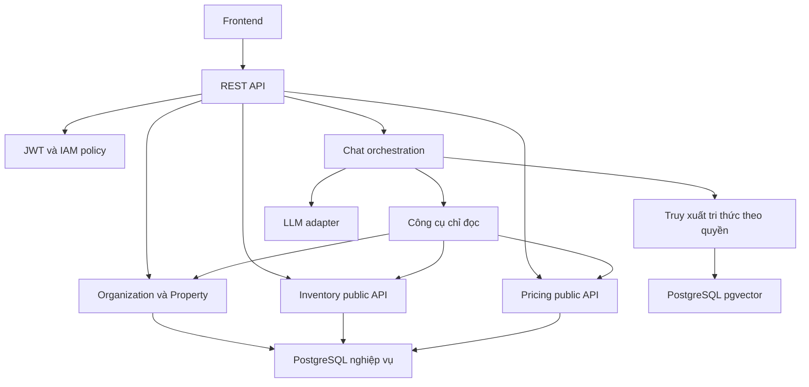

# Kế hoạch xây dựng code base backend và chatbot RAG

Ngày lập: 24/09/2026.

**Mục tiêu:** tạo một nền backend có thể mở rộng theo module, dựng môi trường lặp lại được, kiểm soát quyền theo khách sạn và có hai luồng mẫu chạy thật: tra cứu phòng/báo giá và hỏi đáp RAG có dẫn nguồn. Chatbot dùng Java + Spring AI trong cùng ứng dụng Spring Boot; PostgreSQL là nguồn dữ liệu nghiệp vụ, pgvector lưu vector tri thức, Redis phục vụ cache và giới hạn tần suất.

Kế hoạch này cụ thể hóa phần nền tảng của [kế hoạch nhóm 5 người](ke-hoach-nhom-5-nguoi-quan-ly-chuoi-khach-san-rag.md), dự kiến thực hiện trong **4 tuần đầu**, với BE1, BE2 và AI triển khai chính; QA kiểm thử và FE kiểm tra contract. Đây là lịch đề xuất theo mức 15–20 giờ/người/tuần. Chưa bao gồm toàn bộ chức năng booking, check-in/out, thanh toán và báo cáo của dự án 12 tuần.

Đây là tài liệu triển khai sắp tới. Các tên lớp, endpoint, bảng mới và cấu hình được ghi là đề xuất; tác vụ hiện tại chưa tạo code, thay schema, cập nhật dependency hoặc chạy migration.

## 1. Hiện trạng và việc cần xử lý trước

Đã đọc `backend/`, các cấu hình Docker, schema và tài liệu liên quan trên nhánh hiện tại `ndt/ai-chatbot`. Kết luận dưới đây dựa trên đọc mã, chưa phải lỗi runtime đã tái hiện.

| Hiện trạng | Tác động | Việc trong kế hoạch |
|---|---|---|
| `pom.xml` dùng Java 21, Spring Boot 4.0.7, JPA, Redis, OAuth2 Resource Server, MapStruct, SpringDoc | Có nền dependency; chưa có module nghiệp vụ | Giữ JDK/Boot hiện có làm baseline; thêm dependency theo từng PR nhỏ |
| Package thực tế là `vn.edu.utc.hotel_booking` | Một số ví dụ skill dùng package và tên module khác | Dùng package thực tế, không copy nguyên ví dụ |
| Có `ApiResponse`, `BaseEntity`, `AppException`, `ErrorCode`, handler và SecurityConfig | Có thể tái sử dụng nhưng cần sửa hành vi trước | Củng cố từng lớp; không viết framework chung thứ hai |
| Handler của `RuntimeException` trả HTTP 400 dù lỗi nội bộ có mã 500 | FE/AI khó phân biệt dữ liệu sai với lỗi server | Sửa HTTP status và thêm test hợp đồng lỗi |
| Handler import `java.nio.file.AccessDeniedException` | Không phải exception phân quyền của Spring Security | Xử lý đúng exception và thêm entry point/denied handler cho security filter chain |
| Validation lấy field error đầu tiên, ánh xạ message sang enum và có catch rỗng | Dễ xử lý thiếu lỗi, lỗi global hoặc thông báo không phải mã enum | Thiết kế phản hồi validation rõ, không phụ thuộc mọi message phải trùng enum |
| SecurityConfig mới kiểm tra authenticated; chưa có kiểm soát scope | JWT hợp lệ chưa đủ bảo vệ dữ liệu từng cơ sở | Thêm IAM application policy và test truy cập khác cơ sở |
| CORS cố định cổng 3000 | Local Vite hoặc header mới có thể không dùng được | Externalize origin, headers; hỗ trợ môi trường được cấu hình |
| Compose truyền `SPRING_REDIS_HOST`, YAML đọc `spring.data.redis.host` qua `REDIS_HOST` | Cấu hình container cần kiểm tra lại binding | Thống nhất một cách truyền đúng thuộc tính; kiểm tra kết nối thực tế |
| Issuer tại local và Docker khác hostname; Keycloak chưa có realm import trong Compose | Có nguy cơ token do trình duyệt nhận không khớp issuer backend kiểm tra | Chốt canonical issuer và cách truy cập JWK từ container; kiểm thử token thật |
| Keycloak 24.0.4 đi với biến bootstrap/healthcheck cần đối chiếu phiên bản | Không được coi container start là IAM đã sẵn sàng | Kiểm tra biến khởi tạo, endpoint health, realm và persistence cho đúng image |
| JPA dùng `ddl-auto: validate`, SQL đang chạy qua Docker init | Giữ được kiểm soát schema, nhưng chưa có migration nâng cấp DB cũ | Đưa Flyway vào theo quy trình baseline có kiểm chứng |
| `08-pricing-engine.sql` chứa seed quy tắc; không tìm thấy khai báo hàm tính giá trong tệp | Tên tệp không chứng minh đã có engine tính giá | BE2 xây pricing service từ quy tắc đã chốt, không gọi một hàm SQL chưa tồn tại |
| Chỉ có test `contextLoads`; chưa có CI workflow kiểm thử backend | Chưa có bằng chứng contract, scope, migration và RAG hoạt động | Thêm test nền và CI ngay từ đầu |

Các tệp cần đối chiếu trực tiếp: [pom.xml](../backend/pom.xml), [SecurityConfig](../backend/src/main/java/vn/edu/utc/hotel_booking/common/config/SecurityConfig.java), [handler](../backend/src/main/java/vn/edu/utc/hotel_booking/common/exception/GlobalHandlerException.java), [application.yaml](../backend/src/main/resources/application.yaml), [Docker Compose](../docker-compose.yml), [schema](../database/01-init-schema.sql), [seed giá](../database/08-pricing-engine.sql).

### Các khác biệt tài liệu phải ghi nhận

- Tài liệu contract cũ đề xuất `/api`, còn rule API trong repository dùng `/api/v1`. Đề xuất chọn `/api/v1` cho endpoint nghiệp vụ mới; cập nhật OpenAPI, mock và cấu hình FE trong PR contract. Chưa có endpoint nghiệp vụ hiện hữu để mặc định cần đổi hoặc tạo alias.
- Skill schema nói sửa các SQL khởi tạo, trong khi [AGENTS.md áp dụng cho workspace](D:/AGENTS.md) định hướng Flyway. Kế hoạch chọn migration có phiên bản cho thay đổi mới và giữ SQL cũ làm nguồn baseline, không âm thầm sửa dữ liệu đã triển khai.
- Rule concurrency cũ lấy Redis TTL 10 phút và mặc định slot vắng là Ready. Kế hoạch nghiệp vụ mới đề xuất hold bền vững trong PostgreSQL, TTL cấu hình 15 phút và tách vệ sinh khỏi tồn phòng. Phải ghi ADR và cập nhật rule trong PR liên quan trước khi xây luồng ghi; không dùng hai cơ chế giữ phòng song song.
- `docs/ai/ARCHITECTURE_KNOWLEDGE_MAP.md` được nhắc trong AGENTS nhưng chưa tìm thấy ở các vị trí đã kiểm tra. Bổ sung bản đồ module từ quyết định được chốt; không coi tài liệu này đã tồn tại.

Những khác biệt trên chưa chặn công việc đọc và lập kế hoạch. Khi triển khai, PR quyết định kiến trúc phải giải quyết chúng trước PR phụ thuộc; không sửa framework theo một ví dụ trái với schema hoặc contract thực tế.

## 2. Phạm vi của đợt xây code base

### 2.1. Kết quả bắt buộc

1. Backend khởi động được ở local, Docker và CI với cấu hình rõ ràng; không cần khóa LLM khi AI tắt.
2. Database mới được migrate; database cũ có quy trình baseline và nâng cấp thử trên bản sao.
3. JWT được kiểm tra chữ ký, issuer, thời hạn và audience; quyền được kiểm tra tại backend theo role, permission và scope.
4. Một luồng backend thật: nhân viên đăng nhập → xem khách sạn/hạng phòng đúng scope → xem khả dụng → nhận quote có breakdown.
5. Một luồng AI thật: tài liệu được duyệt → ingest → pgvector → truy xuất đúng phạm vi → trả lời kèm nguồn; công cụ giá/phòng trống gọi cùng service với REST API.
6. Có bộ test và CI kiểm tra boundary, contract, migration, scope, RAG và tình huống lỗi.
7. Có hướng dẫn thêm module mới, thêm AI tool, cập nhật tri thức và dựng môi trường.

### 2.2. Để sau đợt nền tảng

Chưa cam kết tạo booking/hold hoàn chỉnh, thu tiền, webhook thanh toán, hoàn tiền, check-in/out, Night Audit hoặc UI quản trị. Các module này có vị trí và owner được định nghĩa, nhưng chỉ tạo code khi bắt đầu use case tương ứng. Không sinh controller/service/repository rỗng cho mọi bảng.

Đối với AI, chưa làm công cụ ghi, OCR, crawler tự động, huấn luyện mô hình, nhiều agent, live chat chuyển tiếp hoặc streaming. Bắt đầu bằng REST JSON và công cụ chỉ đọc; thêm SSE sau khi contract, hủy request và truy vết đã ổn định.

## 3. Kiến trúc đích

### 3.1. Một ứng dụng và ranh giới theo module

Giữ một Maven application, một Spring Boot deployment và một PostgreSQL instance ở giai đoạn này. AI nằm trong `aiassistant`, không tạo dịch vụ Python/FastAPI riêng chỉ để gọi mô hình. Spring AI đã có RAG và bộ lọc metadata; nhánh 2.0.x công bố hỗ trợ Spring Boot 4.0.x/4.1.x. Phiên bản cụ thể phải qua compatibility test rồi mới khóa BOM. [Spring AI Getting Started](https://docs.spring.io/spring-ai/reference/getting-started.html), [Spring AI RAG](https://docs.spring.io/spring-ai/reference/api/retrieval-augmented-generation.html).



Các khối ở sơ đồ là trách nhiệm logic, không phải mỗi khối một process. Tiến trình AI dùng chung ứng dụng nên phải có timeout, số request đồng thời và worker ingest giới hạn; không giữ transaction database trong lúc chờ LLM.

### 3.2. Cây thư mục đề xuất

```text
backend/
├── pom.xml
├── Dockerfile
└── src/
    ├── main/
    │   ├── java/vn/edu/utc/hotel_booking/
    │   │   ├── HotelBookingApplication.java
    │   │   ├── common/
    │   │   │   ├── config/          # Cấu hình dùng chung
    │   │   │   ├── security/        # JWT, principal, handler 401/403
    │   │   │   ├── web/             # Request ID, pagination, filter
    │   │   │   ├── dto/             # Giữ ApiResponse hiện có
    │   │   │   ├── entity/          # Giữ BaseEntity hiện có nếu phù hợp
    │   │   │   └── exception/       # Lỗi nền và ánh xạ HTTP
    │   │   ├── iam/                # Permission, scope, trạng thái nhân sự
    │   │   ├── organization/       # Vùng, cơ sở, bộ phận
    │   │   ├── property/           # Hạng phòng, phòng vật lý, cấu hình
    │   │   ├── inventory/          # Khả dụng, phân bổ và quỹ phòng
    │   │   ├── pricing/            # Giá, phí, thuế, quote
    │   │   ├── audit/              # Sự kiện kiểm toán theo quyền
    │   │   └── aiassistant/        # Chat và tri thức RAG
    │   └── resources/
    │       ├── application.yaml
    │       ├── application-local.yaml
    │       ├── application-docker.yaml
    │       ├── db/migration/
    │       └── ai/prompts/
    └── test/
        ├── java/vn/edu/utc/hotel_booking/
        │   ├── architecture/
        │   ├── support/
        │   ├── iam/
        │   ├── inventory/
        │   ├── pricing/
        │   └── aiassistant/
        └── resources/
            ├── application-test.yaml
            ├── fixtures/
            └── ai/evaluation/
```

`reservation`, `customer`, `frontdesk`, `housekeeping`, `billing`, `payment`, `reporting` và `notification` được bổ sung ở các sprint nghiệp vụ sau. Không chuyển namespace sang `com.hotel.booking` hoặc đổi các lớp chung chỉ để khớp ví dụ skill.

Một module nghiệp vụ thường gồm:

```text
pricing/
├── api/               # Giao diện liên module và input/output đã kiểm soát
├── controller/        # REST và validation đầu vào
├── service/           # Use case và transaction phù hợp
├── repository/        # Truy cập dữ liệu thuộc pricing
├── entity/            # Mapping đúng schema
├── dto/request/       # Contract HTTP
├── dto/response/
├── mapper/
└── exception/
```

Không bắt buộc mỗi service có một interface và một lớp `Impl`. Chỉ tạo interface khi đó là boundary liên module, cổng tới nhà cung cấp hoặc điểm thay thế cần kiểm thử. Public API nội bộ trả immutable DTO/projection, không trả JPA entity hay repository.

### 3.3. Quyền sở hữu và dependency

| Module | Owner | Phạm vi dữ liệu | Public boundary đề xuất |
|---|---|---|---|
| `iam` | BE1 | `staffs`, `roles`, `permissions`, `role_permissions`; assignment mới nếu được chốt | Current actor, scope resolution, authorization policy |
| `organization` | BE1 | `regions`, `hotels`, `departments` | Tra cứu cơ sở và thuộc tính phạm vi |
| `property` | BE1 | `room_types`, `hotel_room_types`, `room_instances`, tiện ích/cấu hình phòng | Read model hạng phòng/phòng vật lý |
| `inventory` | BE1 | `room_availability`, `room_slots`, `room_maintenance_blocks` | Availability query; command giữ/gán phòng triển khai sau |
| `pricing` | BE2 | Quy tắc giá, phụ thu, khuyến mãi, thuế và chính sách tuổi | `PricingQuoteService` |
| `audit` | BE1 | `audit_logs` và quy tắc ghi/đọc audit | Ghi sự kiện tối thiểu, không giữ entity module gọi |
| `aiassistant` | AI | Tài liệu, vector, tác vụ ingest, hội thoại nếu cần | Chat, ingest, source access, tool adapter |

Luồng phụ thuộc chính: `aiassistant → organization/property/inventory/pricing.api`; `inventory → property.api`; `pricing → property.api`; các module nghiệp vụ dùng IAM và audit. Không module nghiệp vụ nào phụ thuộc ngược vào `aiassistant`.

Để tránh vòng lặp `organization ↔ iam`, module sở hữu tài nguyên lấy các thuộc tính scope từ dữ liệu tin cậy rồi đưa vào policy IAM. IAM kiểm tra phân công của actor, không gọi ngược controller/service của mọi module. Policy hoặc object scope không được tạo từ body/claim tự khai mà bỏ qua dữ liệu server.

## 4. Nền tảng backend cần xây

### 4.1. HTTP contract và xử lý lỗi

Giữ envelope đang có: `code`, `message`, `result`; giữ mã thành công `1000`. Chốt pagination theo `items`, `page`, `size`, `totalElements` để tương thích hướng contract cũ; không serialize trực tiếp `Page<Entity>`. Nếu cần trường validation bổ sung thì ghi rõ thay đổi additive trong OpenAPI.

| Nội dung | Quy tắc đề xuất |
|---|---|
| API base | `/api/v1`; endpoint nội bộ yêu cầu JWT; không đặt chat hoặc tài liệu nội bộ vào `/api/public/**` |
| Tiền | `BigDecimal` trong Java, `NUMERIC` trong PostgreSQL, decimal string trong JSON |
| ID | Mapping Java khớp kiểu SQL; ID `BIGINT` ra JSON dưới dạng chuỗi để FE không mất độ chính xác |
| Ngày | `LocalDate` cho ngày ở; thời điểm có timezone dùng `Instant`/`OffsetDateTime` theo schema |
| Khoảng lưu trú | `[checkIn, checkOut)`; validation check-out sau check-in |
| Danh sách | Giới hạn size ở server, whitelist trường sort; mặc định 20 và tối đa 100 |
| Trace | Request ID do server kiểm tra/tạo, trả qua response header; không nhận chuỗi bất kỳ vào log |
| Validation | Lỗi field và global được xử lý ổn định; không log raw payload hoặc giấy tờ khách |
| HTTP | 400 input sai; 401 thiếu/sai token; 403 thiếu quyền; 404 không tìm thấy; 409 xung đột; 429 quá hạn mức; 500 lỗi nội bộ; 503 dịch vụ AI không sẵn sàng |

Sửa handler hiện có, thêm `AuthenticationEntryPoint` và `AccessDeniedHandler` cho lỗi xảy ra trước controller. Các xung đột khóa phải có mã lỗi nghiệp vụ phù hợp; không ánh xạ mọi lỗi database thành 409 hoặc mọi RuntimeException thành 400. Giới hạn page size phải được thực thi thật, không chỉ khai báo giá trị mặc định.

### 4.2. IAM theo cơ sở

1. Xác minh token ở Resource Server; kiểm tra issuer/audience và ánh xạ role có namespace rõ.
2. Từ JWT `sub`, tìm `staffs.keycloak_id`, kiểm tra active và trạng thái xóa.
3. Đọc role/permission/scope trong database; phân quyền nghiệp vụ không chỉ dựa trên tên role trong token.
4. Áp scope vào query danh sách, xem chi tiết, export, AI tools và nguồn trích dẫn.
5. Kiểm tra lại permission tại public service để AI gọi trực tiếp vẫn chịu cùng chính sách.

Schema hiện đã có `scope_type` và `scope_entity_id`, không còn là mô hình chỉ có `staff.hotel_id`. Tuy nhiên vẫn có một `role_id` và một scope trên mỗi staff. Đợt code base triển khai đúng giới hạn này, che sau public API IAM; multi-role/multi-scope của phạm vi đầy đủ là migration riêng. Không tuyên bố đã hỗ trợ nhiều assignment khi chưa có dữ liệu lưu tương ứng.

Canonical issuer phải trùng `iss` trong token thật. Nếu backend dùng JWK URI nội bộ riêng thì vẫn giữ kiểm tra issuer chính xác, không bỏ validation để giải quyết khác hostname. Spring Security hỗ trợ cấu hình issuer và JWK URI độc lập. [Spring Security JWT](https://docs.spring.io/spring-security/reference/servlet/oauth2/resource-server/jwt.html).

Keycloak dùng realm/client/role demo export được, không chứa credential thật. Browser client dùng Authorization Code + PKCE; backend xác minh bearer token. Không xây endpoint nhận password để thay quy trình đăng nhập của Keycloak.

### 4.3. Transaction, thời gian và log

- Constructor injection; controller không gọi repository trực tiếp; không trả entity ra HTTP.
- Dùng `Clock` được inject cho expiry và test thời gian; không dùng `Thread.sleep()` để kiểm thử hết hạn.
- Giữ `BaseEntity` chỉ cho bảng thực sự có các cột tương ứng. Đối chiếu trigger timestamp và annotation JPA để chọn trách nhiệm nhất quán; không ép mọi bảng kế thừa.
- `@Transactional` đặt ở public use case ghi và read service khi cần; không áp transaction dài lên chat, embedding hoặc ingest I/O.
- INFO cho startup và mốc pipeline; DEBUG cho thông tin kỹ thuật đã che dữ liệu; WARN cho lỗi có thể phục hồi; ERROR cho lỗi cần xử lý. Không ghi token, API key, nguyên prompt hay PII mặc định.
- Audit là nghiệp vụ riêng, ghi actor/action/resource/scope/result cần thiết; log SLF4J không thay audit trail.
- Worker ingest dùng `ExecutorService`/Spring executor có pool và queue hữu hạn; không tạo thread tùy ý và không dùng common pool không giới hạn.

### 4.4. Hai service đầu tiên để chứng minh kiến trúc

**Availability:** đọc theo hạng phòng tại cơ sở trong toàn bộ khoảng ngày. Đối chiếu phòng vật lý, slot và maintenance; không lấy `total_quantity` hoặc counter seed chưa đồng bộ làm nguồn khả dụng đáng tin cậy. Nếu sparse row chưa có, phải suy ra từ nguồn chuẩn đã chọn; không suy ra phòng đã sạch.

**Pricing:** tính giá theo quy tắc tối thiểu đã được nhóm chốt: giá cơ sở, hiệu lực theo ngày, phụ thu cần thiết, phí dịch vụ và VAT. Phải có ví dụ tính tay và quy tắc thứ tự/làm tròn. Nếu thiếu dữ liệu thuế hoặc quy tắc chưa hỗ trợ thì trả lỗi rõ; không tự điền thuế suất hoặc bỏ qua một rule đang active.

Đợt nền tảng chỉ nghiệm thu quote trên bộ tình huống được xác định; chưa có snapshot giao dịch bền vững vì chưa có booking command. Quote cần thể hiện thời điểm tính và dữ liệu cấu trúc đã chốt contract. UI và AI không tự tính lại tổng tiền.

## 5. Database và migration

### 5.1. Đưa Flyway vào mà không làm mất dữ liệu

1. Kiểm kê schema SQL và schema thực tế trên database phát triển được chỉ định; ghi nhận drift. Không suy ra DB đang chạy giống script chỉ vì tên bảng trùng.
2. Tạo snapshot cấu trúc đã kiểm chứng làm migration khởi tạo. Tách reference data bắt buộc khỏi demo seed; không đưa khách/tài khoản thật vào migration.
3. Với DB mới: Flyway tạo schema từ đầu. Chuyển Docker init về bootstrap database/role/extension cần thiết, tránh vừa chạy toàn bộ SQL cũ vừa chạy migration tạo lại bảng.
4. Với DB cũ: backup, thử trên bản sao, so schema với baseline, rồi mới đặt mốc baseline phù hợp. Không bật `baseline-on-migrate` toàn cục để bỏ qua schema không rõ nguồn gốc.
5. Mọi thay đổi sau baseline là migration mới. Giữ `ddl-auto: validate`, không để Hibernate hoặc vector store tự sửa schema ngoài kiểm soát.
6. CI kiểm tra cả khởi tạo DB mới và nâng cấp fixture đại diện DB cũ, sau đó đối chiếu dữ liệu và constraint.

Baseline là điểm bắt đầu theo dõi một database hiện hữu, không phải hành động chứng minh schema đúng hoặc sửa drift. [Flyway baselines](https://documentation.red-gate.com/flyway/flyway-concepts/baselines).

### 5.2. Khoảng trống schema phải đưa vào backlog

| Khoảng trống từ mã hiện có | Quyết định cho code base | Khi bắt buộc giải quyết |
|---|---|---|
| `room_availability` chưa đưa `ooo_rooms` vào CHECK tổng cung | Kiểm tra số âm và tổng booked + locked + OOO; migration kèm dữ liệu sạch | Trước bật luồng ghi tồn phòng |
| Một `locked_until` trên counter không mô tả các lượt hold độc lập | Đề xuất hold riêng theo chủ sở hữu, khoảng ở, hạn và trạng thái; chưa định DDL khi contract chưa chốt | Trước xây hold/booking |
| `version` có nhưng chưa có code kiểm tra khi ghi | Thiết kế concurrency trong owner inventory; test PostgreSQL thật | Trước mọi lệnh giữ/gán phòng |
| Bảng staff chỉ có một role và một scope | Dùng được cho luồng mẫu; giữ boundary để mở rộng | Trước nghiệm thu yêu cầu nhiều vai trò/phạm vi |
| Chưa có kho tri thức và vector store | Migration riêng cho RAG, theo contract mục 6 | Trong đợt code base |
| Chưa có lưu request idempotency cho booking/payment | Thiết kế theo từng command, fingerprint và kết quả, không tạo cache Redis chung thay DB | Trước booking/payment, ngoài phạm vi luồng chỉ đọc |

Các nhận xét chi tiết hơn có trong [review database](database-review-2026-09-17.md); cần đối chiếu lại với schema hiện tại trước khi sửa, không coi mọi nhận xét cũ là kết quả runtime mới.

Với sparse inventory, `SELECT FOR UPDATE` không khóa một row chưa tồn tại. ADR concurrency phải chọn cơ chế xử lý lần ghi đầu bằng unique/upsert và khóa tài nguyên ổn định hoặc phương án tương đương, cùng thứ tự khóa xuyên suốt các command. Không giữ khóa database trong suốt 15 phút hold hoặc khi chờ thanh toán. [PostgreSQL 16 về khóa](https://www.postgresql.org/docs/16/explicit-locking.html).

### 5.3. pgvector

Giữ PostgreSQL 16 và chọn image có pgvector tương thích, khóa tag sau khi thử. Không đổi PostgreSQL major version để thêm extension. Với volume hiện hữu phải backup và thử khôi phục trên môi trường riêng; không xóa volume để chạy lại init.

Tạo schema/bảng vector bằng migration; chọn kích thước embedding đúng với model thực tế. Bật các extension mà phiên bản adapter yêu cầu sau khi rà tài liệu, không copy mù kích thước 1536 hoặc index mặc định. Với tập tri thức nhỏ có thể đo exact search trước khi thêm HNSW. Spring AI có cấu hình opt-in tạo schema; ở dự án này dùng Flyway thay cho auto-create. [Spring AI PGvector](https://docs.spring.io/spring-ai/reference/api/vectordbs/pgvector.html).

## 6. Code base cho chatbot RAG

### 6.1. Cấu trúc và trách nhiệm

```text
aiassistant/
├── controller/        # Chat, knowledge management, nguồn trích dẫn
├── dto/               # Request/response của AI, không trả SDK type
├── service/           # Điều phối hội thoại
├── llm/               # Adapter mô hình và cấu hình provider
├── knowledge/         # Tài liệu, phiên bản, ingest, repository sở hữu
├── retrieval/         # Lọc quyền, tìm đoạn, chọn ngữ cảnh
├── tool/              # Adapter công cụ chỉ đọc
├── conversation/      # Context/hội thoại có giới hạn
├── prompt/            # Prompt template và version
├── config/            # Timeout, quota, model, chunking, executor
└── exception/         # Lỗi AI và fallback
```

| Thành phần đề xuất | Trách nhiệm | Không được làm |
|---|---|---|
| `ChatService` | Nhận câu hỏi, điều phối RAG/tool, tạo phản hồi | Tính giá, query bảng booking hoặc tự quyết quyền |
| `KnowledgeIngestionService` | Nạp văn bản, chuẩn hóa, chia đoạn, gọi embedding, ghi chỉ mục | Tự publish nội dung chưa duyệt hoặc giữ DB transaction khi gọi embedding |
| `ScopedRetriever` | Tạo filter từ quyền server và lấy đoạn còn hiệu lực | Dùng filter do LLM/client tự đặt làm căn cứ phân quyền |
| `HotelInformationTool` | Gọi public API tổ chức/danh mục | Đọc repository của module khác |
| `RoomAvailabilityTool` | Kiểm tra tham số, gọi service availability | Giữ phòng hoặc hứa chắc còn phòng sau thời điểm truy vấn |
| `RoomQuoteTool` | Gọi pricing service, trả dữ liệu cấu trúc | Tự cộng giá, tự chọn thuế hoặc làm tròn khác backend |
| `ConversationService` | Quản lý context theo chủ sở hữu và giới hạn lưu | Chia sẻ lịch sử giữa người dùng hoặc dùng Redis làm audit bền vững |

Tận dụng `ChatModel`, `EmbeddingModel`, `VectorStore` của Spring AI. Chỉ bọc những chỗ cần ổn định contract hoặc kiểm soát hành vi; không xây một framework LLM độc lập có nhiều tầng factory khi mới dùng một provider.

### 6.2. Luồng ingest có thể phục hồi

1. Nhận tài liệu text/Markdown giới hạn kích thước, kiểm tra quyền quản trị tri thức và phạm vi tài liệu.
2. Lưu phiên bản nguồn cùng checksum; phân biệt trạng thái xử lý với trạng thái công bố.
3. Worker nhận job có trạng thái và retry giới hạn; đọc văn bản, chia đoạn theo chính sách/tiêu đề, gọi embedding ngoài transaction DB.
4. Ghi chunk/vector của phiên bản mới. Ingest lỗi không để tài liệu xử lý dở lọt vào retrieval.
5. Người có quyền duyệt công bố; chuyển phiên bản đang dùng trong transaction ngắn. Giữ bản cũ tới khi bản mới sẵn sàng.
6. Thu hồi tài liệu cập nhật quyền/trạng thái truy xuất và cache ngay; xóa vật lý theo chính sách lưu, không chờ xóa vector mới ngừng trả lời.

Phương án lưu tối thiểu cần chốt:

| Nhóm dữ liệu đề xuất | Mục đích bắt buộc | Giới hạn |
|---|---|---|
| Manifest tài liệu và phiên bản | Nguồn, checksum, scope, hiệu lực, trạng thái công bố, nội dung/đường dẫn nguồn | Không cần lưu dữ liệu định danh khách |
| Chunk/vector | Văn bản được phép truy xuất và liên kết tới đúng phiên bản/đoạn | Không lưu giá/phòng trống làm dữ liệu authoritative |
| Ingestion job | Trạng thái, lần thử, lỗi đã che dữ liệu, thông tin phục hồi | Không cần broker riêng ở quy mô nền tảng |
| Trace AI tối thiểu | Request ID, actor, nguồn đã dùng, tool/status, model, latency/token | Không mặc định lưu toàn văn mọi prompt và response |

BE1 và AI thống nhất chính xác field/constraint trong migration và DTO trước khi code. Dùng ID chunk ổn định hoặc unique theo phiên bản/thứ tự để retry không sinh bản sao. Worker crash phải có cơ chế reclaim job; queue trong bộ nhớ không phải nơi duy nhất lưu công việc ingest.

### 6.3. Luồng trả lời có giới hạn quyền

```text
Câu hỏi
→ JWT và IAM
→ Xác định phạm vi hợp lệ tại server
→ Chọn RAG, công cụ chỉ đọc hoặc hỏi bổ sung
→ Truy xuất tài liệu được phép / gọi public service
→ Kiểm tra nguồn còn hiệu lực và đủ căn cứ
→ Sinh câu trả lời, gắn citation từ dữ liệu truy xuất thực
→ Trả text và thẻ dữ liệu nghiệp vụ
→ Ghi trace đã che dữ liệu
```

Bộ lọc scope, trạng thái công bố và hiệu lực phải được áp dụng trong truy xuất; kiểm tra lại kết quả trước khi đưa vào prompt để xử lý cache/phiên bản thay đổi. Không chỉ lấy top-k toàn bộ kho rồi lọc sau, vì vừa dễ lấy sai dữ liệu vừa làm mất kết quả hợp lệ. Nếu adapter không biểu diễn được filter cần thiết thì dùng truy vấn trong repository tri thức do module AI sở hữu, có tham số hóa và test; không nới quyền cho thuận tiện.

Tài liệu là nội dung tham khảo, không phải chỉ dẫn hệ thống. LLM không có SQL tool, file tool, URL fetch tùy ý hoặc công cụ ghi. Công cụ nghiệp vụ nhận actor context từ server, không nhận role/staff ID do mô hình chọn. Không đủ tham số thì hỏi bổ sung; không có nguồn thì báo chưa tìm thấy thông tin; lỗi API thì không sinh giá dự đoán.

Giá, tổng tiền và tồn phòng xuất hiện trong thẻ dữ liệu cấu trúc từ tool result. Citation chỉ được tạo từ source ID/version/chunk đã truy xuất; khi mở nguồn vẫn kiểm tra quyền. Hội thoại cũ phải được giới hạn theo người dùng và không tiếp tục dùng đoạn nguồn đã thu hồi hoặc quyền đã mất.

### 6.4. Contract AI đầu tiên

Các endpoint dưới đây là đề xuất cho PR contract, không phải API đang chạy.

| Endpoint | Quyền | Nội dung |
|---|---|---|
| `POST /api/v1/ai/chat` | Nhân viên được sử dụng chatbot | Câu hỏi, conversation ID tùy chọn và cơ sở đang chọn; server xác minh toàn bộ scope |
| `POST /api/v1/ai/knowledge/documents` | Quản trị tri thức trong phạm vi tương ứng | Tạo tài liệu text/Markdown nháp và job ingest |
| `GET /api/v1/ai/knowledge/jobs/{id}` | Chủ thể được quản trị nguồn | Xem trạng thái xử lý, lỗi có thể khắc phục |
| `PATCH /api/v1/ai/knowledge/documents/{id}` | Quyền sửa/công bố/thu hồi tương ứng | Thay đổi được kiểm soát theo contract; không tự ghi arbitrary status |
| `GET /api/v1/ai/knowledge/sources/{id}` | Người có quyền đọc nguồn | Nội dung/đoạn nguồn đã được phép đọc để mở citation |

Response chat dùng envelope chung. Phần `result` dự kiến gồm answer text, loại kết quả, citations và thẻ dữ liệu nghiệp vụ khi có. Request/response không chứa provider SDK type, prompt hệ thống, access token, raw SQL hoặc số tiền do LLM tự tạo. Không công bố “confidence %” nếu chưa có thước đo được hiệu chuẩn.

`conversationId` chỉ thêm khi đã có nơi lưu hoặc cơ chế context tương ứng. Nếu chưa làm hội thoại nhiều lượt, luồng đầu tiên chạy một lượt; không tạo field giả chỉ để giao diện trông đầy đủ.

### 6.5. Chế độ chạy và cô lập lỗi

| Chế độ đề xuất | Hành vi |
|---|---|
| AI tắt | Backend nghiệp vụ vẫn khởi động; endpoint AI báo rõ không sẵn sàng; không khởi tạo bean đòi khóa provider |
| AI trong test | Dùng fake model/embedding qua test configuration; không gọi dịch vụ tính phí |
| AI thật | Provider/model qua cấu hình; kiểm tra key, dimension và kết nối; không silently fallback sang dữ liệu giả |

Mỗi request chat có timeout tổng, giới hạn input/context/output và số lượt gọi công cụ. Dùng giới hạn concurrency riêng cho AI và ingest để tránh chiếm hết request thread/DB pool. Retry có giới hạn cho lỗi tạm thời của provider, không retry toàn bộ workflow làm nhân đôi ingest. Không gọi LLM để kiểm tra liveness định kỳ.

## 7. Dependency và môi trường

### 7.1. Bổ sung theo nhu cầu

| Nhóm | Giữ hoặc bổ sung | Điều kiện |
|---|---|---|
| Hiện có | Web, validation, JPA, Redis, Security, MapStruct, SpringDoc, JUnit | Giữ baseline; kiểm tra dependency tree và build trước khi thêm AI |
| Migration | Flyway core và module PostgreSQL tương thích | Cùng PR baseline, có test nâng cấp |
| Quan sát | Actuator và metric cần thiết | Health endpoint chỉ lộ thông tin tối thiểu; endpoint nhạy cảm bị giới hạn |
| AI | Spring AI BOM, một model provider, pgvector starter và thành phần RAG cần dùng | Compatibility test với Boot 4.0.7; khóa release ổn định, không snapshot |
| Test | Testcontainers PostgreSQL/Redis, ArchUnit | Test thật cho SQL đặc thù, boundary test cho module |
| Chưa thêm | Kafka, Elasticsearch, service discovery, API gateway riêng, framework multi-agent | Chỉ xem xét khi có use case và số liệu cần thiết |

Không thêm cùng lúc nhiều SDK provider, LangChain4j và Spring AI. Việc chọn provider/model/embedding là kết quả thử nghiệm nhỏ do AI phụ trách; chưa có ngân sách thì CI vẫn dùng fake adapter. [Spring AI PGvector starter](https://docs.spring.io/spring-ai/reference/api/vectordbs/pgvector.html).

### 7.2. Cấu hình

- `application.yaml`: mặc định an toàn, tên ứng dụng, contract chung; không chứa credential thật.
- `application-local.yaml`: địa chỉ các dịch vụ được expose cho lập trình viên, log phục vụ debug đã kiểm soát.
- `application-docker.yaml`: service DNS, canonical issuer/JWK, pool và timeout.
- `application-test.yaml`: container datasource, fake AI, thời gian/dữ liệu test xác định.
- `.env-example`: placeholder cho database, Redis, IAM và AI; tài liệu phân biệt biến Compose với property Spring.
- Cấu hình riêng được bind bằng `@ConfigurationProperties` và validation khi khởi động; không đọc biến môi trường rải rác trong service.

Các key như `app.ai.enabled`, model ID, dimension, timeout, top-k và quota là tên đề xuất thuộc ứng dụng; thuộc tính `spring.ai.*` phải lấy đúng theo phiên bản đã chọn. Không coi tên cấu hình tự đặt là tên property thư viện.

Keycloak dev cần realm có thể dựng lại và phương án lưu cấu hình/tài khoản phù hợp. Việc sửa biến bootstrap phải theo version thực tế; không nâng server chỉ để hợp với biến của một version khác. Changelog Keycloak ghi thay đổi bootstrap ở nhánh 26, nên Compose đang pin 24.0.4 cần kiểm tra riêng. [Keycloak 26 về bootstrap](https://www.keycloak.org/2024/10/keycloak-2600-released).

## 8. Thứ tự PR và phân công

| PR | Owner | Nội dung cụ thể | Phụ thuộc | Điều kiện merge |
|---|---|---|---|---|
| CB-01 | BE1, BE2 và AI review | ADR module/API/migration; ghi khác biệt tài liệu; compatibility spike dependency; phân quyền mẫu | Không | Có sơ đồ dependency, danh sách API/field dự kiến và danh sách việc ngoài scope |
| CB-02 | BE1 | Profiles, Compose binding, issuer/JWK, realm demo, startup/health, CI compile/test ban đầu | CB-01 | Token thật được backend chấp nhận đúng issuer; backend không cần key LLM |
| CB-03 | BE1 | Flyway baseline, seed tách biệt, sửa lỗi schema chặn luồng mẫu, môi trường test database | CB-01, CB-02 | Fresh DB và upgrade fixture đạt; không mất dữ liệu mẫu |
| CB-04 | BE1 | HTTP error contract, request ID, validation, pagination và IAM theo scope | CB-03 | Test 400/401/403/404/500; khác cơ sở bị chặn |
| CB-05 | BE1 | Organization/property API và availability chỉ đọc | CB-04 | Query đúng scope và toàn bộ khoảng ở trên fixture đã đối soát |
| CB-06 | BE2 | Pricing query/calculation, DTO/mapper, ví dụ giá/thuế, quote API | CB-03, CB-04; contract CB-05 | Đối chiếu tính tay; thiếu quy tắc trả lỗi; không trả entity |
| CB-07 | AI | AI module, pgvector migration do BE1 review, ingest/version/publication, retrieval mẫu | CB-03, CB-04 | Ingest retry không trùng; nguồn chưa duyệt/bị thu hồi không được dùng |
| CB-08 | AI | Chat API, nguồn trích dẫn, timeout/quota, fake adapter trong test | CB-07 | FAQ có nguồn; test quyền tài liệu, lỗi provider và không đủ thông tin |
| CB-09 | AI, BE1/BE2 review | Công cụ catalog/availability/quote gọi service thật | CB-05, CB-06, CB-08 | Dữ liệu tool bằng dữ liệu REST cùng actor/input; không có write tool |
| CB-10 | BE1 + QA | Củng cố CI, ArchUnit, contract/integration/AI test, smoke Docker, tài liệu developer | Các PR trên | Hai luồng mẫu chạy thật, test có bằng chứng, clone mới dựng lại được |

BE2 có thể chuẩn bị calculator thuần và test tính tay trong lúc BE1 làm IAM. AI có thể làm prompt, tài liệu mẫu, fake adapter và thử embedding ngay từ tuần 1. Khi contract chưa xong, dùng test double; chỉ nghiệm thu sau khi nối service thật.

BE1 điều phối các file dễ xung đột: `pom.xml`, `application.yaml`, Compose, SecurityConfig và số thứ tự migration. BE2 sở hữu `pricing`; AI sở hữu `aiassistant` và tài nguyên prompt/test của module. Không giao AI sửa IAM hoặc pricing để chạy qua test.

### Lịch 4 tuần

| Tuần | BE1 | BE2 | AI | QA và FE | Mốc |
|---|---|---|---|---|---|
| 1 | CB-01/02, chuẩn bị baseline | Contract tiền/ngày, quy tắc giá, test tính tay | Spike Spring AI, 5 tài liệu/20 câu hỏi, fake model | QA rà AC; FE review envelope/auth | Build và đăng nhập kiểm chứng được |
| 2 | CB-03/04 | CB-06 phần calculator/query | CB-07 ingest/vector | QA migration/scope; FE mock API | DB và IAM sẵn sàng cho module |
| 3 | CB-05, hỗ trợ integration | Hoàn thành quote API | CB-08, thử tool với contract | QA contract/negative test | Luồng backend và FAQ chạy độc lập |
| 4 | CB-10, sửa lỗi nền | Test tích hợp giá/availability | CB-09, đánh giá và fallback | QA hai luồng thật; FE gọi thử API | Bàn giao code base đủ để phát triển nghiệp vụ |

Khoảng 180–240 giờ phát triển của 3 người trong 4 tuần là trần năng lực giả định; phải dành ít nhất 20% cho review và sửa lỗi. Nếu rà schema hoặc cấu hình IAM phát sinh lớn, lùi deadline hoặc giảm chức năng phụ như lịch sử hội thoại và giao diện quản trị tri thức, giữ nguyên kiểm tra scope, nguồn và tính đúng của quote.

## 9. Kiểm thử và tiêu chí bàn giao code base

### 9.1. Kiểm thử có mục tiêu

| Lớp kiểm thử | Ca cần có | Owner |
|---|---|---|
| Unit | Giá/thuế/làm tròn, scope policy, state publication và routing AI | Chủ module |
| PostgreSQL integration | Migration mới/cũ, query availability, native SQL, pgvector, ingest retry | BE1 + BE2 + AI |
| Security/API | Không token; sai issuer/audience; staff inactive; role đúng nhưng sai hotel; đổi source ID | BE1 + QA |
| Contract | Envelope, money string, ID, ngày, pagination, lỗi; AI không lộ SDK type | BE2 + AI + FE review |
| Architecture | Không gọi repository/entity chéo; controller không gọi repository; không có dependency ngược vào AI | BE1 |
| AI | Có/không có nguồn, tài liệu hết hạn/thu hồi, khác cơ sở, prompt injection, timeout, tool lỗi | AI + QA |
| Docker smoke | Fresh environment, token thật, query nghiệp vụ, chat thật khi bật provider | BE1 + QA |

ArchUnit có thể kiểm tra dependency theo package và tính không chu kỳ. Dùng rule cụ thể cho repository/service boundary; không chỉ kiểm tra tồn tại thư mục. [ArchUnit user guide](https://www.archunit.org/userguide/html/000_Index.html).

Không dùng H2 thay PostgreSQL cho test khóa, generated column, EXCLUDE constraint hoặc vector. Test CI không dùng key trả phí. Live AI smoke tách khỏi test quyết định merge: xác minh cấu hình/provider thật nhưng không thay kiểm thử quyền và hành vi xác định.

### 9.2. CI và lệnh xác minh dự kiến

PR đầu tiên chạy compile/unit test; thêm integration test và architecture test theo tiến độ, không đợi CB-10 mới có CI. Chạy Maven Wrapper thay vì phụ thuộc Maven cài trên máy cá nhân. Sau khi cấu hình Surefire/Failsafe, quy ước `*Test` cho unit và `*IT` cho integration; `verify` phải thực sự chạy cả hai.

```powershell
# Chạy tại thư mục backend, sau khi code base được triển khai
.\mvnw.cmd test
.\mvnw.cmd verify

# Chạy tại thư mục repository; kiểm tra cấu hình mà không in giá trị secret
docker compose config --quiet
docker compose up -d --build
docker compose ps
```

Docker build có thể dùng artifact đã kiểm thử hoặc bỏ test ở bước đóng gói sau khi CI `verify` đạt; `-DskipTests` trong Dockerfile hiện có không phải bằng chứng test đạt. Các lệnh trên là kế hoạch xác minh, chưa được chạy như kết quả của tác vụ lập tài liệu.

### 9.3. Checklist hoàn thành

- [ ] Clone mới dựng môi trường theo hướng dẫn, migration và realm seed lặp lại được.
- [ ] Backend hoạt động khi AI tắt; lỗi provider không làm API danh mục/giá ngừng phục vụ.
- [ ] Không còn mismatch cấu hình Redis/issuer trong luồng đã kiểm thử.
- [ ] Không còn generic RuntimeException trả 400; lỗi 401/403 đúng ở filter và service.
- [ ] Endpoint danh mục, availability và quote cùng kiểm tra scope; API thật và tool AI cho kết quả nhất quán.
- [ ] Fresh migration và upgrade fixture đạt, JPA validate đạt; dimension vector đúng model.
- [ ] RAG dùng nguồn đã duyệt, đúng scope/hiệu lực, mở citation đúng quyền; ingest lại không nhân đôi.
- [ ] Test 20 câu ban đầu đạt các ca bắt buộc về quyền, lỗi và nguồn; bộ đánh giá 100 ca của MVP tiếp tục ở các sprint sau.
- [ ] Không có repository access chéo, entity lộ qua API, giá tự tính trong AI hoặc write tool.
- [ ] CI `verify`, smoke Docker và tài liệu developer có bằng chứng; mọi giới hạn còn lại được ghi rõ.

Đợt code base chưa chứng minh chống overbooking hay idempotency payment trong sản phẩm hoàn chỉnh, vì các command tương ứng chưa nằm trong phạm vi. Khi triển khai chúng, bắt buộc bổ sung concurrency test và test retry trước khi bàn giao nghiệp vụ.

## 10. Tác động kiến trúc và tương thích

**Tái sử dụng:** giữ ứng dụng Spring Boot, package root, MapStruct, Resource Server, envelope response và schema hiện có đã được kiểm chứng. Chỉnh các lớp dùng chung bằng thay đổi nhỏ, có test contract; không tạo BaseCrudService, BaseRepository hoặc utility tổng hợp không có nhu cầu thực tế.

**Tác động dự kiến khi triển khai:** thêm module IAM/nghiệp vụ/AI theo package, Flyway, pgvector, test containers và CI; đổi các đường cấu hình cần thiết để môi trường nhất quán. AI vẫn nằm trong modular monolith, không phát sinh giao tiếp HTTP nội bộ giữa chatbot và pricing.

**Đánh đổi:** dùng chung deployment giúp giảm vận hành nhưng cần giới hạn tài nguyên AI; pgvector giúp tận dụng PostgreSQL nhưng ingest/truy xuất phải có chỉ mục và pool phù hợp; chưa làm streaming giúp contract nhỏ hơn nhưng trải nghiệm chờ cần được FE thể hiện rõ.

**Tương thích:** giữ `ApiResponse` và cách biểu diễn tiền/ID đã đề xuất trước đó; ghi rõ thay đổi `/api/v1` trong contract mới. Migration nâng cấp dữ liệu cũ thay vì sửa init script đã dùng. Các package mới không bắt buộc di chuyển lớp nền hiện tại khi chưa có lợi ích cụ thể.

**Thứ tự bắt đầu:** chốt CB-01 → ổn định môi trường và database → IAM/HTTP contract → luồng backend mẫu và ingest RAG → nối công cụ → kiểm thử/bàn giao. Sau mốc này, nhóm tiếp tục booking/hold và vận hành theo kế hoạch 12 tuần, trên cùng ranh giới module đã kiểm chứng.
