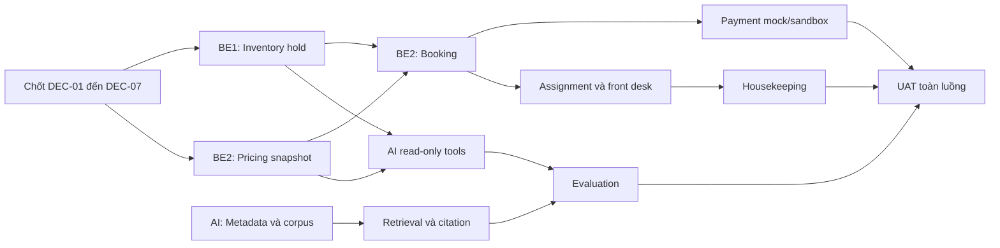

# Backlog hoàn thiện backend và chatbot AI sau khi có codebase

**Cập nhật:** 25/09/2026

**Nhân sự:** 2 Backend (`BE1`, `BE2`) và 1 AI (`AI`)

**Mục tiêu:** hoàn thiện MVP quản lý nội bộ chuỗi khách sạn, đặt phòng một hạng phòng, thanh toán online giả lập và chatbot RAG dành cho nhân viên.

Tài liệu này mô tả phần việc **còn lại sau codebase nền tảng**. Code, migration Flyway, OpenAPI và test trong repository là nguồn xác nhận trạng thái thực tế. Các API nằm trong tài liệu thiết kế nhưng chưa có controller/service/test vẫn được xem là backlog.

Tài liệu liên quan: [README backend](../backend/README.md), [bản đồ kiến trúc](../docs/ai/ARCHITECTURE_KNOWLEDGE_MAP.md), [ADR pricing](../docs/adr/0001-pricing-quote-policy.md), [ADR availability](../docs/adr/0002-stay-limits-and-sale-availability.md) và [thiết kế API dự kiến](api-design-hotel-chain-v1.md).

Quy ước ưu tiên:

- `P0`: bắt buộc để chạy trọn luồng MVP.
- `P1`: cần hoàn thành trước khi demo hoặc bàn giao có nhiều người dùng.
- `P2`: cải tiến sau khi luồng P0 ổn định.

## 1. Codebase hiện đã có gì?

| Nhóm | Đã có trong codebase | Chưa cần làm lại |
|---|---|---|
| Nền tảng | Java 21, Spring Boot modular monolith, PostgreSQL, Redis config, Flyway `V001`–`V003`, Docker Compose, CI | Không tách microservice, không tạo lại base response hoặc cấu trúc package |
| IAM | Keycloak JWT, kiểm tra audience/issuer, `StaffAccessService`, permission và scope `CHAIN/REGION/PROPERTY` | Không xây API username/password trong backend |
| Catalog và inventory read | Danh sách khách sạn, hạng phòng, availability theo `[checkIn, checkOut)` | Không dùng trạng thái vệ sinh hiện tại làm nguồn tồn phòng tương lai |
| Pricing read | Quote theo từng đêm, giá cơ sở, adjustment, discount, phụ thu, phí dịch vụ và VAT | Không tính lại giá ở FE hoặc trong LLM |
| Giới hạn và lỗi | Kỳ lưu trú 1–30 đêm; rule được đọc theo cả khoảng ngày; holiday ngừng hoạt động không tăng giá; HTTP giữ đúng `404/405/406/415` | Không mở lại khoảng ngày không giới hạn; không đổi lỗi giao thức thành `500` |
| RAG | Tạo tài liệu text, job ingest, chunk/embedding pgvector, publish/revoke, retrieval theo scope, citation | Không cho model truy cập SQL hoặc tự quyết định actor/scope |
| Chat | Chat một lượt cho nhân viên, quote tool dùng chung `PricingQuoteService`, giới hạn số request đồng thời trong một instance | Không để chatbot tự tính giá hay tự tạo booking/payment |
| Kiểm thử | Unit test, API contract test và integration test PostgreSQL/pgvector cho các luồng nền | Không xem test hiện tại là bằng chứng cho chống overbooking hoặc callback payment |

Các module nghiệp vụ chưa có implementation hoàn chỉnh: `reservation`, `customer`, `frontdesk`, `housekeeping`, `billing`, `payment`, `reporting` và `notification`. Schema `V001` đã có nhiều bảng thuộc các module này, nhưng cần kiểm tra lại ràng buộc và bổ sung migration mới trước khi dùng trong luồng ghi.

## 2. Các quyết định phải chốt trước khi viết luồng ghi

| ID | Quyết định | Người chốt | Đầu ra |
|---|---|---|---|
| DEC-01 | Thời hạn hold, điều kiện gia hạn và thời điểm giải phóng tồn | BE1 + BE2 | ADR về hold và transaction |
| DEC-02 | State machine của booking: `PENDING_PAYMENT`, `CONFIRMED`, `CANCELLED`, `NO_SHOW`, `CHECKED_IN`, `CHECKED_OUT`, `EXPIRED` | BE2 | Sơ đồ chuyển trạng thái và bảng lệnh hợp lệ |
| DEC-03 | Chọn một cổng thanh toán cho MVP | BE2 | Đề xuất VNPay sandbox; mock gateway dùng cùng interface cho local/test |
| DEC-04 | Thanh toán thành công đến sau khi hold hết hạn | BE2 + nghiệp vụ | Trạng thái đối soát thủ công; không tự cấp thêm phòng |
| DEC-05 | Chính sách hủy, no-show, tiền cọc và điều kiện check-out | BE2 + nghiệp vụ | ADR pricing/payment; ví dụ tính tay |
| DEC-06 | Dữ liệu khách tối thiểu, thời gian lưu và permission đọc PII | BE1 + BE2 | Data contract và ma trận permission |
| DEC-07 | Loại tài liệu đưa vào RAG, người duyệt và ngày hiệu lực | AI + nghiệp vụ | Metadata bắt buộc và quy trình publish/revoke |

Không bắt đầu migration hold/payment trước khi `DEC-01`–`DEC-05` được ghi thành ADR hoặc API contract. Không hardcode mức VAT, phí dịch vụ hoặc chính sách hủy trong controller.

## 3. Backlog của BE1 — IAM, catalog, inventory và vận hành phòng

### B1-01 — Dữ liệu dev và quy trình database (`P0`)

**Công việc**

- Chuẩn hóa seed lặp lại được cho tối thiểu 3 khách sạn thuộc 2 vùng, hạng phòng, phòng vật lý, giá, VAT, role và staff demo.
- Viết hướng dẫn map Keycloak user `sub` với bảng `staffs`.
- Thử migration trên database mới; thử backup → restore và Flyway baseline trên **bản sao** database cũ.
- Bổ sung dữ liệu biên: phòng bảo trì, phòng đang dọn, ngày lễ vô hiệu hóa, VAT đổi theo ngày.

**Hoàn thành khi**

- Một thành viên mới có thể clone repository, chạy Docker và có dữ liệu demo mà không sửa SQL thủ công.
- Không sửa lại `V001`–`V003`; mọi thay đổi schema dùng migration mới.

### B1-02 — Hoàn thiện IAM cho API nghiệp vụ (`P0`)

**Công việc**

- Lập ma trận `role × permission × scope` cho booking, guest PII, front desk, housekeeping, billing, payment và report.
- Mọi service đọc tài nguyên từ DB rồi mới kiểm tra scope; không tin `hotelId`, `staffId` hoặc role do client gửi.
- Bổ sung permission bằng migration/seed và audit thay đổi quyền nhạy cảm.
- Chỉ thiết kế multi-role/multi-scope khi MVP có use case thật; mô hình hiện tại vẫn là một role và một scope cho mỗi staff.

**Hoàn thành khi**

- Có test cho cùng scope, khác cơ sở, khác vùng, tài khoản inactive và thiếu permission.
- Dữ liệu PII không xuất hiện trong API danh sách nếu actor không có quyền.

### B1-03 — API quản lý tài nguyên cơ sở (`P1`)

**Công việc**

- Hoàn thiện API đọc phòng vật lý theo cơ sở, hạng phòng, trạng thái vận hành và trạng thái vệ sinh.
- Bổ sung CRUD tối thiểu cho khách sạn/hạng phòng/phòng/tiện ích nếu màn hình quản trị MVP cần sửa dữ liệu.
- Áp dụng phân trang, filter, soft-delete, optimistic locking và audit cho lệnh ghi.

**API dự kiến**

- `GET /api/v1/hotels/{hotelId}/rooms`
- Các endpoint quản trị catalog chỉ được thêm sau khi chốt màn hình FE và permission.

### B1-04 — Inventory hold và chống overbooking (`P0`)

**Công việc**

- Thiết kế hold riêng có owner, hạng phòng, từng ngày lưu trú, số lượng, `expiresAt` và trạng thái.
- Xây public application service `hold`, `confirm`, `release`, `expire`; module khác chỉ gọi service này.
- Chọn một thứ tự khóa cố định; xử lý sparse row bằng unique/upsert hoặc khóa tài nguyên ổn định.
- Job hết hạn phải idempotent và có thể chạy nhiều instance.
- PostgreSQL là nguồn sự thật. Redis chỉ hỗ trợ cache/rate limit và không quyết định booking đã được xác nhận.

**Hoàn thành khi**

- Hai request đồng thời tranh phòng cuối chỉ có một request thành công.
- Retry tạo/release hold không tăng hoặc trả tồn hai lần.
- Lỗi giữa transaction không để lại `locked_rooms`, slot hoặc hold lệch nhau.

### B1-05 — Gán phòng, housekeeping và maintenance (`P0`)

**Công việc**

- Xây lệnh gán phòng vật lý cho booking đã xác nhận; kiểm tra đúng cơ sở, đúng hạng và không trùng khoảng ở.
- Chuyển trạng thái vệ sinh theo luồng `DIRTY → CLEANING → READY`.
- Giữ trạng thái vận hành, vệ sinh và booking độc lập; phòng `MAINTENANCE` không được gán.
- Hoàn thiện lệnh mở/đóng maintenance block, audit lý do và người thao tác.

**API dự kiến**

- `POST /api/v1/bookings/{bookingId}/room-assignments`
- `POST /api/v1/hotels/{hotelId}/rooms/{roomId}/housekeeping-transitions`
- API maintenance theo phạm vi cơ sở.

### B1-06 — Vận hành và bảo vệ API (`P1`)

**Công việc**

- Audit các lệnh booking, gán phòng, housekeeping, payment adjustment và thay đổi cấu hình.
- Log có request ID nhưng không ghi access token, API key, giấy tờ tùy thân hoặc nội dung chat chứa PII.
- Bổ sung rate limit cho public search và callback protection phù hợp; health/readiness không gọi provider AI.
- Thêm smoke test Docker, backup/restore runbook và cảnh báo job hold hết hạn thất bại.

## 4. Backlog của BE2 — pricing, booking, front desk và payment

### B2-01 — Chốt pricing contract và snapshot giao dịch (`P0`)

**Công việc**

- Duyệt lại ADR pricing hiện tại với nghiệp vụ: thứ tự adjustment/discount/surcharge/fee/VAT, làm tròn và ngày áp dụng.
- Bổ sung API quản trị rule tối thiểu nếu demo cần thay đổi giá, kèm validation khoảng ngày và audit.
- Khi tạo booking, lưu daily rate, discount, surcharge, fee, VAT và tổng tiền thành snapshot.
- Thay đổi rule sau đó không được sửa giá lịch sử của booking.

**Hoàn thành khi**

- Có ví dụ tính tay cho ngày thường, cuối tuần, ngày lễ, extra guest, long stay và thời điểm VAT thay đổi.
- REST, booking và AI quote dùng cùng `PricingQuoteService` và cho cùng kết quả với cùng input.

### B2-02 — Reservation state machine và idempotency (`P0`)

**Công việc**

- Rà lại các bảng booking trong `V001`, bổ sung constraint/index/column bằng migration mới khi cần.
- Xây command tạo, xác nhận, hủy, hết hạn và no-show theo state machine đã chốt.
- Tạo cơ chế `Idempotency-Key`: cùng key và cùng payload trả lại kết quả cũ; cùng key nhưng payload khác trả `409`.
- Không nhận trạng thái tùy ý từ FE; mỗi hành động là một command có điều kiện chuyển trạng thái rõ ràng.

**API dự kiến**

- `POST /api/v1/public/holds`
- `POST /api/v1/public/bookings`
- `GET /api/v1/public/bookings/{bookingId}/status`
- `GET /api/v1/bookings` và `GET /api/v1/bookings/{bookingId}`
- `POST /api/v1/bookings/{bookingId}/cancellations`

### B2-03 — Booker, guest và dữ liệu lưu trú (`P0`)

**Công việc**

- Tách người đặt phòng với người lưu trú; hỗ trợ nhiều occupant trong một phòng.
- Chuẩn hóa số điện thoại/email, validation ngày sinh/giấy tờ và tránh tạo guest trùng theo quy tắc đã chốt.
- Mask PII ở danh sách/log; detail chỉ trả cho actor có permission và đúng scope.
- Ghi nhận audit cho đọc/xuất dữ liệu nhạy cảm nếu nghiệp vụ yêu cầu.

### B2-04 — Front desk: check-in và check-out (`P0`)

**Công việc**

- Check-in chỉ khi booking hợp lệ, phòng đã gán và sẵn sàng; lưu occupant thực tế.
- Check-out kiểm tra số dư theo chính sách, đóng stay, cập nhật booking room và gọi housekeeping service của BE1 để chuyển phòng sang `DIRTY`.
- Retry không tạo hai lần check-in/check-out; chuyển trạng thái sai trả `409`.

**API dự kiến**

- `POST /api/v1/bookings/{bookingId}/check-ins`
- `POST /api/v1/bookings/{bookingId}/check-outs`

### B2-05 — Thanh toán online giả lập (`P0`)

**Công việc**

- Định nghĩa `PaymentGateway` và hai adapter: `MockPaymentGateway` cho local/test, một sandbox adapter cho cổng đã chọn.
- Tạo payment attempt với reference không trùng; backend lấy amount từ booking snapshot.
- Kiểm tra chữ ký, merchant, reference, amount, response status và transaction status ở callback.
- Callback phải idempotent; callback lặp không ghi nhận tiền hai lần.
- Payment thành công sau khi hold hết hạn chuyển sang hàng đợi đối soát, không tự xác nhận booking vượt tồn.
- Secret chỉ lấy từ environment/secret store; không commit key sandbox.

**API dự kiến nếu chọn VNPay**

- `POST /api/v1/public/bookings/{bookingId}/payment-attempts`
- `GET /api/v1/payment-callbacks/vnpay/ipn`
- Return URL chỉ phục vụ UX; IPN đã xác minh mới cập nhật trạng thái payment.

### B2-06 — Folio và báo cáo MVP (`P1`)

**Công việc**

- Tổng hợp giá phòng snapshot, charge dịch vụ, adjustment, payment thành công và số dư.
- Adjustment dùng bản ghi bù có lý do và audit; không sửa/xóa lịch sử tài chính.
- Báo cáo tối thiểu: booking theo trạng thái, công suất, doanh thu phòng và payment theo cơ sở/kỳ.
- Ghi rõ đây là folio/báo cáo nội bộ, chưa phải hóa đơn điện tử hoặc tích hợp cơ quan nhà nước.

**API dự kiến**

- `GET /api/v1/bookings/{bookingId}/folio`
- Các API report luôn lọc theo permission và scope.

## 5. Backlog của AI — dữ liệu tri thức, retrieval, tool và đánh giá

### AI-01 — Kết nối provider thật có kiểm soát (`P0`)

**Công việc**

- Chạy smoke test chat và embedding trên môi trường dev bằng key ngoài repository.
- Chốt model chat, model embedding, dimension, timeout, retry và ngân sách token.
- Đo latency, token và chi phí trên một bộ câu hỏi nhỏ; ghi cấu hình mẫu vào runbook.
- CI tiếp tục dùng fake model để ổn định và không phát sinh phí.

**Hoàn thành khi**

- Provider lỗi hoặc timeout trả `503` rõ ràng; API catalog/booking vẫn hoạt động.
- Đổi embedding model/dimension phải có kế hoạch migration và reindex, không chỉ đổi biến môi trường.

### AI-02 — Hoàn thiện vòng đời tài liệu (`P0`)

**Công việc**

- Bổ sung metadata: loại tài liệu, nguồn, hotel scope, ngày hiệu lực/hết hiệu lực, người tạo và người duyệt.
- Hỗ trợ tạo version mới, ingest lại, publish atomically, supersede version cũ và revoke.
- Có API danh sách/detail tài liệu và trạng thái job để làm màn hình quản trị.
- Bảo đảm cùng checksum/version không tạo chunk trùng.
- Chỉ thêm parser PDF/DOCX/Markdown khi corpus thật cần; giới hạn dung lượng, loại file và nội dung có thể trích xuất.

### AI-03 — Xây bộ tri thức đã duyệt (`P0`)

**Công việc**

- Thu thập và chuẩn hóa chính sách nhận/trả phòng, hủy, trẻ em, phụ thu, tiện ích và quy trình nội bộ.
- Mỗi nội dung phải có owner nghiệp vụ, phạm vi chuỗi/cơ sở và ngày hiệu lực.
- Tạo tập dữ liệu dev không chứa PII; tài liệu hết hiệu lực phải được revoke hoặc supersede.

**Mốc đề xuất**

- Ít nhất 30 mục tri thức có kiểm duyệt cho 3 cơ sở trước vòng đánh giá đầu tiên.

### AI-04 — Nâng chất lượng retrieval và citation (`P0`)

**Công việc**

- Đánh giá chunk size/overlap, `topK`, similarity threshold và filter theo visibility/scope/effective date.
- Citation phải trỏ đúng chunk đang được dùng; source bị revoke hoặc quyền thay đổi không còn đọc được.
- Với câu hỏi không có nguồn, nguồn mâu thuẫn hoặc bằng chứng không đủ, trả trạng thái rõ ràng thay vì suy đoán.
- Bảo vệ prompt injection trong nội dung tài liệu; document là dữ liệu tham khảo, không phải system instruction.

### AI-05 — Tool orchestration cho dữ liệu realtime (`P0`)

**Công việc**

- Giữ quote tool hiện có và bổ sung tool đọc danh sách khách sạn, hạng phòng, availability theo ngày/số khách.
- Tool gọi public application service của module sở hữu dữ liệu; không gọi repository module khác.
- Actor lấy từ server context; model không được truyền `staffId`, role hoặc scope tùy ý.
- Phân biệt rõ kết quả `GROUNDED`, `LIVE_DATA`, `NO_SOURCE`, `NEED_MORE_INFO` và lỗi provider/tool.
- Giá, availability, booking status và payment status luôn lấy từ service nghiệp vụ tại thời điểm gọi.

**Giới hạn MVP**

- Chỉ có read-only tool. Không cấp tool tạo hold, booking, payment, sửa giá hoặc đọc hồ sơ khách.

### AI-06 — An toàn, quota và quan sát vận hành (`P1`)

**Công việc**

- Rate limit/quota theo actor bằng Redis; semaphore hiện tại chỉ giới hạn trong một backend instance.
- Giới hạn độ dài input, context, output, số tool call, thời gian toàn request và số request đồng thời.
- Ghi metrics latency, lỗi provider, token, retrieval hit/no-source và tool failure; không log prompt/response chứa PII theo mặc định.
- Chuẩn hóa fallback và hướng dẫn chuyển sang nhân viên khi chatbot không đủ dữ liệu.

### AI-07 — Evaluation và bàn giao (`P0`)

**Công việc**

- Tạo tập ít nhất 20 câu cho development, mở rộng khoảng 100 ca cho nghiệm thu cùng QA.
- Bao phủ: đúng nguồn, không nguồn, nguồn mâu thuẫn, sai scope, prompt injection, citation revoke, giá thay đổi, tool lỗi và provider timeout.
- Chấm riêng retrieval, grounded answer, permission, citation, latency và chi phí; lưu kết quả theo version prompt/model/index.
- Viết runbook thêm/sửa/gỡ tài liệu, reindex, thay model, xử lý job lỗi và rollback cấu hình.

**Hoàn thành khi**

- Có ngưỡng đạt được nhóm chấp nhận trước khi mở chatbot cho toàn bộ nhân viên.
- Không dùng nhận xét thủ công vài câu làm bằng chứng độc lập cho chất lượng RAG.

### AI-08 — Hội thoại nhiều lượt (`P2`)

Chỉ triển khai sau khi chat một lượt đạt evaluation. Conversation phải có owner, TTL, giới hạn số lượt và xóa theo chính sách. Redis có thể giữ context ngắn hạn; PostgreSQL chỉ lưu dữ liệu cần audit/sản phẩm đã được duyệt. Không dùng lịch sử của người này cho người khác.

## 6. Quan hệ phụ thuộc và thứ tự thực hiện

Thứ tự triển khai đề xuất:

1. **Giai đoạn 0 — Chốt contract:** hoàn thành các decision, state machine, ma trận permission, OpenAPI mẫu và dữ liệu demo.
2. **Giai đoạn 1 — Giữ tồn và booking:** BE1 làm inventory hold; BE2 làm snapshot và booking; AI làm metadata, corpus và provider smoke.
3. **Giai đoạn 2 — Thanh toán và front desk:** nối mock/sandbox payment, assignment, check-in/out và housekeeping.
4. **Giai đoạn 3 — Hoàn thiện RAG:** version tài liệu, retrieval/citation, read-only tools, quota và evaluation.
5. **Giai đoạn 4 — Khóa MVP:** chạy UAT xuyên suốt, kiểm tra scope, cạnh tranh, retry, audit, backup/restore và hướng dẫn vận hành.

## 7. Điểm bàn giao giữa các role

| Bên giao | Bên nhận | Contract cần bàn giao |
|---|---|---|
| BE1 | BE2 | `InventoryHoldService`, assignment/housekeeping service, mã lỗi tồn phòng, transaction rule |
| BE2 | BE1 | Booking dates/status cần giữ slot, sự kiện confirm/cancel/check-out |
| BE1/BE2 | AI | Service đọc catalog, availability, quote và mã lỗi; không bàn giao repository |
| AI | BE1 | Migration AI, permission mới, nhu cầu Redis/quota và metrics |
| AI | BE2 | Input/output của quote/live-data tool; case giá thay đổi và thiếu tồn |
| Backend | FE/QA | OpenAPI, account/seed demo, ví dụ lỗi, state machine và kịch bản test |

## 8. Definition of Done cho mọi task

Một task chỉ được đánh dấu `Done` khi đáp ứng phần áp dụng trong danh sách sau:

- Code nằm đúng module và module khác chỉ gọi qua public service.
- Thay đổi DB có Flyway migration mới, rollback vận hành hoặc hướng khôi phục dữ liệu rõ ràng.
- Request/response, mã lỗi và OpenAPI đã cập nhật; không trả entity trực tiếp.
- Permission, scope, PII và audit đã được xem xét ở backend.
- Business rule có unit test; SQL/transaction có integration test PostgreSQL.
- Inventory/payment có test concurrent, retry và idempotency tương ứng.
- AI có test quyền, no-source, citation và evaluation trên dữ liệu đã duyệt.
- Không có secret hoặc PII trong repository, fixture, log và prompt mẫu.
- `mvn verify` qua CI; Docker smoke test qua khi thay đổi cấu hình/deployment.
- README/runbook được cập nhật đủ để một thành viên khác vận hành tính năng.

## 9. Kịch bản nghiệm thu MVP

### Backend

1. Tìm khách sạn và hạng phòng cho kỳ lưu trú hợp lệ.
2. Quote trả đúng breakdown và snapshot được giữ khi rule giá thay đổi.
3. Hai request tranh phòng cuối không tạo hai booking thành công.
4. Tạo hold → booking → payment giả lập thành công → booking được xác nhận.
5. Callback payment gửi lặp không ghi nhận tiền lần hai.
6. Gán phòng → check-in → thêm charge → xem folio → check-out.
7. Sau check-out, phòng chuyển `DIRTY → CLEANING → READY` rồi mới được gán tiếp.
8. Nhân viên khác cơ sở không đọc hoặc sửa booking, guest, payment và tài liệu nội bộ.
9. Hủy/expire/no-show giải phóng tồn đúng một lần và có audit.

### Chatbot AI

1. Trả lời chính sách có citation đúng tài liệu đã publish và đúng scope.
2. Không trả tài liệu đã revoke, hết hiệu lực hoặc thuộc cơ sở khác.
3. Câu hỏi thiếu nguồn trả `NO_SOURCE`; thiếu tham số live query trả `NEED_MORE_INFO`.
4. Availability và quote từ chat khớp REST với cùng input và thời điểm gần nhau.
5. Prompt injection trong tài liệu không thay đổi system rule hoặc cấp thêm quyền.
6. Provider timeout/tool lỗi có fallback rõ ràng và không làm hỏng API nghiệp vụ.

## 10. Ngoài phạm vi MVP

- Đặt nhiều phòng hoặc khách đoàn/corporate đầy đủ.
- Chatbot công khai cho khách và tool có quyền ghi.
- Hoàn tiền tự động, chargeback và đối soát ngân hàng hoàn chỉnh.
- Hóa đơn điện tử, khai báo lưu trú tự động với cơ quan nhà nước.
- Night Audit đầy đủ, loyalty, channel manager/OTA và revenue forecasting.
- OCR tài liệu, voicebot, multi-agent hoặc tách AI thành Python service.
- Multi-role/multi-scope nếu chưa có yêu cầu nghiệp vụ được duyệt.

Các hạng mục ngoài phạm vi được đưa vào backlog riêng sau khi toàn bộ task `P0` và kịch bản nghiệm thu ở mục 9 đạt.
